# ARCHITECTURE — How the Bootstrap Code Works

This doc explains how the TypeScript bootstrap project is wired up — the layers, the data flow, why the sidecar pattern exists, how the WS protocol is implemented, and how the `bootstrap.ts` orchestrator drives the Gateway through configuration.

Audience: anyone who's read `SETUP.md` and wants to extend the code or understand it deeply. Every diagram references real files and functions in this project.

---

## 1. What this project is

A **standalone client** that configures an OpenClaw Gateway from outside the Gateway process. It uses `@openclaw/sdk` (the private OpenClaw monorepo SDK, installed as a `file:` dep from `../../openclaw/packages/sdk`) for typed namespace calls, and the SDK's `GatewayClientTransport` directly for surfaces the SDK doesn't wrap yet (`config.*`, `channels.*`, `web.login.*`).

Three layers:

| Layer | Provided by | Job |
|---|---|---|
| **Transport** | `@openclaw/sdk` (`GatewayClientTransport`) | WebSocket connection, frame parsing, request correlation, event subscription |
| **Typed surface** | `@openclaw/sdk` (`OpenClaw` + namespaces) | `oc.agents`, `oc.models`, `oc.sessions`, `oc.runs`, etc. |
| **Orchestration** | `src/bootstrap.ts` (this project) | Sequence of RPCs to configure provider + model + channel; idempotent |
| **Runtime wrapper** | `run-in-sidecar.sh` | Runs orchestration inside a Docker sidecar that shares the gateway's network namespace |

Two smaller scripts use the same SDK + transport pair:

| File | Job |
|---|---|
| `src/health.ts` | One-shot smoke test |
| `src/watch-status.ts` | Long-running event stream subscriber via `oc.rawEvents()` |

### Why we use the SDK and the raw transport together

The SDK's `OpenClaw` class only exposes namespaces for `agents`, `models`, `sessions`, `runs`, `tasks`, `tools`, `artifacts`, `approvals`, `environments`. There's no `config` or `channels` namespace, and no public `rawRequest` method. But `GatewayClientTransport` (the underlying WS transport) **is** publicly exported and has `transport.request(method, params)` — which is exactly the escape hatch we need.

So the pattern is:

```typescript
import { OpenClaw, GatewayClientTransport } from "@openclaw/sdk";

const transport = new GatewayClientTransport({ url, token });
const oc = new OpenClaw({ transport });
await oc.connect();

// Typed namespace where the SDK has it:
await oc.models.list({ view: "configured" });
await oc.agents.create({ name: "work", workspace: "..." });

// Raw transport for everything else:
await transport.request("config.patch", { raw, baseHash });
await transport.request("channels.start", { channel: "telegram" });
```

When the SDK adds `oc.config` and `oc.channels` namespaces, the migration is mechanical — replace `transport.request("config.patch", ...)` with `oc.config.patch(...)`. The transport stays as a transport.

---

## 2. The big picture

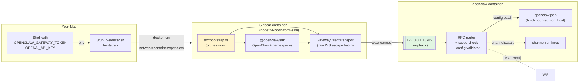

The two boxes that matter:

- **Sidecar** is where your TypeScript code runs. It exists purely because of the loopback issue explained next.
- **`openclaw` container** is the Gateway. The Sidecar joins its network namespace, so `ws://127.0.0.1:18789` from the Sidecar reaches the Gateway's actual loopback interface.

---

## 3. Why the sidecar exists

This is the most important architectural decision in the project. Without understanding it, the code looks more complicated than it needs to be.

### The problem

The Gateway has a security rule: a WS connection without a paired device identity gets its declared scopes cleared to `[]`, **unless** the connection arrives via one of four "trusted" exceptions. From `docs/gateway/protocol.md`:

```
WS clients normally include device identity during connect.
The only device-less operator exceptions are:
  1. allowInsecureAuth (Control UI HTTP)
  2. trusted-proxy auth mode
  3. dangerouslyDisableDeviceAuth (break-glass)
  4. direct-loopback gateway-client backend RPCs
```

We use option 4: in `client.ts`, the `connect` frame sends `client.id: "gateway-client"` and `client.mode: "backend"`. The catch: **direct-loopback** means the connection has to arrive on the gateway's own `127.0.0.1` — not on a Docker bridge IP routed in via `-p 127.0.0.1:18789:18789`.

### The fix: share the gateway's network namespace

```mermaid
flowchart TB
    subgraph BROKEN["❌ Direct run from host (broken)"]
        H1["Mac shell<br/>npm run bootstrap"]
        DKR1["Docker bridge<br/>(172.17.0.1)"]
        GW1["openclaw container<br/>Gateway sees<br/>connection from<br/>172.17.0.1"]
        H1 ==>|ws://127.0.0.1:18789| DKR1
        DKR1 ==>|port forward| GW1
        GW1 -.->|scopes cleared to []| H1
    end

    subgraph WORKING["✓ Sidecar shares namespace (working)"]
        H2["Mac shell<br/>./run-in-sidecar.sh"]
        SC["Sidecar container<br/>--network=container:openclaw"]
        GW2["openclaw container<br/>Gateway sees<br/>connection from<br/>127.0.0.1"]
        H2 ==>|docker run| SC
        SC ==>|ws://127.0.0.1:18789<br/>(real loopback)| GW2
        GW2 -.->|scopes preserved| SC
    end

    style BROKEN fill:#fee
    style WORKING fill:#efe
```

`--network=container:openclaw` makes the sidecar share the gateway's network namespace. From the sidecar's perspective, `127.0.0.1` is the same `127.0.0.1` the gateway is listening on. The "direct-loopback gateway-client backend" exception fires, scopes are preserved.

This is exactly what OpenClaw's own `docker-compose.yml` does for its `openclaw-cli` sidecar service: `network_mode: "service:openclaw-gateway"`.

---

## 4. The transport layer — `src/client.ts`

The WS client is one class (`GatewayClient`) plus one helper (`readEnv`). Total: ~280 lines.

### Public surface

```typescript
class GatewayClient {
  constructor(opts: { url: string; token: string; scopes?: string[] })
  connect(): Promise<HelloOk>              // handshake
  rpc<T>(method: string, params: unknown): Promise<T>
  onEvent(cb: (ev: GatewayEvent) => void): () => void   // returns unsubscribe
  helloOk(): HelloOk                       // negotiated hello-ok payload
  close(): Promise<void>
}
```

Everything else is internal.

### Internal state

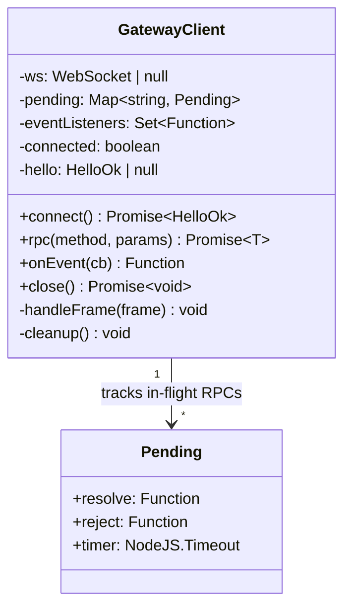

- **`pending`** is the core of request correlation: when you call `rpc(method, params)`, the client generates a `uuid`, stashes `{ resolve, reject, timer }` in `pending[id]`, and sends the request frame. When the matching `res` frame arrives (same `id`), the client pulls the pending entry, clears the timer, and resolves/rejects the promise.
- **`eventListeners`** is a Set of callbacks subscribed via `onEvent()`. Server-pushed events fan out to all of them.

### The handshake — `connect()`

OpenClaw's protocol requires the server to push a challenge **first**, then the client responds with its `connect` request as the first **client** frame. The handshake sequence:

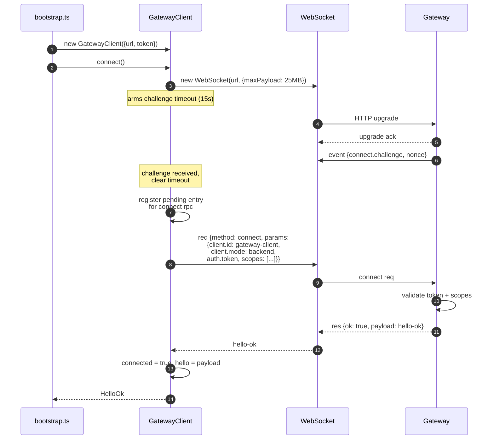

Key decisions in the code:

- **Wait for the challenge before sending anything.** The protocol explicitly requires this. The first thing you send must be `connect`, not any other RPC.
- **The connect request is treated as a normal `rpc` internally** — same pending map, same correlation by `id`. The only special thing is that its resolve handler also flips `this.connected = true` and stashes the `hello-ok` payload.
- **`scopes` defaults to a generous operator-admin set** so bootstrap.ts can do anything. Callers can pass a tighter set to `new GatewayClient({...scopes: [...]})`.

### A normal RPC

After connect succeeds, `rpc()` is the only call you need:

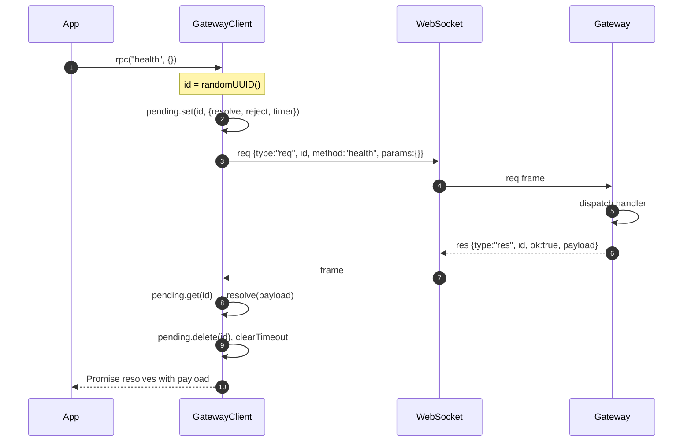

If the Gateway returns `{ ok: false, error: {...} }`, the same correlation flow runs but the promise **rejects** with an `Error` whose `gatewayError` property carries the structured error object. That's how `bootstrap.ts` gets to print `details:` blocks under `✗` lines.

If the response doesn't arrive within `RPC_TIMEOUT_MS` (30s), the per-request timer fires, removes the pending entry, and rejects with `rpc timeout: <method>`.

### Events

Server-pushed events are the other half of the protocol. Anything the gateway broadcasts (`tick`, `presence`, `health`, `sessions.changed`, `session.message`, `agent`, `shutdown`, …) arrives as `{ type: "event", event, payload, seq?, stateVersion? }` frames with **no `id` to correlate against** — they're fan-out, not request/response.

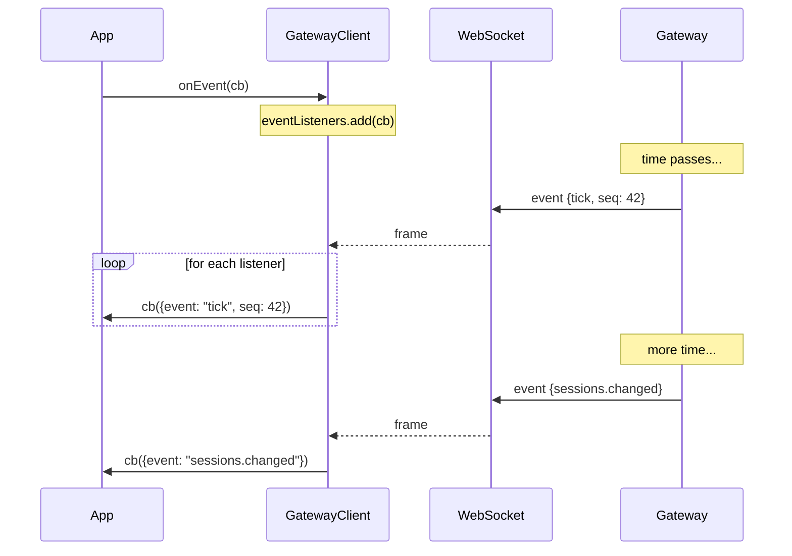

`watch-status.ts` uses this directly: subscribes to all events, calls `sessions.subscribe` to opt in to per-session traffic, then prints anything that's not `tick` or `heartbeat`.

### Lifecycle invariants

- **`connect()` can only be called once per instance.** Re-calling throws.
- **`rpc()` requires `connected === true`.** Calls before connect throw `not connected`.
- **WS close rejects all in-flight RPCs** with a `WebSocket closed (<code>)` error. Pending timers are cleared in the same step.
- **`close()` is idempotent** — calling it twice is fine; the second call returns immediately.

---

## 5. The orchestration layer — `src/bootstrap.ts`

`bootstrap.ts` is a linear sequence of named "steps." Each step is a single RPC (or a small composition of RPCs) with logging around it.

### The `step()` helper

```typescript
async function step<T>(name: string, fn: () => Promise<T>): Promise<T> {
  process.stdout.write(`\n→ ${name}\n`);
  try {
    const result = await fn();
    console.log(`✓ ${truncate(JSON.stringify(result, null, 2), 4000)}`);
    return result;
  } catch (err) {
    console.error(`✗ ${name} failed: ${err.message}`);
    if (err.gatewayError) console.error(`  details: ${JSON.stringify(err.gatewayError)}`);
    throw err;
  }
}
```

Three jobs:
1. Print `→ name` so you can see progress.
2. Pretty-print the result on success (truncated at 4 KB so logs stay scannable).
3. On failure, print the error message **and** the structured `gatewayError` details. Then re-throw so the script aborts.

### The `configPatch()` helper — handling `baseHash`

Every `config.patch` call has to include a `baseHash` that proves you're patching against the current state. The Gateway returns `config base hash required` otherwise. `configPatch` wraps this:

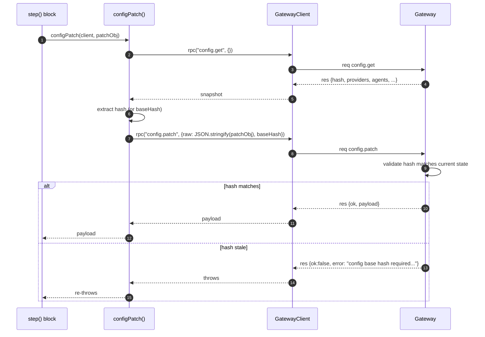

Why each patch re-fetches: after a successful `config.patch`, the gateway's `hash` changes. The next patch needs the **new** hash, not the one from a hello-ok snapshot. So `configPatch` does `get → patch` every call. Cheap (microseconds) and bulletproof against concurrent writers.

### The full bootstrap orchestration

`main()` in `bootstrap.ts` is the entry point. It walks 11 steps:

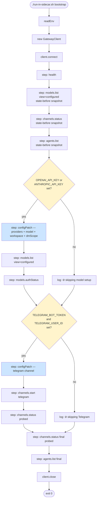

Each blue box uses `configPatch` (not raw `client.rpc`). Each yellow diamond is gated by env vars — if you don't set Telegram credentials, the script still runs, just skips that subtree.

**Idempotency** is the key property. Re-running the script with the same env produces the same end state:

- `config.patch` is a **merge**, so re-asserting the same provider/model is a no-op for everything you don't change.
- `channels.start` against an already-running channel returns `{ started: true }` and is a no-op.
- `channels.status` is read-only.

This means you can edit `bootstrap.ts` to add new steps, re-run, and only the new steps actually mutate. Critical for the "extend incrementally" workflow.

### The provider config block

The interesting branch in step "configPatch — providers + model + workspace + dmScope":

```mermaid
flowchart LR
    ENV[Process env]
    P{provider key<br/>logic}
    P -- OPENAI_API_KEY set --> O[providers.openai = {<br/>apiKey,<br/>baseUrl: OPENAI_BASE_URL<br/>or https://api.openai.com/v1<br/>}]
    P -- ANTHROPIC_API_KEY set --> A[providers.anthropic = {<br/>apiKey,<br/>baseUrl: ANTHROPIC_BASE_URL<br/>or https://api.anthropic.com<br/>}]
    P -- both set --> BOTH[both blocks emitted]
    P -- neither --> SKIP[⊘ skip entire block]

    ENV --> P
    O --> M[default model =<br/>OPENCLAW_DEFAULT_MODEL<br/>or openai/gpt-5.5]
    A --> M2[default model =<br/>OPENCLAW_DEFAULT_MODEL<br/>or anthropic/claude-sonnet-4-6]
    BOTH --> M3[OPENAI takes precedence<br/>for default model]
    M --> PATCH
    M2 --> PATCH
    M3 --> PATCH
    PATCH[configPatch with<br/>models.providers, agents.defaults,<br/>session.dmScope]
```

The `baseUrl` defaults are not optional — the Gateway's validator rejects provider entries with empty `baseUrl`. Override either via `.env` to point at Azure OpenAI / vLLM / a proxy.

---

## 6. The event watcher — `src/watch-status.ts`

Smaller and simpler. Pseudocode:

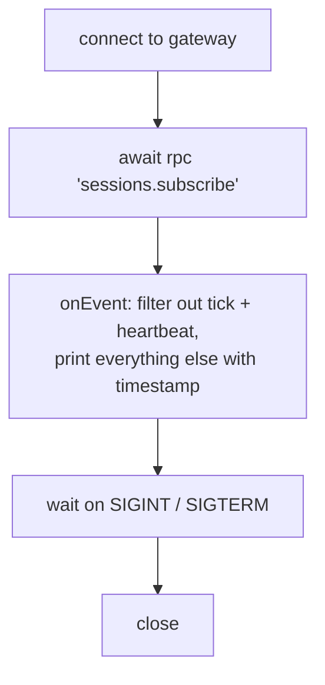

Two takeaways:

- **`sessions.subscribe`** is the RPC that opts in to per-session traffic. Without it, only system-wide events arrive (`presence`, `health`, `cron`, `sessions.changed`, etc.).
- **The script never returns** until you Ctrl-C. Async iterators or callbacks are fine for this; the project uses callbacks via `onEvent()` for simplicity.

Pair it with `bootstrap` to confirm Telegram is wired up:

1. `./run-in-sidecar.sh bootstrap` (sets up Telegram)
2. `./run-in-sidecar.sh watch` (start watching)
3. DM the Telegram bot from your phone
4. Watch sees `sessions.changed`, then `session.message`, then `agent` events stream by

---

## 7. The runtime wrapper — `run-in-sidecar.sh`

Bash script that wraps `docker run --network=container:openclaw ...`. Three responsibilities:

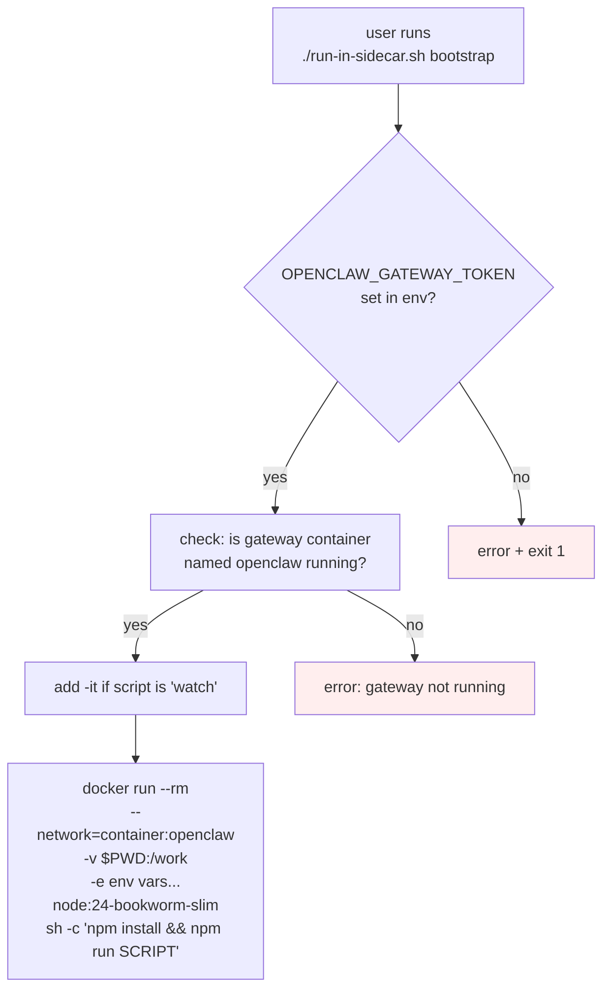

Two design choices worth knowing:

- **Container name defaults to `openclaw`** — matches the SETUP.md walkthrough. Override with `OPENCLAW_GATEWAY_CONTAINER=<name>` if you used a different name in `docker run --name`.
- **Node image is `node:24-bookworm-slim`** — small (~50 MB). Override with `OPENCLAW_NODE_IMAGE=<image>` if you've prebuilt your own.

---

## 8. How errors flow back

A typical failure cascade — the Gateway rejects a `config.patch`:

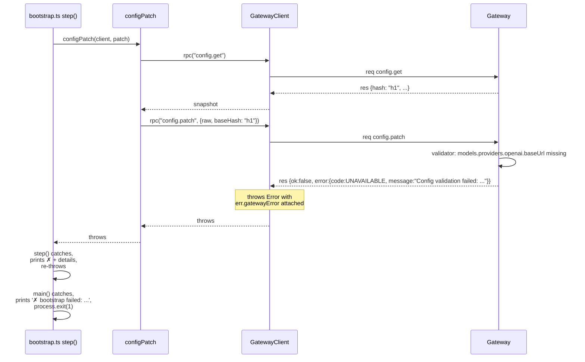

The structured error from the Gateway carries:

- `code` — short stable error code (`INVALID_REQUEST`, `UNAVAILABLE`, `PAIRING_REQUIRED`, etc.)
- `message` — human-readable, sometimes with a config path (`Config validation failed: models.providers.openai.baseUrl: Too small`)
- Optional fields like `details.canRetryWithDeviceToken`, `details.recommendedNextStep`, `retryAfterMs`

`bootstrap.ts` prints all of it via the `step()` helper. The error message is usually enough to know what to fix without diving into source.

---

## 9. Extending the code

Three patterns you'll use most:

### Adding a new step

```typescript
// In bootstrap.ts main()
await step("agents.create work", async () => {
  return client.rpc("agents.create", {
    name: "work",
    workspace: "/home/node/.openclaw/workspace-work",
    model: "anthropic/claude-sonnet-4-6",
  });
});
```

Use `client.rpc` for any RPC that **isn't** `config.patch`. The `step()` wrapper takes care of logging and error printing.

### Adding a new config write

```typescript
await step("config.patch — binding telegram to work", async () => {
  return configPatch(client, {
    bindings: [
      { agentId: "work",
        match: { channel: "telegram", accountId: "default" } },
    ],
  });
});
```

**Always use `configPatch`** for `config.patch` calls. Never raw `client.rpc("config.patch", ...)` — you'll hit `config base hash required`.

### Adding a new event handler

```typescript
const unsubscribe = client.onEvent((ev) => {
  if (ev.event === "sessions.changed") {
    console.log("sessions changed:", ev.payload);
  }
});

// later, to stop:
unsubscribe();
```

For per-session events you also need to call `sessions.subscribe` (or `sessions.messages.subscribe { sessionKey }` for a specific session).

---

## 10. The data on disk

The bootstrap writes everything through the gateway's WS API. The Gateway persists state into bind-mounted directories you can inspect from the host:

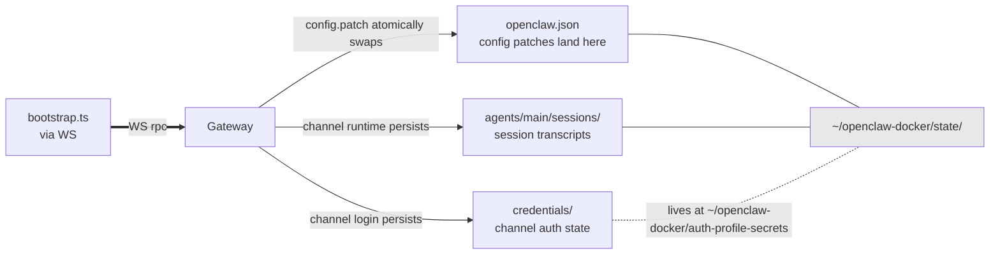

After a successful bootstrap, `cat ~/openclaw-docker/state/openclaw.json` shows the merged config — providers, default model, channels, bindings. That file is the source of truth the Gateway loads on every restart.

---

## 11. Failure modes — a cheat sheet

| Symptom | Layer | Cause |
|---|---|---|
| `timeout waiting for connect.challenge` | Transport | Gateway not reachable. Wrong URL or container not running. |
| `WebSocket closed (1008)` | Transport | Auth failed before hello-ok. Check token. |
| `negotiated scope:` empty | Protocol | You're not on real loopback. Use the sidecar. |
| `missing scope: operator.read` | Protocol | Same as above. |
| `config base hash required` | Orchestration | You called raw `client.rpc("config.patch")`. Use `configPatch()`. |
| `Config validation failed: <path>` | Server | A required field is missing. Read the path literally. |
| `rpc timeout: <method>` | Transport | RPC didn't return in 30s. Either the gateway is overloaded or a downstream provider (LLM API) is hanging. |
| `Gateway container 'openclaw' is not running` | Wrapper | Start the gateway with the SETUP.md step 4 command. |
| `OPENCLAW_GATEWAY_TOKEN is not set` | Wrapper / Orchestration | New shell, re-export the token. |

The layers map to where you'd start debugging:
- **Transport** issues: check container, network, token.
- **Protocol** issues: re-read the connect frame in `client.ts`.
- **Orchestration** issues: check the patch shape against the validator's complaint.

---

## 12. Source map

```
bootstrap/
├── package.json              # ESM, deps: ws, tsx (dev), typescript (dev)
├── tsconfig.json             # strict, ES2022, Bundler resolution
├── .env.example              # all env vars the bootstrap honors
├── .gitignore                # blocks .env, node_modules, dist
├── README.md                 # usage reference + extending guide
├── SETUP.md                  # from-zero install walkthrough
├── ARCHITECTURE.md           # this file
├── run-in-sidecar.sh         # the runtime wrapper
└── src/
    ├── client.ts             # GatewayClient class, readEnv, ~280 lines
    ├── health.ts             # smoke test
    ├── bootstrap.ts          # 11-step orchestrator + configPatch helper
    └── watch-status.ts       # live event stream
```

Cross-references to docs in this folder:

- `../openclaw-gateway-websocket-setup.md` — protocol-level handshake + frame model
- `../openclaw-channels-via-websocket.md` — the WS methods this project calls
- `../openclaw-docker-build-and-run.md` — the Docker layer underneath
- `../ISSUES.md` — every known gotcha with workarounds

References inside the OpenClaw repo:

- `src/gateway/protocol/version.ts` — `PROTOCOL_VERSION` constant
- `src/gateway/protocol/schema/*.ts` — TypeBox schemas for every RPC param
- `src/gateway/methods/core-descriptors.ts` — every method name + required scope
- `src/gateway/client.ts` — OpenClaw's own reference WS client (useful for comparing implementations)
- `docker-compose.yml` — the `network_mode: "service:openclaw-gateway"` precedent for our sidecar pattern
