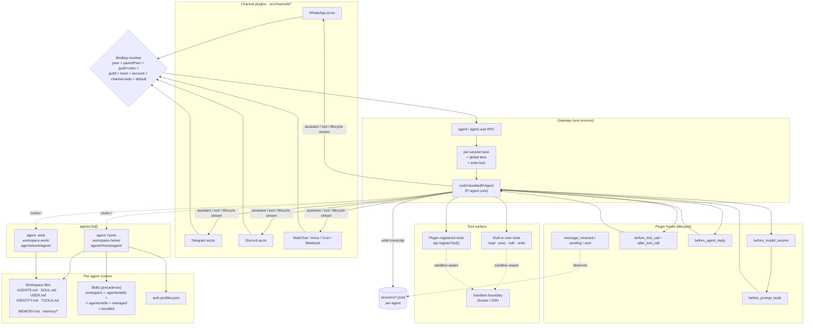

# OpenClaw Agents — Deep Dive

Grounded in the local repo at `/Users/rajendra/projects/openclaw/openclaw`. Primary sources:

- `docs/concepts/agent.md` — agent runtime
- `docs/concepts/agent-loop.md` — lifecycle
- `docs/concepts/agent-workspace.md` — workspace layout
- `docs/concepts/multi-agent.md` — multi-agent + bindings
- `docs/concepts/soul.md` — persona file
- `docs/plugins/sdk-overview.md` — Plugin SDK contract
- `docs/plugins/building-plugins.md` — tool registration

If something below is not in those files, it's not in this doc — I've avoided guessing.

---

## 1. What an "agent" actually is

In OpenClaw, an **agent** is **the full per-persona scope** — not just a prompt. One agent owns:

| Piece | Path |
|---|---|
| Workspace (cwd, bootstrap files, skills, memory) | `~/.openclaw/workspace` (default), or per-agent `~/.openclaw/workspace-<id>` |
| State / `agentDir` (auth, model registry, config) | `~/.openclaw/agents/<agentId>/agent/` |
| Auth profiles (OAuth + API keys) | `~/.openclaw/agents/<agentId>/agent/auth-profiles.json` |
| Session transcripts (JSONL) | `~/.openclaw/agents/<agentId>/sessions/<sessionId>.jsonl` |

Default single agent: `agentId = "main"`. The Gateway can host one agent (default) or many side-by-side.

> **Hard rule from source:** *"Never reuse `agentDir` across agents (it causes auth/session collisions)."* — `multi-agent.md`

### Runtime
- A **single embedded agent runtime** per Gateway, built on the **Pi agent core** (models, tools, prompt pipeline).
- Session management, discovery, tool wiring, and channel delivery are OpenClaw-owned layers on top.

---

## 2. The workspace — what the agent reads as "self"

The workspace is the agent's home, used as `cwd` for tools and as the project-context source. **It is the default cwd, not a hard sandbox** — absolute paths can still reach the host unless `agents.defaults.sandbox` is enabled.

### Bootstrap files (injected into the system prompt on first turn of each session)

| File | Purpose |
|---|---|
| `AGENTS.md` | Operating instructions + how to use memory |
| `SOUL.md` | Persona, tone, boundaries (the "voice") |
| `USER.md` | Who the user is and how to address them |
| `IDENTITY.md` | Agent name / vibe / emoji |
| `TOOLS.md` | Notes about local tool conventions (**does not** control tool availability) |
| `HEARTBEAT.md` | Optional checklist for heartbeat runs |
| `BOOT.md` | Optional startup checklist (gateway restart) |
| `BOOTSTRAP.md` | One-time first-run ritual; deleted after completion |
| `MEMORY.md` | Curated long-term memory (load only in main private session) |
| `memory/YYYY-MM-DD.md` | Daily memory log files |
| `skills/` | Workspace-specific skills (highest precedence) |
| `canvas/` | Canvas UI files (e.g. `canvas/index.html`) |

Missing file → OpenClaw injects a "missing file" marker and continues. Large files are trimmed at `agents.defaults.bootstrapMaxChars` (default 12000) and `bootstrapTotalMaxChars` (60000).

To disable seeding entirely: `{ agents: { defaults: { skipBootstrap: true } } }`.

### What is **not** in the workspace
- Config: `~/.openclaw/openclaw.json`
- Auth profiles: `~/.openclaw/agents/<id>/agent/auth-profiles.json`
- Channel credentials: `~/.openclaw/credentials/`
- Sessions: `~/.openclaw/agents/<id>/sessions/`
- Managed skills: `~/.openclaw/skills/`

These should not be committed to a workspace git repo.

---

## 3. The agent loop — what happens on every turn

From `docs/concepts/agent-loop.md`:

```
intake → context assembly → model inference → tool execution → streaming reply → persistence
```

Entry points:
- **Gateway RPC**: `agent` and `agent.wait`
- **CLI**: `openclaw agent --message "..."`

Step-by-step:
1. `agent` RPC validates params, resolves session (sessionKey/sessionId), persists session metadata, returns `{ runId, acceptedAt }` immediately.
2. `agentCommand` runs the agent: resolves model + thinking/verbose/trace defaults, loads skills snapshot, calls `runEmbeddedPiAgent`, emits lifecycle end/error if the embedded loop didn't.
3. `runEmbeddedPiAgent`:
   - **Serializes runs** via per-session + global queues (prevents tool/session races).
   - Resolves model + auth profile, builds the Pi session.
   - Subscribes to Pi events, streams assistant/tool deltas.
   - Enforces timeout → aborts run if exceeded.
4. `subscribeEmbeddedPiSession` bridges Pi events to OpenClaw streams:
   - tool events → `stream: "tool"`
   - assistant deltas → `stream: "assistant"`
   - lifecycle events → `stream: "lifecycle"` (`start | end | error`)
5. `agent.wait` waits for lifecycle end/error of `runId`.

### Concurrency
- Runs are **serialized per session key** (a session lane) and optionally through a global lane.
- Transcript writes use a process-aware **file-based session write lock** with timeout `session.writeLock.acquireTimeoutMs` (default 60s).
- Non-reentrant by default.

### Steering (mid-run inbound messages)
- `/queue steer` (default): apply to the current run after the current tool calls finish, before the next LLM call.
- `/queue followup` / `/queue collect`: wait for a later turn.
- `/queue interrupt`: abort the active run.

---

## 4. Multi-agent routing — how a message picks an agent

The Gateway accepts messages from many channels and many accounts. **Bindings** map `(channel, accountId, peer)` → `agentId`. Matching is deterministic; **most specific wins**.

Tier order (top wins):

1. `peer` match (exact DM/group/channel id)
2. `parentPeer` (thread inheritance)
3. `guildId + roles` (Discord role routing)
4. `guildId` (Discord)
5. `teamId` (Slack)
6. `accountId` match for a channel
7. Channel-level match with `accountId: "*"`
8. Default agent (`agents.list[].default`, else first entry, else `main`)

Tie-break: same tier → first-in-config-order wins. Multiple match fields on one binding = AND.

### Example: WhatsApp split into two personas

```json5
{
  agents: {
    list: [
      { id: "home", default: true, workspace: "~/.openclaw/workspace-home",
        agentDir: "~/.openclaw/agents/home/agent" },
      { id: "work", workspace: "~/.openclaw/workspace-work",
        agentDir: "~/.openclaw/agents/work/agent" }
    ]
  },
  bindings: [
    { agentId: "home", match: { channel: "whatsapp", accountId: "personal" } },
    { agentId: "work", match: { channel: "whatsapp", accountId: "biz" } },
    // Per-peer override (most-specific wins)
    { agentId: "work",
      match: { channel: "whatsapp", accountId: "personal",
               peer: { kind: "group", id: "1203630...@g.us" } } }
  ],
  channels: {
    whatsapp: {
      accounts: { personal: {}, biz: {} }
    }
  }
}
```

### Per-agent overrides available on `agents.list[]`
- `workspace`, `agentDir`, `model`
- `identity.name`, `groupChat.mentionPatterns`
- `sandbox.{mode, scope, docker.setupCommand}`
- `tools.{allow, deny}` (tool allowlist/denylist — **tools, not skills**)
- `skills` (per-agent skill list, replaces shared baseline)
- `memorySearch.qmd.extraCollections` (cross-agent transcript search)

---

## 5. Tools — built-in, plugin-registered, and gated

### Built-in (always available, subject to policy)
Core tools (read / exec / edit / write and related system tools) are **always available**. `apply_patch` is optional, gated by `tools.exec.applyPatch`.

`TOOLS.md` is **guidance for how you want them used**, not a manifest.

### Plugin-registered tools (the SDK path)

Tools are added by plugins via `api.registerTool(...)`. From `building-plugins.md`:

```typescript
import { Type } from "typebox";
import { definePluginEntry } from "openclaw/plugin-sdk/plugin-entry";

export default definePluginEntry({
  id: "my-plugin",
  name: "My Plugin",
  description: "Adds a custom tool to OpenClaw",
  register(api) {
    api.registerTool({
      name: "my_tool",
      description: "Echo one input value",
      parameters: Type.Object({ input: Type.String() }),
      async execute(_id, params) {
        return { content: [{ type: "text", text: `Got: ${params.input}` }] };
      },
    });
  },
});
```

Manifest must also declare it:
```json
{
  "contracts": { "tools": ["my_tool"] },
  "toolMetadata": { "my_tool": { "optional": true } }
}
```

Optional tools require user opt-in via `tools.allow`. Required tools are on whenever the plugin is enabled.

### Gating per agent
```json5
{
  agents: {
    list: [{
      id: "family",
      tools: {
        allow: ["exec", "read", "sessions_list", "sessions_history",
                "sessions_send", "sessions_spawn", "session_status"],
        deny:  ["write", "edit", "apply_patch", "browser", "canvas",
                "nodes", "cron"]
      }
    }]
  }
}
```

`tools.elevated` is **global** and sender-based, not per-agent.

---

## 6. Channels — how the agent meets the world

A **channel** is the messaging surface (WhatsApp, Discord, Telegram, Slack, etc.). A channel may have multiple **accounts** (e.g. two WhatsApp numbers).

```json5
channels: {
  telegram: {
    accounts: {
      default: { botToken: "123:ABC...", dmPolicy: "pairing" },
      alerts:  { botToken: "987:XYZ...", dmPolicy: "allowlist",
                 allowFrom: ["tg:123456789"] }
    }
  }
}
```

- **DM policy** (`pairing` / `allowlist` / `open`) gates unknown senders.
- **Group/guild allowlists** gate where bots can listen.
- Each `accountId` can be bound to a different agent — that's how you get "one Telegram bot per persona on one Gateway."
- Channels supporting multi-account include: `whatsapp, telegram, discord, slack, signal, imessage, irc, line, googlechat, mattermost, matrix, nextcloud-talk, zalo, zalouser, nostr, feishu`.

### Building a channel plugin
Use `defineChannelPluginEntry` (from `openclaw/plugin-sdk/channel-core`) instead of `definePluginEntry`. Then `api.registerChannel(...)`. The channel plugin is responsible for ingress, message normalization, outbound sends, and account lifecycle. (Full schema: `docs/plugins/sdk-channel-plugins.md`.)

---

## 7. Sandboxing — when tools should NOT have host access

- The `main` session (default single-user) runs **unrestricted** on host.
- Non-main sessions can be sandboxed via Docker (default) or SSH.
- Per-agent override:
  ```json5
  sandbox: {
    mode: "all",       // always sandboxed
    scope: "agent",    // one container per agent
    docker: { setupCommand: "apt-get update && apt-get install -y git curl" }
  }
  ```
- When sandbox is on and `workspaceAccess` ≠ `"rw"`, tools operate inside `~/.openclaw/sandboxes`, **not** the host workspace.
- `setupCommand` is ignored when scope resolves to `"shared"`.

---

## 8. Hook system — how to intercept and extend the loop

Two layers:

### Internal (Gateway) hooks — event-driven scripts
- `agent:bootstrap`: modify bootstrap files before the system prompt is finalized
- Command hooks: `/new`, `/reset`, `/stop`, etc.

Configured via `docs/automation/hooks.md`.

### Plugin hooks — registered via `api.on(...)`

Inside the agent loop / gateway pipeline:

| Hook | When |
|---|---|
| `before_model_resolve` | Pre-session, override provider/model deterministically |
| `before_prompt_build` | After session load (has `messages`), inject `prependContext`, `systemPrompt`, `prependSystemContext`, `appendSystemContext` |
| `before_agent_start` | Legacy compatibility (prefer explicit ones above) |
| `before_agent_reply` | After inline actions, before LLM call — can claim the turn or silence it |
| `agent_end` | Final message list + run metadata |
| `before_compaction` / `after_compaction` | Observe/annotate compaction |
| `before_tool_call` / `after_tool_call` | Intercept tool params/results |
| `before_install` | Inspect findings, optionally block skill/plugin install |
| `tool_result_persist` | Synchronously transform tool results before transcript write |
| `message_received` / `message_sending` / `message_sent` | Inbound/outbound message lifecycle |
| `session_start` / `session_end` | Session boundaries |
| `gateway_start` / `gateway_stop` | Gateway lifecycle |

Decision semantics:
- `before_tool_call: { block: true }` is **terminal** (lower-priority hooks skipped).
- `before_tool_call: { block: false }` is a **no-op** — does not override prior block.
- Same pattern for `before_install` and `message_sending: { cancel: true }`.

---

## 9. The component interaction picture



---

## 10. Implementing an agent — three practical paths

### Path A: One personal agent (default `main`)
1. Install: `npm i -g openclaw@latest && openclaw onboard --install-daemon`
2. `openclaw setup` seeds the workspace files.
3. Edit `AGENTS.md` (rules), `SOUL.md` (voice), `USER.md` (you), `IDENTITY.md`.
4. Add channels: e.g. `openclaw channels login --channel whatsapp`.
5. Set `agents.defaults.model` in `~/.openclaw/openclaw.json`.
6. Done — `openclaw gateway restart` and message yourself.

### Path B: Multiple personas in one Gateway
1. `openclaw agents add work` (then `coding`, `family`, etc.).
2. For each, edit that agent's workspace (`~/.openclaw/workspace-<id>`).
3. Add channel **accounts** per persona and **bindings** (see §4).
4. `openclaw agents list --bindings` to verify the routing table.
5. `openclaw channels status --probe` to verify channel auth.

### Path C: A custom agent capability via a plugin
A **plugin** is how you ship new tools, channels, providers, hooks, or skills to an agent.

Minimal tool plugin (full code in `building-plugins.md`):

```typescript
// index.ts
import { Type } from "typebox";
import { definePluginEntry } from "openclaw/plugin-sdk/plugin-entry";

export default definePluginEntry({
  id: "rss-digest",
  name: "RSS Digest",
  register(api) {
    api.registerTool({
      name: "rss_digest",
      description: "Fetch and summarize an RSS feed URL",
      parameters: Type.Object({ url: Type.String() }),
      async execute(_id, { url }) {
        // ... fetch, parse, return content
        return { content: [{ type: "text", text: "..." }] };
      },
    });
  },
});
```

```json
// openclaw.plugin.json
{ "contracts": { "tools": ["rss_digest"] } }
```

Then:
```bash
clawhub package publish your-org/rss-digest
openclaw plugins install clawhub:your-org/rss-digest
```

### Path D: Custom **channel** (the route, not the tool)
Use `defineChannelPluginEntry` from `openclaw/plugin-sdk/channel-core` and `api.registerChannel(...)`. Channel plugin owns ingress, account lifecycle, message normalization, and outbound delivery. See `docs/plugins/sdk-channel-plugins.md`.

---

## 11. Putting it together — how agents interact with everything

| If you want… | Reach for… |
|---|---|
| Different voice on Telegram vs WhatsApp | Two agents, two bindings on `accountId` |
| New domain capability (search a private DB) | Tool plugin (`api.registerTool`) |
| New messaging surface (e.g. Mastodon) | Channel plugin (`api.registerChannel`) |
| Per-turn behavior change without LLM call | `api.registerCommand` (bypasses LLM) |
| Inject context only when condition X | `before_prompt_build` hook |
| Block a tool call under condition X | `before_tool_call` hook returning `{ block: true }` |
| Trigger an agent on a schedule | Cron (`agents.list[]` + the cron tool) |
| Trigger an agent from a webhook | `api.registerHttpRoute` + `api.registerGatewayMethod` |
| Restrict an agent (e.g. family group) | `agents.list[].sandbox.mode` + `tools.allow/deny` |
| Persist plugin-owned state per session | `api.session.state.registerSessionExtension` |
| Inject something into the next turn exactly once | `api.session.workflow.enqueueNextTurnInjection` |
| Schedule a session turn | `api.session.workflow.scheduleSessionTurn` (Cron-backed; bundled only) |

---

## 12. Known limits / things to verify before relying on them

These are statements straight from the source files; flag-them-up if your design depends on them:

- **Single embedded runtime per Gateway.** Multi-agent is multi-persona inside *one* runtime, not multiple parallel runtimes.
- Workspace is `cwd`, **not** a hard sandbox — absolute paths reach host unless sandbox is enabled.
- Auth profile pass-through: secondary agents can read default agent's auth profile, but **OAuth refresh tokens are NOT cloned** — only portable static `api_key`/`token` profiles travel.
- `tools.elevated` is global / sender-based; no per-agent variant.
- WhatsApp DM access control is **per account**, not per agent (DM-split with one account collapses to the agent's main session key).
- Session write lock is non-reentrant by default; nested writers must opt in with `allowReentrant: true`.

---

## 13. Mapping to your SaaS idea (from [idea.txt](idea.txt))

| Your need | Build on |
|---|---|
| One paying user = one isolated brain | One `agentId` per user with own `workspace`, `agentDir`, `auth-profiles.json` |
| User picks their channels (WhatsApp / Telegram / etc.) | Per-user channel `accounts` + a `binding` to their `agentId` |
| "Public news/blog page" for a user | Tool plugin that writes to `<workspace>/canvas/` or a static export; cron-triggered |
| "Private work-status page" | Same Canvas, gated agent; updated via channel messages or webhooks |
| Per-tenant resource cap / safety | `agents.list[].sandbox` + `tools.allow/deny` + `tools.elevated` (global — caveat above) |
| Tenant onboarding flow | `BOOTSTRAP.md` ritual + `openclaw agents add <id>` + bindings via your control plane |
| Spinning up N tenants | Multi-agent in one Gateway, OR one Gateway-per-tenant container — needs decision |

**The fork in the road for your SaaS:** OpenClaw's multi-agent design is built for *one operator running multiple personas*, not for *multiple paying tenants on one box*. Critical caveats:
- `tools.elevated` is global — can't be per-tenant.
- WhatsApp DM allowlist is per account, not per agent.
- The `main` session runs unrestricted on host by default.

So the safe production shape is probably **one Gateway process per paying tenant** (containerized), with multi-agent reserved for *one tenant's own personas*. Your control plane = a wrapper that provisions containers, mounts per-tenant `~/.openclaw/`, and exposes a UI for the user to define skills/pages.
