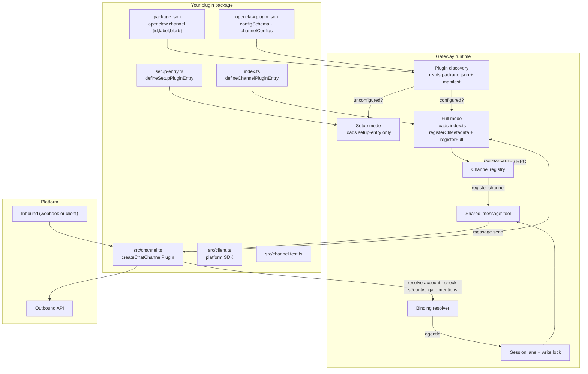

# Building a Custom Channel Plugin

**Short answer:** Yes — the repo documents this extensively. A new channel (anything similar to Telegram, Slack, WhatsApp) is built as a **channel plugin**, not by modifying core. The contract is the `ChannelPlugin` interface, exposed via the Plugin SDK.

Grounded in `/Users/rajendra/projects/openclaw/openclaw`:

- `docs/plugins/sdk-channel-plugins.md` (762 lines) — step-by-step walkthrough
- `docs/plugins/sdk-channel-message.md` (458 lines) — message adapter (durable sends + receipts + live preview)
- `docs/plugins/sdk-channel-ingress.md` (137 lines) — inbound runtime
- `docs/plugins/sdk-channel-turn.md` (580 lines) — the channel turn kernel
- `docs/plugins/sdk-entrypoints.md` — `defineChannelPluginEntry`
- `docs/plugins/sdk-setup.md` — package metadata
- `docs/plugins/manifest.md` — manifest contracts
- `extensions/telegram/`, `slack/`, `discord/`, `irc/`, `matrix/`, `signal/` — bundled real channels to copy patterns from

Every code snippet below is paraphrased from those sources. If a detail isn't documented in the repo, I leave it out instead of inventing it.

---

## 1. The mental model — what a channel plugin owns

From `sdk-channel-plugins.md`:

> *"Channel plugins do not need their own send/edit/react tools. OpenClaw keeps one shared `message` tool in core. Your plugin owns: Config · Security · Pairing · Session grammar · Outbound · Threading · Heartbeat typing."*

| Plugin owns | Core owns |
|---|---|
| Per-account config + setup wizard | Shared `message` tool + prompt wiring |
| DM policy + allowlists | Session-key shape + generic `:thread:` bookkeeping |
| Pairing approval flow | Dispatch + outer routing |
| How provider conversation ids map to base chats, thread ids, parent fallbacks | Mention gating evaluation (after plugin gathers facts) |
| Outbound text, media, poll, reactions to the platform | Approval lifecycle (unless platform-specific) |
| Reply threading | Receipt persistence |
| Optional typing/busy signals | Reload-on-config-change |

The contract is `ChannelPlugin` (with `createChatChannelPlugin<ResolvedAccount>(...)` as the high-level builder).

---

## 2. The full file layout

From `sdk-channel-plugins.md`, the canonical layout:

```
<plugin-root>/acme-chat/
├── package.json              # openclaw.channel metadata
├── openclaw.plugin.json      # Manifest with config schema
├── index.ts                  # defineChannelPluginEntry
├── setup-entry.ts            # defineSetupPluginEntry
├── api.ts                    # Public exports (optional)
├── runtime-api.ts            # Internal runtime exports (optional)
└── src/
    ├── channel.ts            # ChannelPlugin via createChatChannelPlugin
    ├── channel.test.ts       # Vitest tests
    ├── client.ts             # Your platform API client
    └── runtime.ts            # Runtime store (if needed)
```

Real bundled example you can study: `extensions/telegram/` follows this exact pattern with files like `channel-plugin-api.ts`, `setup-entry.ts`, `account-inspect-api.ts`, `session-key-api.ts`, `runtime-setter-api.ts`, etc.

---

## 3. Step-by-step walkthrough (paraphrased from `sdk-channel-plugins.md`)

### Step 1 — `package.json` + `openclaw.plugin.json`

The `openclaw.channel` field is what flags this as a channel plugin (not a generic tool plugin).

```json
// package.json
{
  "name": "@myorg/openclaw-acme-chat",
  "version": "1.0.0",
  "type": "module",
  "openclaw": {
    "extensions": ["./index.ts"],
    "setupEntry": "./setup-entry.ts",
    "channel": {
      "id": "acme-chat",
      "label": "Acme Chat",
      "blurb": "Connect OpenClaw to Acme Chat."
    }
  }
}
```

```json
// openclaw.plugin.json
{
  "id": "acme-chat",
  "kind": "channel",
  "channels": ["acme-chat"],
  "name": "Acme Chat",
  "description": "Acme Chat channel plugin",
  "configSchema": {
    "type": "object",
    "additionalProperties": false,
    "properties": {}
  },
  "channelConfigs": {
    "acme-chat": {
      "schema": {
        "type": "object",
        "additionalProperties": false,
        "properties": {
          "token":     { "type": "string" },
          "allowFrom": { "type": "array", "items": { "type": "string" } }
        }
      },
      "uiHints": {
        "token": { "label": "Bot token", "sensitive": true }
      }
    }
  }
}
```

The docs make a precise distinction between the two schemas:

> *"`configSchema` validates `plugins.entries.acme-chat.config`. Use it for plugin-owned settings that are not the channel account config. `channelConfigs` validates `channels.acme-chat` and is the cold-path source used by config schema, setup, and UI surfaces **before the plugin runtime loads**."*

If your channel reads env vars, also declare them in the manifest's `channelEnvVars` so startup flows know about them before runtime loads.

### Step 2 — Build the `ChannelPlugin` object

Direct from the docs:

```typescript
// src/channel.ts
import {
  createChatChannelPlugin,
  createChannelPluginBase,
} from "openclaw/plugin-sdk/channel-core";
import type { OpenClawConfig } from "openclaw/plugin-sdk/channel-core";
import { acmeChatApi } from "./client.js";

type ResolvedAccount = {
  accountId: string | null;
  token: string;
  allowFrom: string[];
  dmPolicy: string | undefined;
};

function resolveAccount(
  cfg: OpenClawConfig,
  accountId?: string | null,
): ResolvedAccount {
  const section = (cfg.channels as Record<string, any>)?.["acme-chat"];
  const token = section?.token;
  if (!token) throw new Error("acme-chat: token is required");
  return {
    accountId: accountId ?? null,
    token,
    allowFrom: section?.allowFrom ?? [],
    dmPolicy: section?.dmSecurity,
  };
}

export const acmeChatPlugin = createChatChannelPlugin<ResolvedAccount>({
  base: createChannelPluginBase({
    id: "acme-chat",
    setup: {
      resolveAccount,
      inspectAccount(cfg, accountId) {
        const section = (cfg.channels as Record<string, any>)?.["acme-chat"];
        return {
          enabled:     Boolean(section?.token),
          configured:  Boolean(section?.token),
          tokenStatus: section?.token ? "available" : "missing",
        };
      },
    },
  }),

  security: {
    dm: {
      channelKey:        "acme-chat",
      resolvePolicy:     (account) => account.dmPolicy,
      resolveAllowFrom:  (account) => account.allowFrom,
      defaultPolicy:     "allowlist",
    },
  },

  pairing: {
    text: {
      idLabel: "Acme Chat username",
      message: "Send this code to verify your identity:",
      notify: async ({ target, code }) => {
        await acmeChatApi.sendDm(target, `Pairing code: ${code}`);
      },
    },
  },

  threading: { topLevelReplyToMode: "reply" },

  outbound: {
    attachedResults: {
      sendText: async (params) => {
        const result = await acmeChatApi.sendMessage(params.to, params.text);
        return { messageId: result.id };
      },
    },
    base: {
      sendMedia: async (params) => {
        await acmeChatApi.sendFile(params.to, params.filePath);
      },
    },
  },
});
```

What `createChatChannelPlugin` wires for you (from the doc):

| Option | Wires |
|---|---|
| `security.dm` | Scoped DM security resolver from config fields |
| `pairing.text` | Text-based DM pairing flow with code exchange |
| `threading` | Reply-to-mode resolver (fixed, account-scoped, or custom) |
| `outbound.attachedResults` | Send functions that return result metadata (message IDs) |

### Step 3 — Wire the entry point

```typescript
// index.ts
import { defineChannelPluginEntry } from "openclaw/plugin-sdk/channel-core";
import { acmeChatPlugin } from "./src/channel.js";

export default defineChannelPluginEntry({
  id: "acme-chat",
  name: "Acme Chat",
  description: "Acme Chat channel plugin",
  plugin: acmeChatPlugin,
  registerCliMetadata(api) {
    api.registerCli(
      ({ program }) => {
        program.command("acme-chat").description("Acme Chat management");
      },
      {
        descriptors: [
          { name: "acme-chat", description: "Acme Chat management",
            hasSubcommands: false },
        ],
      },
    );
  },
  registerFull(api) {
    // runtime-only registration (HTTP routes, RPC methods, services)
  },
});
```

Critical split from the docs:
- `registerCliMetadata(...)` — CLI descriptors **without** activating runtime. Shown in `openclaw --help`.
- `registerFull(...)` — runtime-only work (transport clients, HTTP routes, socket listeners, RPC methods).

> *"Files such as `channel-plugin-api.ts` should export the channel plugin object without importing setup wizards, transport clients, socket listeners, subprocess launchers, or service startup modules. Put those runtime pieces in modules loaded from `registerFull(...)`, runtime setters, or lazy capability adapters."*

If `registerFull(...)` registers gateway RPC methods, use a plugin-specific prefix. Reserved core admin namespaces (`config.*`, `exec.approvals.*`, `wizard.*`, `update.*`) always resolve to `operator.admin`.

### Step 4 — Setup entry (lightweight load path)

```typescript
// setup-entry.ts
import { defineSetupPluginEntry } from "openclaw/plugin-sdk/channel-core";
import { acmeChatPlugin } from "./src/channel.js";

export default defineSetupPluginEntry(acmeChatPlugin);
```

> *"OpenClaw loads this instead of the full entry when the channel is disabled or unconfigured. It avoids pulling in heavy runtime code during setup flows."*

### Step 5 — Handle inbound messages

This is the channel-specific part. The docs give a webhook example and explicitly tell you to look at bundled plugins for the exact pattern:

```typescript
registerFull(api) {
  api.registerHttpRoute({
    path: "/acme-chat/webhook",
    auth: "plugin",          // plugin-managed auth (verify signatures yourself)
    handler: async (req, res) => {
      const event = parseWebhookPayload(req);

      // Dispatch into OpenClaw. Exact wiring is channel-specific —
      // see bundled plugins (Microsoft Teams, Google Chat) for real patterns.
      await handleAcmeChatInbound(api, event);

      res.statusCode = 200;
      res.end("ok");
      return true;
    },
  });
}
```

From `sdk-channel-ingress.md`, OpenClaw provides a shared helper for the inbound-authorization step:

> *"Channels migrating inbound authorization can use the experimental `openclaw/plugin-sdk/channel-ingress-runtime` subpath from runtime receive paths. The subpath keeps platform lookup and side effects in the plugin, while sharing allowlist state resolution, route/sender/command/event/activation decisions, redacted diagnostics, and turn-admission mapping."*

The two patterns the repo shows:
- **Webhook channels** (Slack, Microsoft Teams, Google Chat) — register an HTTP route via `api.registerHttpRoute(...)`.
- **Client/listener channels** (Telegram long-poll, WhatsApp Baileys WS, Discord Gateway, IRC, Matrix) — open the provider connection inside `registerFull(...)` and dispatch as events arrive.

### Step 6 — Test

```typescript
// src/channel.test.ts
import { describe, it, expect } from "vitest";
import { acmeChatPlugin } from "./channel.js";

describe("acme-chat plugin", () => {
  it("resolves account from config", () => {
    const cfg = {
      channels: { "acme-chat": { token: "test-token", allowFrom: ["user1"] } },
    } as any;
    const account = acmeChatPlugin.setup!.resolveAccount(cfg, undefined);
    expect(account.token).toBe("test-token");
  });

  it("inspects account without materializing secrets", () => {
    const cfg = { channels: { "acme-chat": { token: "test-token" } } } as any;
    const result = acmeChatPlugin.setup!.inspectAccount!(cfg, undefined);
    expect(result.configured).toBe(true);
    expect(result.tokenStatus).toBe("available");
  });

  it("reports missing config", () => {
    const cfg = { channels: {} } as any;
    const result = acmeChatPlugin.setup!.inspectAccount!(cfg, undefined);
    expect(result.configured).toBe(false);
  });
});
```

Run via `pnpm test -- <plugin-root>/acme-chat/`.

---

## 4. The five adapter surfaces explained

### Security (`security.dm`)
Maps config fields to OpenClaw's DM gating engine:
- `channelKey`: the config key (e.g. `"acme-chat"`)
- `resolvePolicy(account)` → `"pairing" | "allowlist" | "open" | "disabled"`
- `resolveAllowFrom(account)` → list of allowed sender ids
- `defaultPolicy`: fallback when not set

The docs recommend a generic helper for channels that have both canonical and legacy keys:

> *"Use the helpers from `plugin-sdk/channel-config-helpers`: `resolveChannelDmAccess`, `resolveChannelDmPolicy`, `resolveChannelDmAllowFrom`, and `normalizeChannelDmPolicy` keep account-local values ahead of inherited root values."*

### Pairing (`pairing.text`)
Text-based code exchange for unknown senders. You supply:
- `idLabel`: what the sender id is called on the platform
- `message`: prompt shown to the sender
- `notify({ target, code })`: how to deliver the pairing code over the platform

### Threading (`threading.topLevelReplyToMode`)
How outbound messages handle reply context: `"reply" | "off" | "all" | ...`. Can be fixed, per-account, or fully custom.

### Outbound (`outbound`)
- `attachedResults.sendText({ to, text }) → { messageId }` — durable text send
- `base.sendMedia({ to, filePath })` — media send

Raw adapters may also define a `chunker(text, limit, ctx)` for platform-aware chunking. Send context can include `replyToIdSource` (`implicit` / `explicit`) so payload helpers preserve explicit reply tags.

### Message (`message` adapter — newer requirement)
From `sdk-channel-message.md`:

> *"New channel plugins should also expose a `message` adapter with `defineChannelMessageAdapter` from `openclaw/plugin-sdk/channel-message`. The adapter declares which durable final-send capabilities the native transport actually supports..."*

The message adapter is what core's shared `message` tool dispatches into. If you already have the `outbound` adapter, the docs give you a bridge:

> *"If the existing `outbound` adapter already has the right send methods and capability metadata, use `createChannelMessageAdapterFromOutbound(...)` to derive the `message` adapter instead of hand-writing another bridge."*

Adapter sends should return `MessageReceipt` values; use `listMessageReceiptPlatformIds(...)` / `resolveMessageReceiptPrimaryId(...)` instead of parallel `messageIds` fields.

**Live preview channels** (channels that edit one message as the agent streams) must declare `message.live.capabilities` like `draftPreview`, `previewFinalization`, `progressUpdates`, `nativeStreaming`, `quietFinalization`. If you finalize a draft in place, also declare `message.live.finalizer.capabilities` and use `defineFinalizableLivePreviewAdapter(...)` + `deliverWithFinalizableLivePreviewAdapter(...)`.

**Receive-ack policy** (deferred platform acks): declare `message.receive.defaultAckPolicy` and `supportedAckPolicies`; cover with `verifyChannelMessageReceiveAckPolicyAdapterProofs(...)`.

---

## 5. Inbound mention gating (split-layer policy)

From `sdk-channel-plugins.md`:

> *"Keep inbound mention handling split in two layers: plugin-owned evidence gathering · shared policy evaluation."*

```typescript
import {
  implicitMentionKindWhen,
  matchesMentionWithExplicit,
  resolveInboundMentionDecision,
} from "openclaw/plugin-sdk/channel-inbound";

const mentionMatch = matchesMentionWithExplicit(text, {
  mentionRegexes, mentionPatterns,
});

const facts = {
  canDetectMention:    true,
  wasMentioned:        mentionMatch.matched,
  hasAnyMention:       mentionMatch.hasExplicitMention,
  implicitMentionKinds: [
    ...implicitMentionKindWhen("reply_to_bot",  isReplyToBot),
    ...implicitMentionKindWhen("quoted_bot",    isQuoteOfBot),
  ],
};

const decision = resolveInboundMentionDecision({
  facts,
  policy: {
    isGroup,
    requireMention,
    allowedImplicitMentionKinds:
      requireExplicitMention ? [] : ["reply_to_bot", "quoted_bot"],
    allowTextCommands,
    hasControlCommand,
    commandAuthorized,
  },
});

if (decision.shouldSkip) return;
```

What goes where (from the doc):

- **Plugin-local logic:** reply-to-bot detection, quoted-bot detection, thread participation, service/system-message exclusions, platform-native caches.
- **Shared helper:** `requireMention`, explicit mention result, implicit mention allowlist, command bypass, final skip decision.

---

## 6. Session grammar (when your platform has odd id shapes)

If your platform encodes scope inside conversation ids (forum topics, server/channel pairs, Matrix room aliases), keep that parsing in the plugin:

> *"If your platform stores extra scope inside conversation ids, keep that parsing in the plugin with `messaging.resolveSessionConversation(...)`. That is the canonical hook for mapping `rawId` to the base conversation id, optional thread id, explicit `baseConversationId`, and any `parentConversationCandidates`."*

For thread bookkeeping, prefer:
- `buildThreadAwareOutboundSessionRoute(...)` from `openclaw/plugin-sdk/channel-core` — preserves explicit `replyToId`/`threadId`
- `openclaw/plugin-sdk/channel-route` — normalizes route-like fields, compares child threads with parent routes, builds stable dedupe keys

Bundled plugins that need parsing **before the channel registry boots** can also expose a top-level `session-key-api.ts` with `resolveSessionConversation(...)` — that's exactly what `extensions/telegram/session-key-api.ts` does.

---

## 7. Approvals (only if your platform has native UX)

From the doc:

> *"Most channel plugins do not need approval-specific code. Core owns same-chat `/approve`, shared approval button payloads, and generic fallback delivery."*

When you do need native approvals (emoji reactions, inline buttons, DM fanout):
- Use one `approvalCapability` object on the channel plugin (`ChannelPlugin.approvals` is removed).
- Helpers: `createChannelExecApprovalProfile`, `createChannelNativeOriginTargetResolver`, `createChannelApproverDmTargetResolver`, `createApproverRestrictedNativeApprovalCapability` from `openclaw/plugin-sdk/approval-runtime`.
- Lazy-load runtime via `createLazyChannelApprovalNativeRuntimeAdapter(...)`.

Bundled examples called out by the docs: Slack (exec + plugin approvals), Matrix (DM/channel routing + reactions).

---

## 8. Heartbeat typing (optional)

> *"If your channel supports typing indicators outside inbound replies, expose `heartbeat.sendTyping(...)` on the channel plugin. Core calls it with the resolved heartbeat delivery target before the heartbeat model run starts and uses the shared typing keepalive/cleanup lifecycle. Add `heartbeat.clearTyping(...)` when the platform needs an explicit stop signal."*

---

## 9. Bundled channels you can read for reference

From `ls extensions/`:

| Channel | Use it as reference for |
|---|---|
| `telegram` | Long-poll + webhook hybrid, native commands, forum topics, complex setup |
| `slack` | Webhook + native HTTP routes, interactive replies, native approvals |
| `discord` | Gateway WebSocket client, role-based routing |
| `matrix` | Native reactions for approvals, DM/room routing |
| `signal` | signal-cli subprocess driver |
| `irc` | Classic protocol, simpler outbound shape |

Each of those is a real npm-shaped package with the same `package.json` / `openclaw.plugin.json` / `index.ts` / `setup-entry.ts` / `src/` layout — copy the structure of whichever is closest to your target platform.

---

## 10. Installing your channel into OpenClaw

The docs cover this in `building-plugins.md`:

```bash
# Publish to ClawHub registry
clawhub package publish your-org/openclaw-acme-chat --dry-run
clawhub package publish your-org/openclaw-acme-chat

# Users install with
openclaw plugins install clawhub:your-org/openclaw-acme-chat
```

Or for local development inside an OpenClaw checkout, put the plugin under `extensions/<id>/` and `pnpm install` (the workspace will pick it up).

Once installed, the configuration flow is identical to Telegram/WhatsApp: write `channels.<id>` config (validated against your `channelConfigs.<id>.schema`), then `openclaw channels start --channel <id>` (or the WS equivalent `channels.start`).

---

## 11. Recommended SDK subpaths for hot paths

The docs are explicit about preferring narrow subpaths over the umbrella `core`:

| Need | Import from |
|---|---|
| Channel plugin entry / base | `openclaw/plugin-sdk/channel-core` |
| Message lifecycle (durable send, receipts, live preview) | `openclaw/plugin-sdk/channel-message` |
| Inbound ingress (allowlist, routing decisions) | `openclaw/plugin-sdk/channel-ingress-runtime` |
| Mention gating only | `openclaw/plugin-sdk/channel-mention-gating` |
| Inbound envelope + dispatch | `openclaw/plugin-sdk/inbound-envelope`, `inbound-reply-dispatch` |
| Target parsing | `openclaw/plugin-sdk/channel-targets` |
| Outbound media + identity | `openclaw/plugin-sdk/outbound-media`, `outbound-runtime` |
| Thread bindings lifecycle | `openclaw/plugin-sdk/thread-bindings-runtime` |
| Account config + default fallback | `openclaw/plugin-sdk/account-core`, `account-id`, `account-resolution`, `account-helpers` |
| Setup wizards | `openclaw/plugin-sdk/setup-runtime`, `channel-setup` |
| Approval runtime | `openclaw/plugin-sdk/approval-runtime` (+ narrow `approval-*-runtime`) |
| Runtime-context registry | `openclaw/plugin-sdk/channel-runtime-context` |

The "narrower is better" rule from the doc:

> *"For hot channel entrypoints, prefer the narrower runtime subpaths when you only need one part of that family."*

---

## 12. The contract test surface

The repo provides verification helpers you should use to prove your adapter behaves correctly:

- `verifyChannelMessageLiveCapabilityAdapterProofs(...)` — preview, progress, edit, fallback, receipt
- `verifyChannelMessageLiveFinalizerProofs(...)` — finalizer behavior
- `verifyChannelMessageReceiveAckPolicyAdapterProofs(...)` — every declared ack policy

Live preview channels and channels with deferred ack must keep these tests green so native behavior cannot drift silently.

---

## 13. Things the docs flag as outdated / do-not-use

So you don't copy old patterns from the bundled plugins by accident:

- `ChannelPlugin.approvals` — **removed**. Use one `approvalCapability` object.
- `deliverOutboundPayloads(...)` from `outbound-runtime` — deprecated for new send paths. Use `sendDurableMessageBatch` / `withDurableMessageSendContext` / `deliverInboundReplyWithMessageSendContext` from `channel-message-runtime`.
- `createChannelTurnReplyPipeline`, `dispatchInboundReplyWithBase`, `recordInboundSessionAndDispatchReply` — compatibility only. New code uses the `message` adapter.
- Provider/channel-branded SDK seams (`openclaw/plugin-sdk/slack`, `.../discord`, `.../signal`, `.../whatsapp`) — **do not import**. Bundled plugins compose generic SDK subpaths inside their own `api.ts` / `runtime-api.ts` barrels.
- `createApproverRestrictedNativeApprovalAdapter` — compatibility wrapper; new code uses the capability builder and exposes `approvalCapability`.

---

## 14. The end-to-end flow



---

## 15. The one-paragraph summary

A custom channel is a TypeScript plugin: a `package.json` with `openclaw.channel.id`, an `openclaw.plugin.json` declaring `kind: "channel"` and a `channelConfigs.<id>.schema` for `channels.<id>`, an `index.ts` that exports `defineChannelPluginEntry({ id, plugin, registerCliMetadata, registerFull })`, a `setup-entry.ts` for the lightweight load path, and a `src/channel.ts` that calls `createChatChannelPlugin<ResolvedAccount>({ base, security.dm, pairing.text, threading, outbound })` — plus a `message` adapter (or a derived one via `createChannelMessageAdapterFromOutbound(...)`) so the shared core `message` tool can dispatch durable sends with receipts. Inbound is plugin-owned: either an HTTP webhook registered through `api.registerHttpRoute(...)` (Slack/Teams/Google Chat pattern) or a long-running client opened in `registerFull(...)` (Telegram long-poll, WhatsApp Baileys, Discord Gateway, IRC, Matrix). Mention gating splits: your plugin gathers evidence (`reply_to_bot`, `quoted_bot`, native caches), `resolveInboundMentionDecision(...)` decides. Once the plugin is published to ClawHub and installed via `openclaw plugins install clawhub:<pkg>`, configuration uses the exact same WS surface as any built-in channel — `config.patch` writes `channels.<id>`, `channels.start` brings it up, `channels.status` reports linkage. Six bundled channels under `extensions/` are real, readable, and meant to be copied — `telegram` is the closest reference for a token-based bot, `slack` for HTTP-webhook + interactive UI, `matrix` for reaction-based approvals.

---

## 16. Source map

- `docs/plugins/sdk-channel-plugins.md` — main walkthrough (the source for §3 above)
- `docs/plugins/sdk-channel-message.md` — message adapter + receipts + live preview
- `docs/plugins/sdk-channel-ingress.md` — shared inbound runtime
- `docs/plugins/sdk-channel-turn.md` — channel turn kernel deep dive
- `docs/plugins/sdk-entrypoints.md` — `defineChannelPluginEntry` reference
- `docs/plugins/sdk-setup.md` — package metadata
- `docs/plugins/sdk-overview.md` — full subpath catalog
- `docs/plugins/sdk-runtime.md` — `api.runtime.*` helpers
- `docs/plugins/sdk-testing.md` — contract test helpers
- `docs/plugins/manifest.md` — manifest schema reference
- `extensions/telegram/`, `slack/`, `discord/`, `matrix/`, `signal/`, `irc/` — bundled reference implementations
