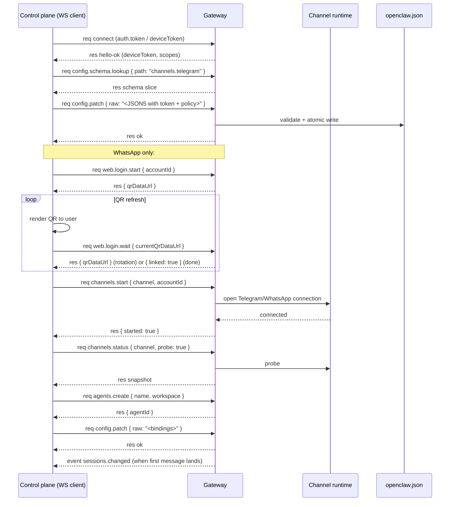

# Setting Up Channels Over WebSocket

Short answer: **Yes — almost the entire channel-setup flow runs over WS native methods**, except the inbound channel-pairing approval step (`openclaw pairing approve`), which the repo implements as a local-only CLI operation, **not** as a public WS RPC method. Everything else (token write, allowlist write, `channels.start`, the WhatsApp QR flow) is a real WS call with an exact schema in source.

Grounded in `/Users/rajendra/projects/openclaw/openclaw`:
- `docs/gateway/protocol.md` — protocol surface
- `src/gateway/methods/core-descriptors.ts` — method names + scopes (authoritative)
- `src/gateway/protocol/schema/channels.ts` — TypeBox schemas for channel/web methods
- `src/gateway/protocol/schema/config.ts` — `config.*` schemas
- `src/gateway/protocol/schema/agents-models-skills.ts` — `agents.*` schemas
- `src/gateway/server-methods/channels.ts`, `web.ts` — handler implementations
- `src/cli/pairing-cli.ts` — proves that `openclaw pairing approve` is local-only
- `docs/channels/whatsapp.md`, `docs/channels/telegram.md` — channel-specific config

Everything I quote, I read from those files. The rare gap is called out at the end.

---

## 1. The complete WS-method surface for channel setup

These method names are taken **verbatim** from `src/gateway/methods/core-descriptors.ts` (the registry the Gateway uses to enforce scopes):

| Method | Scope (server-enforced) | Purpose |
|---|---|---|
| `config.get` | `operator.read` | Read current config snapshot |
| `config.schema` | `operator.admin` | Full live config schema |
| `config.schema.lookup` | `operator.read` | Schema slice for one path (e.g. `channels.telegram`) |
| `config.patch` | `operator.admin` (controlPlaneWrite) | Merge a partial config update |
| `config.set` | `operator.admin` | Replace a config field |
| `config.apply` | `operator.admin` (controlPlaneWrite) | Validate + replace full config |
| `channels.status` | `operator.read` | Live status + audits for channels + accounts |
| `channels.start` | `operator.admin` | Start a channel/account runtime |
| `channels.stop` | `operator.admin` | Stop a channel/account runtime |
| `channels.logout` | `operator.admin` | Clear a channel/account's stored auth |
| `web.login.start` | `operator.admin` (not advertised) | Start a QR/web login flow (used by WhatsApp) |
| `web.login.wait` | `operator.admin` (not advertised) | Wait for the QR flow to complete |
| `agents.list` / `agents.create` / `agents.update` / `agents.delete` | `operator.read` / `operator.admin` | Manage per-persona agents |
| `device.pair.list` / `device.pair.approve` / `device.pair.reject` / `device.pair.remove` | `operator.pairing` | Pair the **operator/node WS client**, not channel senders |

> Note: `web.login.start` and `web.login.wait` are real handlers but flagged `advertise: false` in `core-descriptors.ts`, meaning they don't appear in `hello-ok.features.methods`. They are callable; they're just not in the discovery list.

The WS frame for any of these is the standard envelope from `docs/gateway/protocol.md`:

```json
{ "type":"req", "id":"<uuid>", "method":"<name>", "params": { ... } }
```

Auth follows the same rules as every other WS call: `connect` with `auth.token` (or device token), get `hello-ok`, then send the request.

---

## 2. The exact param schemas (from source)

These are pulled directly from `src/gateway/protocol/schema/channels.ts` and `config.ts`. The TypeBox definitions are the contract — anything else is wrong.

### `channels.status`
```ts
{
  probe?:      boolean,
  timeoutMs?:  integer (>=0),
  channel?:    string  // non-empty; filter to one channel
}
```
Result includes `channelOrder`, `channelLabels`, `channels`, `channelAccounts` (per-account snapshot with `connected`, `linked`, `running`, `dmPolicy`, `allowFrom`, `lastInboundAt`, `lastError`, etc.), `channelDefaultAccountId`, optional `eventLoop`, `partial`, `warnings`.

### `channels.start`
```ts
{
  channel:    string,        // required, non-empty
  accountId?: string         // omit for default account
}
```
Result: `{ channel, accountId, started: boolean }`.

### `channels.stop`
```ts
{ channel: string, accountId?: string }
```

### `channels.logout`
```ts
{ channel: string, accountId?: string }
```
Clears stored auth for that channel/account.

### `web.login.start` (WhatsApp QR flow)
```ts
{
  force?:     boolean,
  timeoutMs?: integer (>=0),
  verbose?:   boolean,
  accountId?: string
}
```

### `web.login.wait`
```ts
{
  timeoutMs?:        integer (>=0),
  accountId?:        string,
  currentQrDataUrl?: string  // "data:image/png;base64,..." up to 16384 chars
}
```
The Gateway emits a fresh QR data URL inside the wait response — you display it, the user scans it, then the wait resolves.

### `config.get`
```ts
{}  // no params
```

### `config.patch` (and `config.apply` — same shape)
```ts
{
  raw:              string,     // required, non-empty (JSON5 patch text)
  baseHash?:        string,
  sessionKey?:      string,
  deliveryContext?: { ... },
  note?:            string,
  restartDelayMs?:  integer (>=0)
}
```
**Important from source:** `raw` is a string (JSON5 patch text), not a structured object. Pass `JSON.stringify(yourPatch)` or write the JSON5 directly.

### `config.set`
```ts
{
  raw:       string,
  baseHash?: string
}
```

### `config.schema.lookup`
```ts
{ path: string  /* like "channels.telegram" */ }
```

### `agents.create`
```ts
{
  name:       string,    // required, non-empty
  workspace:  string,    // required, non-empty
  model?:     string,
  emoji?:     string,
  avatar?:    string
}
```
Result: `{ ok: true, agentId, name, workspace, model? }`.

### `agents.update`
```ts
{
  agentId:    string,    // required
  name?:      string,
  workspace?: string,
  model?:     string,
  emoji?:     string,
  avatar?:    string
}
```

### `agents.delete`
```ts
{ agentId: string, deleteFiles?: boolean }
```
Result: `{ ok: true, agentId, removedBindings: number }`.

### `agents.list`
```ts
{}  // no params
```
Result: `{ defaultId, mainKey, scope: "per-sender"|"global", agents: [...] }`.

---

## 3. End-to-end Telegram setup over WebSocket

Telegram is the easy case: no QR flow, just a bot token in config.

```typescript
import { OpenClaw } from "@openclaw/sdk";

const oc = new OpenClaw({
  url: "ws://127.0.0.1:18789",
  token: process.env.OPENCLAW_GATEWAY_TOKEN,
});
await oc.connect();

// 1) Discover schema if you want to validate locally first
const schema = await oc.rawRequest("config.schema.lookup",
  { path: "channels.telegram" });

// 2) Read current config (returns full snapshot)
const current = await oc.rawRequest("config.get", {});

// 3) Patch in token + DM policy + group rule
//    NOTE: `raw` is a JSON5 STRING, not an object
const patch = JSON.stringify({
  channels: {
    telegram: {
      enabled: true,
      botToken: "123456:ABC-DEF...",        // from BotFather
      dmPolicy: "pairing",                  // or "allowlist"
      allowFrom: ["8734062810"],            // numeric Telegram user id
      groupPolicy: "allowlist",
      groups: { "*": { requireMention: true } },
    },
  },
});
await oc.rawRequest("config.patch", { raw: patch });

// 4) Start the Telegram runtime
await oc.rawRequest("channels.start", { channel: "telegram" });

// 5) Verify with a live probe
const status = await oc.rawRequest("channels.status",
  { channel: "telegram", probe: true, timeoutMs: 5000 });
console.log(status.channelAccounts.telegram);
// → [{ accountId: "default", linked: true, connected: true, dmPolicy: "pairing", ... }]
```

That's the entire setup over WS — no plugin, no admin-http-rpc, no CLI.

### Multi-account Telegram (one bot per persona)

```typescript
const patch = JSON.stringify({
  channels: {
    telegram: {
      defaultAccount: "default",
      accounts: {
        default: {
          botToken: "123:ABC...",
          dmPolicy: "pairing",
        },
        alerts: {
          botToken: "987:XYZ...",
          dmPolicy: "allowlist",
          allowFrom: ["tg:123456789"],
        },
      },
    },
  },
  bindings: [
    { agentId: "main",  match: { channel: "telegram", accountId: "default" } },
    { agentId: "alert", match: { channel: "telegram", accountId: "alerts" } },
  ],
});
await oc.rawRequest("config.patch", { raw: patch });

// Start both accounts
await oc.rawRequest("channels.start",
  { channel: "telegram", accountId: "default" });
await oc.rawRequest("channels.start",
  { channel: "telegram", accountId: "alerts" });
```

---

## 4. End-to-end WhatsApp setup over WebSocket

WhatsApp is the interesting case — it has the QR flow, so two extra WS methods come in: `web.login.start` and `web.login.wait`.

> Prerequisite: the WhatsApp runtime ships as the external plugin `@openclaw/whatsapp`. From `docs/channels/whatsapp.md`: *"Onboarding and `openclaw channels add --channel whatsapp` prompt to install the WhatsApp plugin the first time."* If the plugin is not installed yet, the channel methods will report it as unavailable. Installing the plugin from a remote control plane is a separate path (the `skills`/`plugins` family) — see "Gaps" at the bottom.

```typescript
// 0) Make sure the @openclaw/whatsapp plugin is installed on the Gateway host.
//    (Local install or skills/plugins.install RPC — outside this doc's scope.)

// 1) Write the WhatsApp access policy
const patch = JSON.stringify({
  channels: {
    whatsapp: {
      dmPolicy: "allowlist",
      allowFrom: ["+15551234567"],
      groupPolicy: "allowlist",
      groupAllowFrom: ["+15551234567"],
    },
  },
});
await oc.rawRequest("config.patch", { raw: patch });

// 2) Start the QR login flow
const loginStart = await oc.rawRequest("web.login.start", {
  accountId: "default",     // omit for default
  force: false,
  verbose: false,
  timeoutMs: 60000,
});
// `loginStart` typically includes the initial state + a `currentQrDataUrl`
// the operator must display to the user (the data URL is a PNG of the QR code).

// 3) Display the QR to the user (web app, mobile push, whatever your control
//    plane does), then wait for them to scan it
const result = await oc.rawRequest("web.login.wait", {
  accountId: "default",
  timeoutMs: 120000,
  // Pass the current QR data URL back so the server can rotate/refresh it
  currentQrDataUrl: loginStart.qrDataUrl,
});
// On success, `result` reports linked state. On a refresh, you'll get a new
// `qrDataUrl` and should call `web.login.wait` again with the new value.

// 4) Start the WhatsApp runtime for that account
await oc.rawRequest("channels.start", {
  channel: "whatsapp",
  accountId: "default",
});

// 5) Verify
const status = await oc.rawRequest("channels.status", {
  channel: "whatsapp",
  probe: true,
});
```

### QR rotation pattern

WhatsApp Web QR codes expire every ~20 seconds. The protocol handles this by:
- `web.login.start` returns the first `currentQrDataUrl`.
- You display it; the user has a short window to scan.
- If the QR rotates, `web.login.wait` resolves early with the new `currentQrDataUrl` (no scan yet).
- Loop: display new QR → call `web.login.wait` again with `currentQrDataUrl: <latest>`.
- When the scan succeeds, `web.login.wait` returns the linked state.

The `currentQrDataUrl` schema (`pattern: "^data:image/png;base64,"`, `maxLength: 16384`) confirms it's a self-contained PNG you can render in any UI.

### Multi-number WhatsApp

```typescript
// Provision two accounts
await oc.rawRequest("config.patch", {
  raw: JSON.stringify({
    channels: {
      whatsapp: {
        accounts: {
          personal: {},
          biz: {},
        },
      },
    },
    bindings: [
      { agentId: "home", match: { channel: "whatsapp", accountId: "personal" } },
      { agentId: "work", match: { channel: "whatsapp", accountId: "biz" } },
    ],
  }),
});

// Pair personal number
const p1 = await oc.rawRequest("web.login.start", { accountId: "personal" });
// ...display QR, wait...
await oc.rawRequest("web.login.wait", {
  accountId: "personal", currentQrDataUrl: p1.qrDataUrl,
});
await oc.rawRequest("channels.start",
  { channel: "whatsapp", accountId: "personal" });

// Pair biz number (separate phone)
const p2 = await oc.rawRequest("web.login.start", { accountId: "biz" });
// ...display QR, wait...
await oc.rawRequest("web.login.wait", {
  accountId: "biz", currentQrDataUrl: p2.qrDataUrl,
});
await oc.rawRequest("channels.start",
  { channel: "whatsapp", accountId: "biz" });
```

---

## 5. The agent-binding piece (same WS surface)

Channels by themselves only route messages to the **default** agent. To route specific channels/accounts/peers to specific agents, you write `bindings` via `config.patch` and create agents with `agents.create`.

```typescript
// Create a second isolated agent
await oc.rawRequest("agents.create", {
  name: "work",
  workspace: "~/.openclaw/workspace-work",
  model: "anthropic/claude-sonnet-4-6",
});

// Tell the router that work-account Telegram routes to it
await oc.rawRequest("config.patch", {
  raw: JSON.stringify({
    bindings: [
      { agentId: "work",
        match: { channel: "telegram", accountId: "alerts" } },
    ],
  }),
});

// List to confirm
const agents = await oc.rawRequest("agents.list", {});
```

---

## 6. The channel sender pairing gap (honest finding)

The `openclaw pairing approve telegram <CODE>` CLI command — the thing that approves an unknown WhatsApp/Telegram DM sender into your bot — is **not a public WS RPC method** in the repo today.

Evidence from source:
- `src/cli/pairing-cli.ts` line 184 calls `approveChannelPairingCode({ channel, code, accountId? })` directly. That's a local function on the gateway host, not a `gatewayClient.request("...")` call.
- `src/gateway/methods/core-descriptors.ts` lists `device.pair.list/approve/reject/remove` — but those are for the **WS device pairing** flow (paired operator/node clients), not channel-sender DM pairing.
- I grepped the protocol schema and method registry for `pairing.approve`, `pairing.list` at the **channel** level and found no public RPC. They exist as CLI/local-store operations only.

What this means for a remote control plane that wants to drive channel setup over WS:
1. You can fully configure channels, start them, drive WhatsApp QR pairing, and create agents/bindings over WS.
2. You **cannot** approve a pending **inbound sender pairing request** over WS in the public protocol.

The workaround is simple and matches what the docs already recommend for multi-user setups:

**Skip pairing entirely and use explicit `allowlist` mode.**

```typescript
await oc.rawRequest("config.patch", {
  raw: JSON.stringify({
    channels: {
      telegram: {
        dmPolicy: "allowlist",        // not "pairing"
        allowFrom: ["8734062810"],    // approve up-front
      },
      whatsapp: {
        dmPolicy: "allowlist",
        allowFrom: ["+15551234567"],
      },
    },
  }),
});
```

Adding/removing senders is then just another `config.patch` call, which is fully WS-driven. This is the same pattern `docs/channels/telegram.md` recommends for "one-owner bots":

> *"For one-owner bots, prefer `dmPolicy: \"allowlist\"` with explicit numeric `allowFrom` IDs to keep access policy durable in config (instead of depending on previous pairing approvals)."*

If you genuinely need the on-demand pairing UX over WS, the options are:
- SSH to the Gateway host and run `openclaw pairing approve <channel> <code>`.
- Build a custom plugin that wraps `approveChannelPairingCode` with `api.registerGatewayMethod(...)` and exposes it as a new WS method.

---

## 7. The full WS workflow as a Mermaid sequence



---

## 8. The raw-WS pattern (no SDK)

For a non-Node control plane (Python, Go, whatever), the wire is identical:

```python
# After connect/hello-ok (see openclaw-gateway-websocket-setup.md)
async def rpc(method, params):
    rid = str(uuid.uuid4())
    await ws.send(json.dumps(
        {"type": "req", "id": rid, "method": method, "params": params}))
    while True:
        f = json.loads(await ws.recv())
        if f.get("type") == "res" and f.get("id") == rid:
            if not f["ok"]: raise RuntimeError(f["error"])
            return f["payload"]

# Telegram bot in 4 calls
await rpc("config.patch", {
    "raw": json.dumps({
        "channels": {"telegram": {
            "enabled": True,
            "botToken": "123:ABC...",
            "dmPolicy": "allowlist",
            "allowFrom": ["8734062810"]
        }}
    })
})
await rpc("channels.start", {"channel": "telegram"})
print(await rpc("channels.status", {"channel": "telegram", "probe": True}))
```

---

## 9. What the docs explicitly say about scope and safety

Straight from `core-descriptors.ts`:

- `channels.{start, stop, logout}` and `config.{set, patch, apply, schema}` all require `operator.admin`.
- `config.patch` and `config.apply` are marked `controlPlaneWrite: true` — they go through the same validation path used by the live config reload.
- `web.login.{start, wait}` are `operator.admin` and `advertise: false` (callable, not in discovery list).
- `channels.status` is `operator.read` — read-only, safe for monitoring clients.

From `docs/gateway/protocol.md`:

- After config writes, the Gateway swaps the in-memory snapshot atomically (`hybrid` reload mode by default), so `channels.start` immediately sees the new config.
- Reserved core admin prefixes (`config.*`, `exec.approvals.*`, `wizard.*`, `update.*`) **always** resolve to `operator.admin` even if a plugin tries to widen them.

---

## 10. Source map

| Question | File |
|---|---|
| What methods are exposed? | `src/gateway/methods/core-descriptors.ts` |
| Exact param schemas? | `src/gateway/protocol/schema/channels.ts`, `config.ts`, `agents-models-skills.ts` |
| Handler implementations? | `src/gateway/server-methods/channels.ts`, `web.ts`, `config.ts`, `agents.ts` |
| Is channel-sender pairing a WS RPC? | `src/cli/pairing-cli.ts` shows it's local-only |
| Channel reference docs | `docs/channels/whatsapp.md`, `docs/channels/telegram.md` |
| Routing model | `docs/channels/channel-routing.md` |
| Protocol contract | `docs/gateway/protocol.md` |
| SDK helpers | `docs/concepts/openclaw-sdk.md` |

---

## 11. The one-paragraph summary

You can run essentially the entire channel-setup flow over native WebSocket: connect with operator-admin scope, call `config.patch` (params: `{ raw: "<JSON5 string>" }`) to write `channels.<name>` config (token, accounts, policies, bindings), call `channels.start` to bring the runtime up, optionally `channels.status` with `probe: true` to confirm linked + connected. WhatsApp adds a two-call QR loop — `web.login.start` returns a `data:image/png;base64,...` QR code; you display it and call `web.login.wait` (passing `currentQrDataUrl` so the Gateway can rotate it) until the link completes. Multi-agent setup uses the same surface: `agents.create` + another `config.patch` for `bindings`. The one piece that isn't a public WS method is approving an inbound DM sender via the legacy `openclaw pairing approve` CLI (`src/cli/pairing-cli.ts` calls a local function directly). Workaround that matches the project's own recommendation: skip pairing mode and use `dmPolicy: "allowlist"` with explicit `allowFrom` — fully WS-driven.
