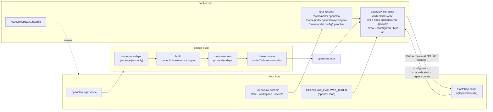

# OpenClaw in Docker — Build Locally, Run Unconfigured

A detailed runbook for: **clone the repo → build the image locally → run the Gateway in a container with `--allow-unconfigured` → configure it from outside over WebSocket**.

Grounded in the actual files in `/Users/rajendra/projects/openclaw/openclaw`:

- `Dockerfile` (325 lines, multi-stage)
- `docker-compose.yml` (128 lines, two services: `openclaw-gateway` + `openclaw-cli`)
- `docs/install/docker.md` (562 lines)
- `scripts/docker/setup.sh` (orchestrator; you don't need it for this flow)
- `src/cli/gateway-run-argv.ts` — confirms `--allow-unconfigured` is a real flag

Everything here comes from those files. Build-arg names, env-var names, port numbers, mount paths, healthcheck URLs — all taken straight from source.

---

## 1. Prerequisites

From `docs/install/docker.md`:

- **Docker Engine** (or Docker Desktop) + **Docker Compose v2**
- **At least 2 GB RAM** for the build (*"`pnpm install` may be OOM-killed on 1 GB hosts with exit 137"*)
- Disk space for the image (~1.5–2 GB) and logs
- Optional: BuildKit enabled (default on modern Docker) — the Dockerfile uses `--mount=type=cache` heavily

Check:
```bash
docker --version           # 20.10+ recommended
docker compose version     # v2.x
docker buildx version
```

---

## 2. Clone the repo

```bash
git clone https://github.com/openclaw/openclaw.git
cd openclaw
```

The Dockerfile at the root is the build descriptor. The image is published officially as `ghcr.io/openclaw/openclaw:<tag>`, but we're building locally.

---

## 3. Understand what the Dockerfile produces

From the Dockerfile header:

> *"Multi-stage build produces a minimal runtime image without build tools, source code, or Bun. Works with Docker, Buildx, and Podman."*

Stages (from the file):

1. **`workspace-deps`** — copies just the `package.json` files for workspace packages and selected `extensions/*`, so unrelated source changes don't bust the dependency cache.
2. **`bun-binary`** — pulls a pinned Bun binary from `oven/bun:1.3.13` for use during build.
3. **`build`** — `node:24-bookworm` (full), `pnpm install --frozen-lockfile`, builds dist + UI + a2ui + qa-lab.
4. **`runtime-assets`** — prunes dev deps, strips `.d.ts` / `.map` files, runs `prune-docker-plugin-dist.mjs`.
5. **`base-runtime` / runtime** — `node:24-bookworm-slim`, copies in `dist/`, `node_modules/`, `extensions/`, `skills/`, etc. as user `node` (uid 1000).

Final image:

| Detail | Value |
|---|---|
| Base runtime | `node:24-bookworm-slim` |
| User | `node` (uid 1000) |
| Workdir | `/app` |
| `openclaw` symlink | `/usr/local/bin/openclaw` → `/app/openclaw.mjs` |
| Default ENTRYPOINT | `tini -s --` |
| Default CMD | `node openclaw.mjs gateway` |
| Healthcheck | `fetch('http://127.0.0.1:18789/healthz')` |
| Pre-created volume mount points | `/home/node/.openclaw`, `/home/node/.openclaw/workspace`, `/home/node/.config/openclaw` (all `node:node 700/755`) |

> Important — **the default CMD does not include `--allow-unconfigured`**. We override it at `docker run` time below.

---

## 4. Pick your build args (optional)

The Dockerfile exposes these `--build-arg`s (all documented in the file itself):

| Build arg | Purpose | Default |
|---|---|---|
| `OPENCLAW_EXTENSIONS` | Space/comma-separated bundled extension dirs to include (e.g. `"matrix,diagnostics-otel"`) | empty |
| `OPENCLAW_BUNDLED_PLUGIN_DIR` | Where the extensions live | `extensions` |
| `OPENCLAW_IMAGE_APT_PACKAGES` | Extra apt packages your skills need (e.g. `"python3 wget"`) | empty |
| `OPENCLAW_IMAGE_PIP_PACKAGES` | Extra pip packages for your skills | empty |
| `OPENCLAW_INSTALL_BROWSER` | Set to `1` to bundle Chromium + Xvfb (~300 MB but skips runtime install) | empty |
| `OPENCLAW_INSTALL_DOCKER_CLI` | Set to `1` for Docker CLI inside the image — required for `agents.defaults.sandbox` | empty |
| `OPENCLAW_NODE_BOOKWORM_IMAGE` / `_SLIM_IMAGE` | Pinned base image digests | as in file |
| `OPENCLAW_BUN_IMAGE` | Pinned Bun image digest | as in file |

You can ignore all of them for a plain build. The most common opt-ins are `OPENCLAW_INSTALL_BROWSER=1` and `OPENCLAW_INSTALL_DOCKER_CLI=1`.

---

## 5. Build the image

### 5.1 Minimal build

```bash
# from the repo root
DOCKER_BUILDKIT=1 docker build \
  -t openclaw:local \
  .
```

This takes ~10–20 minutes on a first build (pnpm install + UI build + a2ui + qa-lab). Subsequent builds with the same lockfile reuse cached layers and complete in 2–5 minutes.

### 5.2 Build with browser bundled (recommended if you'll use the browser tool)

```bash
DOCKER_BUILDKIT=1 docker build \
  --build-arg OPENCLAW_INSTALL_BROWSER=1 \
  -t openclaw:local \
  .
```

### 5.3 Build with extra apt packages and an extension

```bash
DOCKER_BUILDKIT=1 docker build \
  --build-arg OPENCLAW_EXTENSIONS="matrix diagnostics-otel" \
  --build-arg OPENCLAW_IMAGE_APT_PACKAGES="python3 wget ripgrep" \
  -t openclaw:local \
  .
```

### 5.4 Build with the Docker CLI for sandboxing

```bash
DOCKER_BUILDKIT=1 docker build \
  --build-arg OPENCLAW_INSTALL_DOCKER_CLI=1 \
  -t openclaw:local \
  .
```

> Note from the Dockerfile: *"Only the CLI is installed — no Docker daemon. Required for `agents.defaults.sandbox` to function in Docker deployments."*

### 5.5 Verify the image

```bash
docker images openclaw:local
docker run --rm openclaw:local node openclaw.mjs --version
```

---

## 6. Prepare host directories and a token

The compose file mounts three host directories. Pre-create them so Docker doesn't make them root-owned:

```bash
mkdir -p ~/openclaw-docker/state
mkdir -p ~/openclaw-docker/workspace
mkdir -p ~/openclaw-docker/auth-profile-secrets
# The image runs as uid 1000 (node user). Fix ownership if your uid differs.
sudo chown -R 1000:1000 ~/openclaw-docker
```

Generate a token (required for non-loopback bind, which we'll use because of the loopback caveat below):

```bash
export OPENCLAW_GATEWAY_TOKEN="$(openssl rand -hex 32)"
echo "Save this: $OPENCLAW_GATEWAY_TOKEN"
```

---

## 7. The loopback-vs-bridge gotcha (read this before running)

Directly from the Dockerfile comments:

> *"With Docker bridge networking (`-p 18789:18789`), loopback bind makes the gateway unreachable from the host. Either:*
>   - *Use `--network host`, OR*
>   - *Override `--bind` to `"lan"` (0.0.0.0) and set auth credentials"*

So your two choices:

| Option | Bind | Network | Why |
|---|---|---|---|
| A (recommended for dev) | default loopback | `--network host` | Container shares host network; loopback is reachable from host |
| B (recommended for prod / Docker Desktop) | `--bind lan` | bridge (`-p 18789:18789`) | Container binds 0.0.0.0; port-map exposes it; **token mandatory** |

We'll use **Option B** because (a) `--network host` doesn't work on Docker Desktop / Mac, and (b) it's the same shape `docker-compose.yml` ships with (`OPENCLAW_GATEWAY_BIND:-lan`).

---

## 8. Run the container with `--allow-unconfigured`

This is the centerpiece. We override the default CMD to inject `--allow-unconfigured`, `--bind lan`, and the token.

```bash
docker run -d \
  --name openclaw \
  --restart unless-stopped \
  --init \
  --cap-drop NET_RAW --cap-drop NET_ADMIN \
  --security-opt no-new-privileges:true \
  --add-host host.docker.internal:host-gateway \
  -e HOME=/home/node \
  -e OPENCLAW_HOME=/home/node \
  -e OPENCLAW_STATE_DIR=/home/node/.openclaw \
  -e OPENCLAW_CONFIG_PATH=/home/node/.openclaw/openclaw.json \
  -e OPENCLAW_CONFIG_DIR=/home/node/.openclaw \
  -e OPENCLAW_WORKSPACE_DIR=/home/node/.openclaw/workspace \
  -e OPENCLAW_GATEWAY_TOKEN="$OPENCLAW_GATEWAY_TOKEN" \
  -e TZ=UTC \
  -v ~/openclaw-docker/state:/home/node/.openclaw \
  -v ~/openclaw-docker/workspace:/home/node/.openclaw/workspace \
  -v ~/openclaw-docker/auth-profile-secrets:/home/node/.config/openclaw \
  -p 127.0.0.1:18789:18789 \
  openclaw:local \
  node openclaw.mjs gateway \
    --allow-unconfigured \
    --bind lan \
    --port 18789
```

Why each piece (all from `Dockerfile` / `docker-compose.yml`):

| Piece | Source |
|---|---|
| `--init` | Compose has `init: true`; equivalent of relying on tini-as-PID-1 |
| `--cap-drop NET_RAW NET_ADMIN`, `--security-opt no-new-privileges:true` | Compose drops these capabilities |
| `--add-host host.docker.internal:host-gateway` | Compose includes this for local LM Studio/Ollama reach |
| `OPENCLAW_STATE_DIR`, `OPENCLAW_CONFIG_PATH`, `OPENCLAW_CONFIG_DIR`, `OPENCLAW_WORKSPACE_DIR` | Compose pins these to prevent host paths leaking via `.env` (issue #77436) |
| `OPENCLAW_GATEWAY_TOKEN` | Required when `--bind lan`; from compose env block |
| Three volume mounts | Same three the compose file uses |
| `-p 127.0.0.1:18789:18789` | Maps the container port to host loopback so only the host can reach it |
| `--allow-unconfigured` | Tells the Gateway to start without an existing `openclaw.json` |
| `--bind lan` | Required because we used `-p` instead of `--network host` |
| `--port 18789` | Default Gateway port |

> Bind to `0.0.0.0:18789:18789` only if you want the container reachable from your LAN — and only with the token in place. The doc warns explicitly about exposure: *"If running on a VPS/public host, review Security hardening for network exposure."*

### Logs and status

```bash
docker logs -f openclaw                      # follow the gateway logs
docker inspect --format='{{json .State.Health}}' openclaw | jq
curl -fsS http://127.0.0.1:18789/healthz     # built-in liveness probe
curl -fsS http://127.0.0.1:18789/readyz      # built-in readiness probe
```

The built-in probes come straight from the Dockerfile's `HEALTHCHECK` line and `docs/install/docker.md` lines 202–203.

### Stop / restart / remove

```bash
docker stop openclaw
docker start openclaw
docker rm -f openclaw
```

State persists because of the bind-mount on `~/openclaw-docker/state`.

---

## 9. Alternative: Docker Compose

The repo ships a `docker-compose.yml`. We override the command to add `--allow-unconfigured`:

```bash
# Write the .env compose reads
cat > .env <<EOF
OPENCLAW_GATEWAY_TOKEN=$OPENCLAW_GATEWAY_TOKEN
OPENCLAW_CONFIG_DIR=$HOME/openclaw-docker/state
OPENCLAW_WORKSPACE_DIR=$HOME/openclaw-docker/workspace
OPENCLAW_AUTH_PROFILE_SECRET_DIR=$HOME/openclaw-docker/auth-profile-secrets
OPENCLAW_GATEWAY_BIND=lan
OPENCLAW_GATEWAY_PORT=18789
OPENCLAW_IMAGE=openclaw:local
EOF
```

Create a compose override that injects `--allow-unconfigured`:

```yaml
# docker-compose.override.yml
services:
  openclaw-gateway:
    command:
      [
        "node",
        "dist/index.js",
        "gateway",
        "--allow-unconfigured",
        "--bind",
        "${OPENCLAW_GATEWAY_BIND:-lan}",
        "--port",
        "18789",
      ]
```

Then:

```bash
docker compose up -d openclaw-gateway
docker compose ps
docker compose logs -f openclaw-gateway
```

The compose file ships **two** services. The second one — `openclaw-cli` — shares the gateway's network namespace and is for running `openclaw …` commands against the live container. We're driving setup over WS from outside, so we don't need it for this flow.

---

## 10. Configure end-to-end over WebSocket from the host

The Gateway is up at `ws://127.0.0.1:18789`. Everything from the gateway-websocket / bootstrap docs in this folder applies directly — Docker is just the runtime.

Minimal Node bootstrap from outside the container:

```typescript
// bootstrap.ts (runs on your host, not in the container)
import { OpenClaw } from "@openclaw/sdk";

const oc = new OpenClaw({
  url: "ws://127.0.0.1:18789",
  token: process.env.OPENCLAW_GATEWAY_TOKEN!,
});
await oc.connect();

console.log("health:", await oc.rawRequest("health", {}));

// 1) Provider key + default model
await oc.rawRequest("config.patch", {
  raw: JSON.stringify({
    models: {
      providers: {
        anthropic: { apiKey: process.env.ANTHROPIC_API_KEY! },
      },
    },
    agents: {
      defaults: {
        workspace: "/home/node/.openclaw/workspace",   // <-- container path
        model:     "anthropic/claude-sonnet-4-6",
      },
    },
    session: { dmScope: "per-channel-peer" },
  }),
});

// 2) Telegram channel
await oc.rawRequest("config.patch", {
  raw: JSON.stringify({
    channels: { telegram: {
      enabled:    true,
      botToken:   process.env.TELEGRAM_BOT_TOKEN!,
      dmPolicy:   "allowlist",
      allowFrom:  [process.env.TELEGRAM_USER_ID!],
      groupPolicy:"allowlist",
    }}
  }),
});
await oc.rawRequest("channels.start", { channel: "telegram" });

console.log("status:",
  await oc.rawRequest("channels.status",
    { channel: "telegram", probe: true, timeoutMs: 5000 }));
```

Run it:

```bash
OPENCLAW_GATEWAY_TOKEN=... \
ANTHROPIC_API_KEY=sk-ant-... \
TELEGRAM_BOT_TOKEN=... \
TELEGRAM_USER_ID=... \
node --loader ts-node/esm bootstrap.ts
```

**Critical:** when you write paths like `workspace` in `config.patch`, use the **container's** filesystem (`/home/node/.openclaw/workspace`), not your host paths. The bind-mount means those map back to `~/openclaw-docker/workspace` on the host, but the Gateway sees them as the container path.

For the WhatsApp QR loop, MS Teams credentials, multi-agent bindings, etc., see the companion docs:
- `openclaw-channels-via-websocket.md`
- `openclaw-msteams-websocket-setup.md`
- `openclaw-ubuntu-daemon-websocket-bootstrap.md`

The method names and shapes are identical — container or no container.

---

## 11. Optional: run a CLI session inside the container

If you want to poke at the live Gateway with the CLI (status checks, doctor, agent runs), use the second compose service or `docker exec`:

```bash
# via compose
docker compose run --rm openclaw-cli status
docker compose run --rm openclaw-cli channels status

# via docker exec on the running container
docker exec -it openclaw openclaw status
docker exec -it openclaw openclaw doctor
docker exec -it openclaw openclaw logs --follow
```

The CLI talks WS to the same Gateway via `127.0.0.1:18789` inside the container. It reads `OPENCLAW_GATEWAY_TOKEN` from env, which compose already populates.

---

## 12. Verify everything

```bash
# 1) Container is healthy
docker ps --filter name=openclaw --format 'table {{.Names}}\t{{.Status}}'
docker inspect --format='{{json .State.Health}}' openclaw | jq

# 2) HTTP probes succeed
curl -fsS http://127.0.0.1:18789/healthz   # → 200 "ok"
curl -fsS http://127.0.0.1:18789/readyz

# 3) Gateway accepts authenticated WS calls
#    (use the bootstrap.ts above, OR enable admin-http-rpc plugin then:)
curl -sS http://127.0.0.1:18789/api/v1/admin/rpc \
  -H "Authorization: Bearer $OPENCLAW_GATEWAY_TOKEN" \
  -H 'Content-Type: application/json' \
  -d '{"method":"health","params":{}}'
# (returns 404 until admin-http-rpc plugin is enabled — expected)

# 4) Channel came up
docker exec openclaw openclaw channels status
```

---

## 13. Tearing down

```bash
docker rm -f openclaw

# State persists on the host. Wipe it if you want a clean slate:
rm -rf ~/openclaw-docker
```

Or with compose:

```bash
docker compose down            # keep volumes
docker compose down -v         # if you used named volumes (we used bind mounts so this doesn't apply)
```

---

## 14. Common build / run failures

| Symptom | Cause | Fix |
|---|---|---|
| `pnpm install` killed (exit 137) | Docker engine ran out of RAM (doc says ≥ 2 GB needed) | Increase Docker memory limit / use bigger host |
| `error setting certificate file` on outbound HTTPS | Stripped-down `node:24-bookworm-slim` without `ca-certificates` | Already handled in the Dockerfile — but if you remove the runtime apt step, you'll hit this |
| Gateway unreachable on `127.0.0.1:18789` | Default `--bind loopback` inside the container | Use `--bind lan` (and a token) — that's why §8 sets it |
| `refusing to bind gateway ... without auth` in logs | `--bind lan` without `OPENCLAW_GATEWAY_TOKEN` | Set the env var or fall back to `--network host` + loopback bind |
| EACCES on `/Users/...` paths after first reply | macOS host path leaked into the container via `.env` import (issue #77436) | The `OPENCLAW_STATE_DIR` / `OPENCLAW_CONFIG_*` / `OPENCLAW_WORKSPACE_DIR` overrides in §8 prevent this |
| First-run dirs owned by root | Volume mounts created by Docker before the entrypoint had a chance to chown | Pre-create host dirs and `chown 1000:1000` (§6) |
| A2UI bundle build error during build | Cross-compiling amd64 on Apple Silicon under QEMU | Dockerfile already stubs this (line 107–112); message is non-fatal |

---

## 15. Production hardening reminders (from the docs / compose file)

- `cap_drop: NET_RAW, NET_ADMIN` and `security_opt: no-new-privileges:true` are baked into the compose. Mirror them on raw `docker run` (§8 does).
- Don't publish to `0.0.0.0` unless the bearer token is strong and you're behind a reverse proxy or firewall.
- For multi-tenant deployments, **one Gateway per tenant** (separate container + separate `OPENCLAW_GATEWAY_TOKEN` + separate volumes). The bearer-token model is full-operator; there's no per-tenant scope narrowing on shared-secret auth.
- Set `gateway.reload.mode: "hybrid"` (the default) so config changes from your WS bootstrap take effect without restarting the container.
- The built-in `HEALTHCHECK` already runs every 3 minutes (Dockerfile line 322). Kubernetes / Compose orchestrators consume it automatically.

---

## 16. The full flow as a diagram



---

## 17. The one-paragraph TL;DR

Clone the repo, build with `DOCKER_BUILDKIT=1 docker build -t openclaw:local .` (optionally `--build-arg OPENCLAW_INSTALL_BROWSER=1` or `OPENCLAW_INSTALL_DOCKER_CLI=1`), generate a token (`openssl rand -hex 32`), pre-create three host directories owned by uid 1000 (`state`, `workspace`, `auth-profile-secrets`), then `docker run -d --init --cap-drop NET_RAW --cap-drop NET_ADMIN --security-opt no-new-privileges:true -e OPENCLAW_GATEWAY_TOKEN=... -e OPENCLAW_STATE_DIR=/home/node/.openclaw (+matching CONFIG_PATH/CONFIG_DIR/WORKSPACE_DIR) -v host-dirs onto /home/node/.openclaw{,/workspace} and /home/node/.config/openclaw -p 127.0.0.1:18789:18789 openclaw:local node openclaw.mjs gateway --allow-unconfigured --bind lan --port 18789`. The Gateway is now up, healthy (curl `/healthz`), and empty. Configure it with the same WS bootstrap script you'd use on a bare Ubuntu host — only `agents.defaults.workspace` needs to use the container path `/home/node/.openclaw/workspace` instead of a host path. For Compose, write a tiny `docker-compose.override.yml` that adds `--allow-unconfigured` to the gateway service's `command` array, plus an `.env` with `OPENCLAW_GATEWAY_TOKEN` and the three `OPENCLAW_*_DIR` host paths.

---

## 18. Source map

- `Dockerfile` — every build arg, stage boundary, runtime ENV, default CMD, HEALTHCHECK
- `docker-compose.yml` — the env-pinning trick (`OPENCLAW_STATE_DIR=...`), volumes, capabilities
- `docs/install/docker.md` — narrative version of the above + the `scripts/docker/setup.sh` automated path
- `docs/install/podman.md` — Podman-specific notes (same image)
- `docs/install/docker-vm-runtime.md` — sandbox runtime details
- `src/cli/gateway-run-argv.ts` — `--allow-unconfigured` flag inventory
- Companion docs in this folder:
  - `openclaw-ubuntu-daemon-websocket-bootstrap.md` — the WS bootstrap script you point at this container
  - `openclaw-gateway-websocket-setup.md` — handshake + frame model
  - `openclaw-gateway-deep-dive.md` — daemon internals
