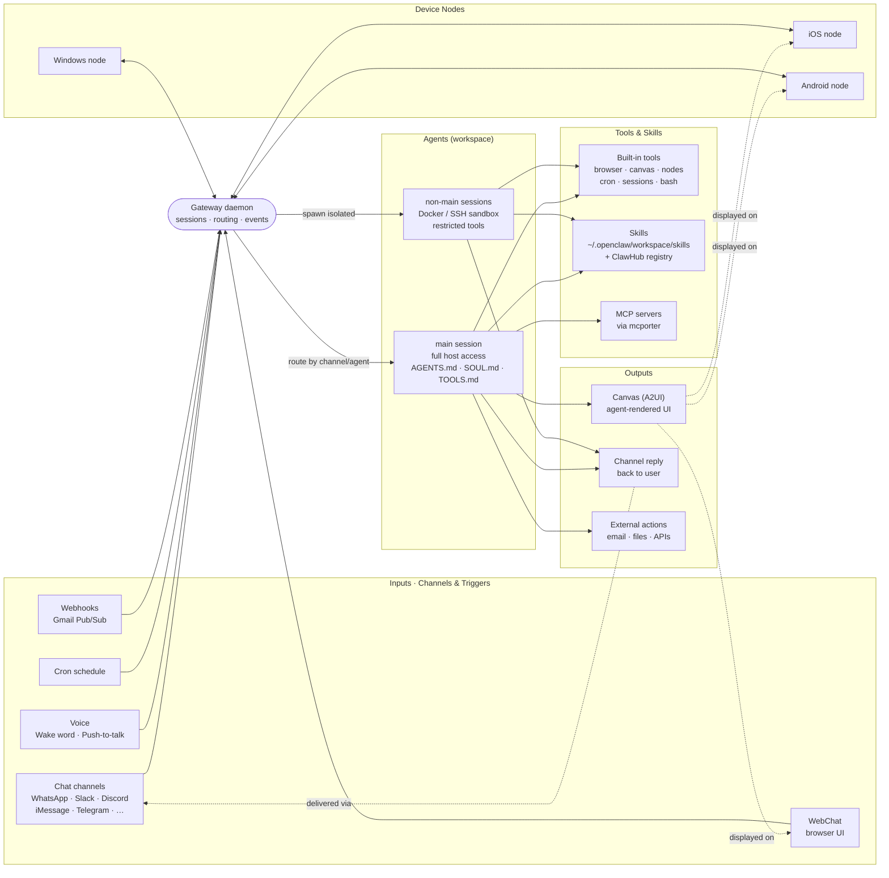

# OpenClaw — Functional Deep-Dive

A self-hosted, local-first personal AI assistant framework. You run a **Gateway** daemon on your own machine; it routes between **channels** (chat platforms, voice, web), **agents** (isolated reasoning workers), **tools/skills** (capabilities), and a **Canvas** (visual workspace).

Sources used: [openclaw/openclaw](https://github.com/openclaw/openclaw), [openclaw org repos](https://github.com/openclaw), [getopenclaw.ai blog](https://www.getopenclaw.ai/blog/openclaw-github), [awesome-claws](https://github.com/LHL3341/awesome-claws).

---

## Flow Diagram



**Read it as:** an inbound event (a message, voice trigger, cron tick, or webhook) hits the **Gateway**, which routes it to the right **agent session**. That agent uses **tools + skills** (and optional **MCP** servers) to do work, then emits output — a reply on the originating channel, an update to **Canvas**, or an external action like sending email. Device **nodes** are bidirectional: they forward inputs in and render Canvas/replies out.

---

## 1. Core Architecture

### Gateway (control plane)
- Single daemon that owns sessions, channel connections, tool execution, and event routing.
- Runs via `launchd` (macOS) or `systemd` (Linux); foreground debug via `openclaw gateway --port 18789 --verbose`.
- Default install: `openclaw onboard --install-daemon`.
- All other components — desktop app, mobile nodes, WebChat, CLI — are clients of this Gateway.

### Agents
- Isolated reasoning entities defined in a **workspace** (`~/.openclaw/workspace`).
- Behavior shaped by injected prompt files: `AGENTS.md`, `SOUL.md`, `TOOLS.md`.
- Each channel/account can route to a distinct agent — useful for separating personal vs. work vs. customer-facing personas.
- Session model maintains conversation state per agent.
- **`main` session** runs unrestricted on the host; **non-main sessions** run in a sandbox (Docker default; SSH/OpenShell alternatives).

### Channels (20+ messaging platforms)
WhatsApp, Telegram, Slack, Discord, Google Chat, Signal, iMessage, IRC, Microsoft Teams, Matrix, Feishu, LINE, Mattermost, Nextcloud Talk, Nostr, Synology Chat, Tlon, Twitch, Zalo, WeChat, QQ, WebChat.

- **DM pairing policy** (default): unknown senders must answer a verification code before the agent talks to them.
- Public channels require explicit opt-in via `allowFrom` allowlist.

### Canvas (visual workspace)
- Agent-driven UI surface with **A2UI** (AI-to-UI) — agents can render and update views.
- Available as native component on macOS and on mobile nodes.
- This is the UI surface most relevant to "public/private pages" use cases.

### Nodes (device extensions)
- **iOS node**: pairs to Gateway over WebSocket, forwards voice triggers, displays Canvas.
- **Android node**: full Connect/Chat/Voice tabs plus Camera, Screen capture, and device commands.
- **Windows node**: system tray + PowerToys integration ([openclaw-windows-node](https://github.com/openclaw/openclaw-windows-node)).

---

## 2. Installation

```bash
# Recommended
npm install -g openclaw@latest
openclaw onboard --install-daemon
```

- Runtime: Node 24 recommended; Node 22.19+ minimum.
- Dev install from source uses `pnpm` (workspace deps): `pnpm install && pnpm openclaw setup && pnpm gateway:watch`.
- Update channels: stable (`latest`), `beta`, `dev` — switch via `openclaw update --channel <name>`.

---

## 3. Features by Component

### Multi-channel inbox
Unified surface across all supported messaging platforms. Per-channel config for DM policy, allowlist, and which agent handles which channel.

### Voice
- macOS/iOS: wake-word ([Swabble](https://github.com/openclaw) on macOS) + push-to-talk overlay.
- Android: continuous voice mode with ElevenLabs TTS + system TTS fallback.
- "Talk Mode" for continuous voice conversation.

### Built-in tool families
- `browser` — web navigation/extraction
- `canvas` — drawing/visual output
- `nodes` — iOS/Android device interaction
- `cron` — scheduled automation
- `sessions` — inter-agent comms + spawning child agents
- `discord` / `slack` — native platform actions
- Plus bash, process, read, write, edit (allowed even in sandbox)

### Skills registry (ClawHub)
- [ClawHub](https://github.com/openclaw) is the plugin/skill registry (8.8k★).
- Local skills live at `~/.openclaw/workspace/skills/<skill>/SKILL.md`.
- Plugin SDK is TypeScript-based with full workspace access.

### Automation triggers
- **Cron** jobs — scheduled agent runs.
- **Webhooks** — inbound HTTP triggers.
- **Gmail Pub/Sub** — agent runs on incoming mail.

---

## 4. Configuration

Minimal `~/.openclaw/openclaw.json`:
```json
{ "agent": { "model": "<provider>/<model-id>" } }
```

Notable keys:
- `agents.defaults` — default model, sandbox, workspace path
- `agents.defaults.sandbox.mode` — `main` (unrestricted) or `non-main` (restricted)
- `channels.<platform>.dmPolicy` — `pairing` (default) or `open`
- `channels.<platform>.allowFrom` — explicit allowlist

---

## 5. CLI Quick Reference

```bash
# Gateway
openclaw gateway start | stop | status
openclaw gateway --port 18789 --verbose       # foreground debug

# Agent
openclaw agent --message "<query>" --thinking high
openclaw message send --target <id> --message "<text>"

# In-session slash commands
/status  /new  /reset  /compact
/think <level>   /verbose on|off   /trace on|off
/restart   /activation mention|always

# Pairing & nodes
openclaw pairing approve <channel> <code>
openclaw nodes …
openclaw doctor                               # audit risky config
```

---

## 6. Security Model

- `main` session = full host access (single-user assumption).
- Non-main sessions sandboxed; **denied** by default: `browser`, `canvas`, `nodes`, `cron`, Discord/Slack actions.
- `openclaw doctor` audits dangerous exposure.
- Remote access via SSH tunnel or Tailscale (not raw port exposure).

---

## 7. Ecosystem Highlights

| Project | Purpose |
|---|---|
| [clawhub](https://github.com/openclaw) | Skill + plugin registry (8.8k★) |
| [mcporter](https://github.com/openclaw) | Call MCP servers as plain TS APIs |
| [acpx](https://github.com/openclaw) | Headless Agent Client Protocol CLI |
| [Peekaboo](https://github.com/openclaw) | macOS screenshot + visual QA tool for agents |
| [gogcli](https://github.com/openclaw) | Google Workspace from terminal (7.6k★) |
| [discrawl](https://github.com/openclaw) | Discord CLI with SQLite backend |
| [clawpdf](https://github.com/openclaw) | PDFium WASM bindings |
| [remindctl](https://github.com/openclaw) | Apple Reminders CLI |
| [crabpot](https://github.com/openclaw) | Plugin compatibility testing |

Wider ecosystem ([awesome-claws](https://github.com/LHL3341/awesome-claws)) groups into: personal assistants, multi-agent "agent companies" (e.g. HiClaw, OpenCrew), coding/research agents (OpenHands, Prismer), automation (n8n), content workflows, memory systems (mem0), and channel adapters (LangBot).

---

## 8. How This Maps to the [idea.txt](idea.txt) Vision

Your sketch is:
> Daily-work assistant with public pages (AI news blog, model leaderboard) and private pages (work status, updated by home-server OpenClaw). Then resell as a multi-tenant SaaS where paid users get their own instance.

OpenClaw primitives line up cleanly:

| Your need | OpenClaw building block |
|---|---|
| "Public pages" (news blog, model board) | **Canvas** rendered via A2UI, exposed through WebChat. Cron triggers a news-fetcher agent → skill writes the post → Canvas serves it. |
| "Private work-status page" | Same Canvas, gated agent. Updates via channel messages (Slack/iMessage) or webhooks from your tools. |
| "Auto-summarize AI/GenAI news" | Cron + `browser` tool + a custom skill in `~/.openclaw/workspace/skills/`. |
| "Updatable from my home server" | Gateway runs locally; remote nodes / Tailscale tunnel let you push updates from anywhere. |
| "Spin up per-paid-user instances" | Each user = one Gateway instance + isolated workspace. Multi-tenant story = orchestrating N Gateways (containers / k8s) with per-tenant config and channel pairings. |
| "Let users create their own pages" | Build a meta-UI on top of Canvas/A2UI that lets a user describe a page; agent generates the skill + Canvas template. |

### Gaps to think about before building
1. **Multi-tenant isolation** — OpenClaw is designed single-user (`main` session = host access). A SaaS needs per-tenant Gateway processes or hardened sandbox-only mode.
2. **Public hosting** — Canvas/WebChat is designed for a single user behind a tunnel. Public pages mean a separate read-only renderer that pulls from Canvas state.
3. **Billing / auth** — not in scope for OpenClaw; needs a wrapper service (auth → provisioning → quota).
4. **Cost model** — each tenant runs their own LLM calls; pricing must cover that.
5. **Update channel** — pin to `stable` per tenant; auto-update is risky for paying customers.

### Suggested next probes
- Read the actual `AGENTS.md` / `SOUL.md` / `TOOLS.md` schema in the repo to scope a custom skill.
- Look at ClawHub for an existing "blog publisher" or "news digest" skill before building one.
- Prototype: one local Gateway + one custom skill that writes a Markdown blog post on a cron, rendered via Canvas. Validate the loop before designing the SaaS layer.
