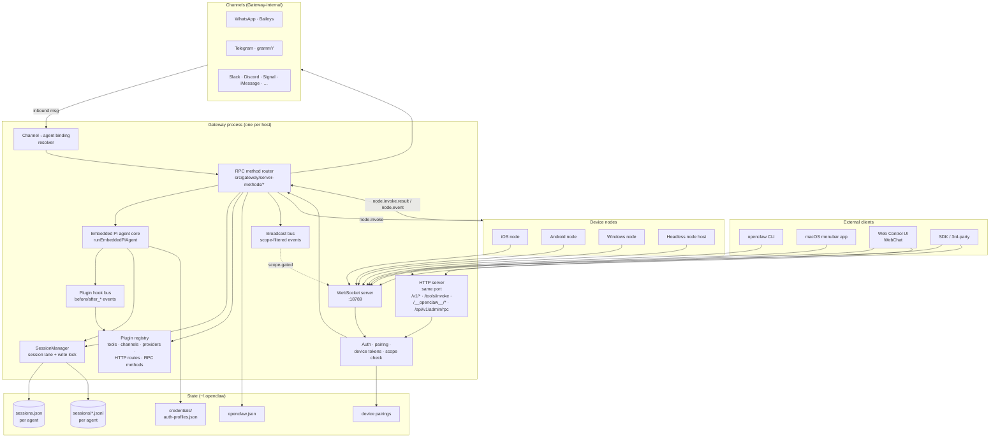
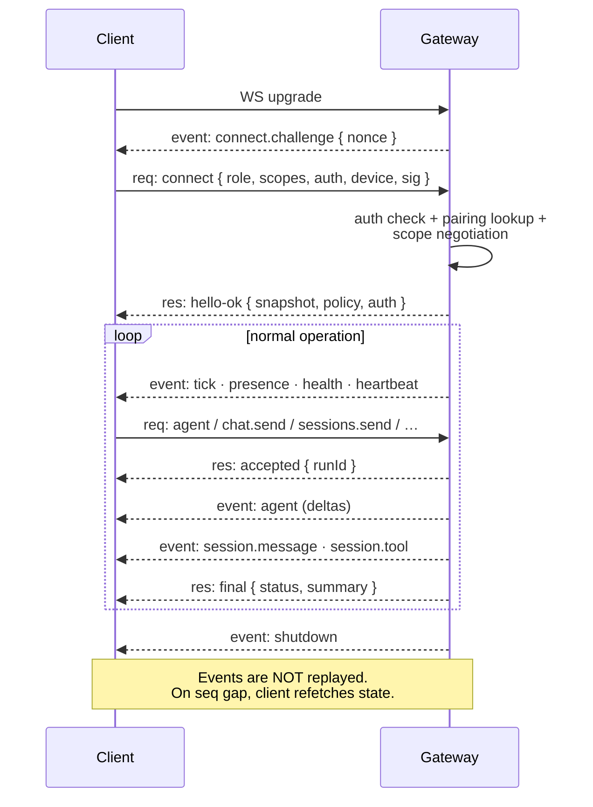
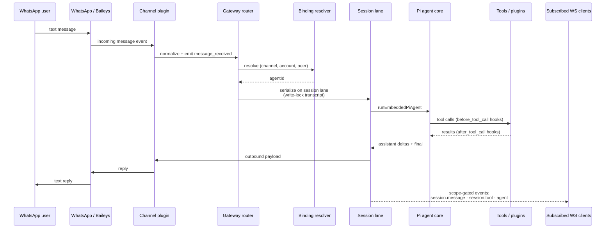

# OpenClaw Gateway — Deep Dive

Grounded in the local repo at `/Users/rajendra/projects/openclaw/openclaw`. Primary sources:

- `docs/concepts/architecture.md` — gateway architecture overview
- `docs/gateway/index.md` — runbook
- `docs/gateway/protocol.md` — WS protocol (frames, methods, events, auth)
- `docs/concepts/session.md` — session routing, lifecycle, persistence
- `docs/reference/session-management-compaction.md` — store + transcript schema
- `src/gateway/`, `src/sessions/`, `src/daemon/`, `src/gateway/protocol/`

If something isn't in those files, it's not in this doc.

---

## 1. What the Gateway is, in one line

> *"A single long-lived **Gateway** owns all messaging surfaces (WhatsApp via Baileys, Telegram via grammY, Slack, Discord, Signal, iMessage, WebChat)."* — `architecture.md`

It's the **one always-on process** that:
- Holds every channel connection (the only place that opens a WhatsApp Baileys session per host),
- Embeds and runs the agent (Pi agent core),
- Owns session state and transcripts,
- Exposes a typed WebSocket RPC + HTTP API,
- Routes RPCs to plugins,
- Forwards commands to **nodes** (peripheral devices).

> **Invariant from `architecture.md`:** *"Exactly one Gateway controls a single Baileys session per host."*

Everything else (CLI, macOS menubar app, Web Control UI, iOS/Android nodes, headless node hosts, third-party clients) is a **WS client** of this Gateway.

---

## 2. Process model — how it actually runs

### Runtime
- Single Node process. Runtime: Node 22.19+, Node 24 recommended.
- Built from `src/entry.ts` → `src/daemon/gateway-entrypoint.ts`.
- Default bind: `loopback` (127.0.0.1). Port resolution: `--port → OPENCLAW_GATEWAY_PORT → gateway.port → 18789`.

### Supervised lifecycle
- **macOS**: `launchd` LaunchAgent labeled `ai.openclaw.gateway` (or `ai.openclaw.<profile>`). `openclaw gateway stop` uses `launchctl bootout` (keepalive preserved); `--disable` to suppress across reboots.
- **Linux**: `systemd` user unit (`openclaw-gateway.service`) or system unit. User-unit users may need `loginctl enable-linger`.
- **Windows**: Scheduled Task `OpenClaw Gateway`. Falls back to Startup-folder launcher if Scheduled Task creation is denied.

`openclaw doctor` audits and repairs drift in these supervisor units.

### Multiple gateways on one host
Allowed but discouraged. Each instance needs unique:
- `gateway.port`
- `OPENCLAW_CONFIG_PATH`
- `OPENCLAW_STATE_DIR`
- `agents.defaults.workspace`

```bash
OPENCLAW_CONFIG_PATH=~/.openclaw/a.json OPENCLAW_STATE_DIR=~/.openclaw-a openclaw gateway --port 19001
```

### Config hot-reload
`gateway.reload.mode` ∈ `{off, hot, restart, hybrid (default)}`. Watches active config path; on success swaps the in-memory snapshot atomically. The running process always serves the **in-memory snapshot**, never re-reads from disk on hot paths.

---

## 3. The transport — one port, three surfaces multiplexed

From `docs/gateway/index.md`:

> *"Single multiplexed port for: WebSocket control/RPC; HTTP APIs (`/v1/models`, `/v1/embeddings`, `/v1/chat/completions`, `/v1/responses`, `/tools/invoke`); Plugin HTTP routes, such as optional `/api/v1/admin/rpc`; Control UI and hooks."*

Same default port (`18789`) serves:

| Surface | Path | Purpose |
|---|---|---|
| WS RPC | `/` (WebSocket upgrade) | All operator + node + plugin RPC |
| OpenAI-compat HTTP | `/v1/models`, `/v1/models/{id}`, `/v1/embeddings`, `/v1/chat/completions`, `/v1/responses` | LLM-client compatibility for Open WebUI, LobeChat, LibreChat, RAG pipelines |
| Tools HTTP | `/tools/invoke` | One-off tool invocation by external clients |
| Canvas host | `/__openclaw__/canvas/` | Agent-editable HTML/CSS/JS served to nodes |
| A2UI host | `/__openclaw__/a2ui/` | Agent-to-UI surface |
| Admin RPC | `/api/v1/admin/rpc` (optional plugin route) | Plugin-controlled admin |
| Control UI | (varies) | Web admin UI |

All HTTP surfaces share the **same trusted operator auth boundary** as WS.

---

## 4. The WebSocket protocol

### Frame format

```ts
// Request
{ type: "req", id, method, params }

// Response
{ type: "res", id, ok, payload | error }

// Server-push event
{ type: "event", event, payload, seq?, stateVersion? }
```

- Side-effecting methods (`send`, `agent`, …) require **idempotency keys**; the server keeps a short-lived dedupe cache.
- Pre-connect frames capped at **64 KiB**.
- Post-handshake, clients honor `hello-ok.policy.maxPayload` (default 25 MB) and `policy.maxBufferedBytes`.

### Handshake — `connect` → `hello-ok`

1. Client opens WS.
2. Gateway sends pre-connect **challenge** event:
   ```json
   { "type":"event", "event":"connect.challenge",
     "payload":{ "nonce":"…","ts":1737264000000 } }
   ```
3. Client sends `connect` request — must be the **first** frame:
   ```json
   { "type":"req", "id":"…", "method":"connect",
     "params":{
       "minProtocol":3, "maxProtocol":4,
       "client": { "id":"cli", "version":"…", "platform":"macos", "mode":"operator" },
       "role":"operator",
       "scopes":["operator.read","operator.write"],
       "caps":[], "commands":[], "permissions":{},
       "auth":{ "token":"…" },
       "device":{ "id":"…", "publicKey":"…", "signature":"…",
                  "signedAt":…, "nonce":"…" }
     }
   }
   ```
4. Gateway replies `hello-ok` with snapshot + negotiated auth + policy:
   ```json
   { "type":"res", "ok":true,
     "payload":{ "type":"hello-ok", "protocol":4,
       "server":{ "version":"…","connId":"…" },
       "features":{ "methods":["…"], "events":["…"] },
       "snapshot":{ /* presence, health, stateVersion, uptimeMs */ },
       "auth":{ "role":"operator", "scopes":[...], "deviceToken":"…?" },
       "policy":{ "maxPayload":26214400, "maxBufferedBytes":52428800,
                  "tickIntervalMs":15000 }
     }
   }
   ```

Invalid first frame → hard close. Startup-sidecar window can return retryable `UNAVAILABLE` with `details.reason: "startup-sidecars"` + `retryAfterMs`.

### Versioning
- `PROTOCOL_VERSION` lives in `src/gateway/protocol/version.ts`. Current = **4**.
- Client sends `minProtocol`/`maxProtocol`; server rejects ranges that don't include its current version.
- Schemas are TypeBox; JSON Schema and Swift models are generated:
  ```bash
  pnpm protocol:gen
  pnpm protocol:gen:swift
  pnpm protocol:check
  ```

---

## 5. Roles, scopes, auth

### Two roles
- `operator` — control-plane client (CLI/UI/automation/SDKs).
- `node` — capability host (camera/screen/canvas/`system.run`).

### Operator scopes (claim at connect, server enforces)
- `operator.read`
- `operator.write`
- `operator.admin`
- `operator.approvals`
- `operator.pairing`
- `operator.talk.secrets`

Reserved core admin prefixes (`config.*`, `exec.approvals.*`, `wizard.*`, `update.*`) **always** resolve to `operator.admin`, even if a plugin tries to register them at a narrower scope.

### Node claims at connect
- `caps`: high-level categories (`camera`, `canvas`, `screen`, `location`, `voice`, `talk`)
- `commands`: command allowlist for `node.invoke`
- `permissions`: granular toggles (`camera.capture`, `screen.record`, …)

Gateway treats these as **claims** and applies server-side allowlists (e.g. `gateway.nodes.allowCommands` / `denyCommands`).

### Auth modes
| Mode | How it satisfies `connect` |
|---|---|
| Shared-secret (default) | `connect.params.auth.token` or `auth.password` (or `OPENCLAW_GATEWAY_TOKEN/_PASSWORD`) |
| Device token | `auth.token = stored deviceToken` issued in a prior `hello-ok.auth.deviceToken` |
| Trusted proxy (`gateway.auth.mode: "trusted-proxy"`) | From request headers; non-loopback reverse-proxy setups |
| Tailscale (`gateway.auth.allowTailscale: true`) | Identity from tailnet headers |
| None (`gateway.auth.mode: "none"`) | Skips auth; **never expose on public ingress** |
| Bootstrap setup-code | QR/setup-code flow → primary node token + bounded operator token (no admin/pairing) |

### Pairing
- All WS clients send a `device` identity in `connect`. New devices need approval (`openclaw devices approve <requestId>`).
- After approval, Gateway issues a **device token** scoped to the approved role + scopes; client persists it.
- Auto-approval only on direct local **loopback** (or internal `gateway-client` backend RPC). Tailnet/LAN connects, even same-host, still require explicit pairing.
- All connects must sign the `connect.challenge` nonce. v3 signature payload binds `platform` + `deviceFamily`.
- `device.token.rotate` / `device.token.revoke` are self-scoped for non-admins.

### Broadcast event scoping (important!)
- Chat / agent / tool-result frames → require `operator.read`.
- `plugin.*` broadcasts → `operator.write` or `operator.admin` per plugin registration.
- Transport events (`heartbeat`, `presence`, `tick`, connect lifecycle) → unrestricted to authenticated sessions.
- Unknown event families → **fail-closed**, scope-gated by default.

---

## 6. RPC method families (the surface the Gateway exposes)

This is **not** exhaustive — `hello-ok.features.methods` is a discovery list built from `src/gateway/server-methods-list.ts` plus plugin/channel exports. Major families:

| Family | Representative methods |
|---|---|
| **System & identity** | `health`, `status`, `system-presence`, `system-event`, `gateway.identity.get`, `last-heartbeat`, `set-heartbeats`, `diagnostics.stability` |
| **Models & usage** | `models.list` (views: default/configured/all), `usage.status`, `usage.cost`, `sessions.usage`, `sessions.usage.timeseries`, `sessions.usage.logs` |
| **Channels** | `channels.status`, `channels.logout`, `web.login.start`, `web.login.wait`, `push.test`, `voicewake.get/set` |
| **Messaging** | `send` (direct outbound), `logs.tail`, `chat.history`, `chat.send`, `chat.abort`, `chat.inject` |
| **Talk / TTS** | `talk.catalog`, `talk.config`, `talk.session.{create,join,appendAudio,startTurn,endTurn,cancelTurn,cancelOutput,submitToolResult,steer,close}`, `talk.mode`, `talk.client.{create,toolCall,steer}`, `talk.event`, `talk.speak`, `tts.{status,providers,enable,disable,setProvider,convert}` |
| **Secrets / config / update / wizard** | `secrets.reload`, `secrets.resolve`, `config.{get,set,patch,apply,schema,schema.lookup}`, `update.run`, `update.status`, `wizard.{start,next,status,cancel}` |
| **Agents** | `agents.list`, `agents.{create,update,delete}`, `agents.files.{list,get,set}`, `agent.identity.get`, `agent`, `agent.wait` |
| **Tasks / artifacts / environments** | `tasks.list`, `tasks.get`, `tasks.cancel`, `artifacts.{list,get,download}`, `environments.list`, `environments.status` |
| **Sessions** | `sessions.list`, `sessions.subscribe/unsubscribe`, `sessions.messages.subscribe/unsubscribe`, `sessions.preview`, `sessions.describe`, `sessions.resolve`, `sessions.create`, `sessions.send`, `sessions.steer`, `sessions.abort`, `sessions.patch`, `sessions.reset`, `sessions.delete`, `sessions.compact`, `sessions.get` |
| **Device pairing & tokens** | `device.pair.{list,approve,reject,remove}`, `device.token.{rotate,revoke}` |
| **Nodes** | `node.pair.{request,list,approve,reject,remove,verify}`, `node.list`, `node.describe`, `node.rename`, `node.invoke`, `node.invoke.result`, `node.event`, `node.pending.{pull,ack,enqueue,drain}`, `node.pluginSurface.refresh` |
| **Approvals** | `exec.approval.{request,get,list,resolve,waitDecision}`, `exec.approvals.{get,set}`, `exec.approvals.node.{get,set}`, `plugin.approval.{request,list,waitDecision,resolve}` |
| **Automation / skills / tools** | `wake`, `cron.{get,list,status,add,update,remove,run,runs}`, `commands.list`, `skills.{status,search,detail,install,update,upload.begin/chunk/commit}`, `tools.catalog`, `tools.effective`, `tools.invoke` |

### Two-stage agent runs
`agent` requests get:
1. Immediate accepted ack: `status: "accepted"` with `{ runId, acceptedAt }`.
2. Streamed `agent` events as the model works (assistant deltas, tool events, lifecycle).
3. Final completion `res`: `status: "ok" | "error"` with summary.

`agent.wait` blocks for the lifecycle end of a specific `runId` (default 30s).

---

## 7. How the Gateway talks to every other component



### Connection lifecycle (one client)



### Channel ingress (e.g. WhatsApp → agent → reply)



---

## 8. How agents are embedded in the Gateway

From `agent.md`: *"OpenClaw runs a **single embedded agent runtime** — one agent process per Gateway."*

- The agent runtime is built on the **Pi agent core** (`@earendil-works/pi-coding-agent`).
- Entry: `runEmbeddedPiAgent` → `subscribeEmbeddedPiSession` bridges Pi events to the Gateway's `agent` stream (`stream: "assistant" | "tool" | "lifecycle"`).
- Multi-agent = multiple `agentId`s **inside** that one runtime, isolated by workspace + `agentDir` + auth profiles + session store. Not parallel processes.
- The runtime **serializes per session key** (lane) and optionally through a global lane to prevent races.

---

## 9. How channels live inside the Gateway

- Channel plugins register via `defineChannelPluginEntry` + `api.registerChannel(...)`.
- Each channel owns: ingress (provider websocket / SDK), account lifecycle (login, pairing), message normalization, outbound delivery.
- One Gateway holds **all** channel connections — that's why two Gateways trying to share a WhatsApp account corrupt the Baileys auth.
- Channel accounts (`channels.<name>.accounts.<id>`) are first-class: each can be bound to a different `agentId`.
- Per-channel DM gating: `dmPolicy: "pairing" | "allowlist" | "open"`, plus `allowFrom`.

---

## 10. How nodes are connected and commanded

- Node = WS client with `role: "node"`.
- Declares `caps` + `commands` + `permissions` at connect; Gateway applies its allowlist on top.
- Operator side calls `node.invoke` → Gateway forwards to the node → node returns via `node.invoke.result`.
- Offline nodes: durable queue via `node.pending.{enqueue, pull, ack, drain}`.
- Background-alive signal: `node.event` with `event: "node.presence.alive"` and `trigger ∈ {background, silent_push, bg_app_refresh, significant_location, manual, connect}`.

Approval scopes for node pairing:
- Commandless request → `operator.pairing`.
- Non-exec node commands → `operator.pairing + operator.write`.
- `system.run` / `system.run.prepare` / `system.which` → `operator.pairing + operator.admin`.

---

## 11. Sessions — how they are routed, persisted, and aged

### Routing (`docs/concepts/session.md`)

| Source | Behavior |
|---|---|
| Direct messages | Shared session by default |
| Group chats | Isolated per group |
| Rooms / channels | Isolated per room |
| Cron jobs | Fresh session per run |
| Webhooks | Isolated per hook |

**DM isolation** (critical for multi-user setups): set `session.dmScope`:
- `main` (default) — all DMs share one session
- `per-peer` — by sender, across channels
- `per-channel-peer` — by channel + sender (**recommended for multi-user**)
- `per-account-channel-peer` — by account + channel + sender

### Two-layer persistence

**Layer 1 — Session store (`sessions.json`)**: small key/value map `sessionKey -> SessionEntry`.

Path: `~/.openclaw/agents/<agentId>/sessions/sessions.json`

`SessionEntry` (from `src/config/sessions.ts`) tracks:
- `sessionId` — current transcript id
- `sessionStartedAt` — start of current `sessionId`; **drives daily reset**
- `lastInteractionAt` — last real user/channel interaction; **drives idle reset** (system events do NOT extend it)
- `updatedAt` — last row mutation (listing/pruning only; not authoritative)
- `chatType`: `direct | group | room`
- `provider`, `subject`, `room`, `space`, `displayName` — metadata
- Toggles: `thinkingLevel`, `verboseLevel`, `reasoningLevel`, `elevatedLevel`, `sendPolicy`
- Model selection: `providerOverride`, `modelOverride`, `authProfileOverride`
- Token counters: `inputTokens`, `outputTokens`, `totalTokens`, `contextTokens`
- `compactionCount`, `memoryFlushAt`, `memoryFlushCompactionCount`

**Layer 2 — Transcript (`<sessionId>.jsonl`)**: append-only, tree-structured.

Path: `~/.openclaw/agents/<agentId>/sessions/<sessionId>.jsonl`
(Telegram topic sessions: `…/<sessionId>-topic-<threadId>.jsonl`)

Format (managed by Pi's `SessionManager`):
- First line: session header (`type: "session"`, `id`, `cwd`, `timestamp`, optional `parentSession`)
- Then entries with `id` + `parentId` (tree)

Entry types:
- `message` — user/assistant/toolResult
- `custom_message` — extension-injected, enters model context (can be hidden from UI)
- `custom` — extension state, does NOT enter model context
- `compaction` — persisted summary with `firstKeptEntryId` and `tokensBefore`
- `branch_summary` — summary when navigating a tree branch

> Important: *"OpenClaw intentionally does **not** 'fix up' transcripts."*

### Session keys (`sessionKey`)

Routing+isolation identifier. Patterns:

| Source | sessionKey |
|---|---|
| Direct chat (per agent) | `agent:<agentId>:<mainKey>` (default `main`) |
| Group | `agent:<agentId>:<channel>:group:<id>` |
| Discord/Slack channel | `agent:<agentId>:<channel>:channel:<id>` or `…:room:<id>` |
| Cron | `cron:<job.id>` |
| Webhook | `hook:<uuid>` |

### Session ids (`sessionId`)

A UUID v4 — `/^[0-9a-f]{8}-[0-9a-f]{4}-[0-9a-f]{4}-[0-9a-f]{4}-[0-9a-f]{12}$/i` per `src/sessions/session-id.ts`. New `sessionId` per `sessionKey` on:
- `/new` or `/reset` (manual)
- **Daily reset** — default 4:00 AM gateway-host local time
- **Idle expiry** — `session.reset.idleMinutes`
- Daily + idle configured → whichever first wins
- System events (heartbeat/cron/exec) may mutate row but DO NOT extend reset freshness

Reset rollover **discards queued system-event notices** for the previous session before building the next prompt.

### Concurrency — session lane + write lock

From `agent-loop.md` and `session-management-compaction.md`:

- Runs serialized per `sessionKey` (session lane) and optionally a global lane.
- **Transcript write lock**: process-aware, file-based, catches writers from other processes.
  - `session.writeLock.acquireTimeoutMs` (default 60000)
  - `session.writeLock.staleMs` (default 1800000)
  - `session.writeLock.maxHoldMs` (default 300000)
  - Non-reentrant by default; `allowReentrant: true` to opt in.
- Env override: `OPENCLAW_SESSION_WRITE_LOCK_ACQUIRE_TIMEOUT_MS`, …
- `sessions.json` writes go through a per-store writer queue (not a runtime file lock). Hot-path patch helpers borrow the validated mutable cache.

### Maintenance + disk control (`session.maintenance`)
- `mode`: `warn` (default) or `enforce`
- `pruneAfter` (default `30d`)
- `maxEntries` (default `500`)
- `resetArchiveRetention` — for `*.reset.<timestamp>` archives
- `maxDiskBytes`, `highWaterBytes` (default 80% of maxDiskBytes)

Enforcement order:
1. Remove archived/orphan transcript/trajectory artifacts first
2. Evict oldest session rows + their transcript files
3. Continue until `highWaterBytes`

Run manually:
```bash
openclaw sessions cleanup --dry-run
openclaw sessions cleanup --enforce
openclaw sessions cleanup --dry-run --fix-dm-scope   # for old peer-keyed rows
```

### Compaction
- Persistent summarization of older entries into a `compaction` entry; recent messages kept intact.
- Pi runtime triggers on context overflow or threshold (`contextTokens > contextWindow - reserveTokens`).
- OpenClaw can preflight via `agents.defaults.compaction.maxActiveTranscriptBytes` (turn-start byte guard) and `agents.defaults.compaction.midTurnPrecheck.enabled` (in-tool-loop guard).
- Pluggable compaction provider via `registerCompactionProvider()`.

---

## 12. Cron, webhooks, and the task ledger

- **Cron**: `cron.{add,update,remove,run,runs,list,status}`. Each cron job can create an isolated `cron:<jobId>` session; retention via `cron.sessionRetention` (default 24h); run-log files at `~/.openclaw/cron/runs/<jobId>.jsonl` (capped by `cron.runLog.maxBytes` and `keepLines`).
- **Webhooks**: emit isolated `hook:<uuid>` sessions.
- **Task ledger**: durable record of background work. RPCs `tasks.list`, `tasks.get`, `tasks.cancel`. Each `TaskSummary` carries `id`, `status`, `kind`, `runtime`, `title`, `agentId`, `sessionKey`, `childSessionKey`, timestamps, progress, error.

Cron is also the timer for `api.session.workflow.scheduleSessionTurn(...)`.

---

## 13. HTTP surfaces in detail

| Endpoint | Notes |
|---|---|
| `GET /v1/models` | Returns agent-first list: `openclaw`, `openclaw/default`, `openclaw/<agentId>` |
| `GET /v1/models/{id}` | Single model |
| `POST /v1/embeddings` | Embedding via active provider |
| `POST /v1/chat/completions` | OpenAI-compat chat — agent runs end-to-end |
| `POST /v1/responses` | OpenAI Responses API (agent-native clients) |
| `POST /tools/invoke` | Same policy path as `tools.invoke` RPC |
| `POST /api/v1/admin/rpc` | Optional plugin route, default off, for clients that can't do WS |
| `/__openclaw__/canvas/` | Agent-editable HTML/JS served to nodes |
| `/__openclaw__/a2ui/` | A2UI host |

All share the operator auth boundary. `x-openclaw-model` header overrides backend provider/model selection; without it, the resolved agent's normal model setup wins.

---

## 14. Plugin → Gateway integration (the registration surface)

A plugin's `register(api)` callback can:

- Add capabilities: `registerProvider`, `registerAgentHarness`, `registerCliBackend`, `registerChannel`, `registerEmbeddingProvider`, `registerSpeechProvider`, image/music/video gen providers, etc.
- Add tools/commands: `registerTool`, `registerCommand`.
- Add infrastructure: `registerHook`, `registerHttpRoute` (turns into Gateway HTTP endpoint), `registerGatewayMethod` (turns into WS RPC method), `registerCli`, `registerService`, `registerInteractiveHandler`, `registerAgentToolResultMiddleware`.
- Workflow hooks: `api.session.state.registerSessionExtension`, `api.session.workflow.enqueueNextTurnInjection`, `registerTrustedToolPolicy`, `api.session.controls.registerSessionAction`, `api.session.workflow.scheduleSessionTurn`, etc.
- Discovery: `registerGatewayDiscoveryService` for mDNS/Bonjour Gateway advertising.

Gateway-registered HTTP routes and RPC methods are scoped: reserved core admin namespaces (`config.*`, `exec.approvals.*`, `wizard.*`, `update.*`) always require `operator.admin`.

---

## 15. Common failure signatures (from runbook)

| Signature | Likely cause |
|---|---|
| `refusing to bind gateway ... without auth` | Non-loopback bind without auth |
| `another gateway instance is already listening` / `EADDRINUSE` | Port conflict |
| `Gateway start blocked: set gateway.mode=local` | Config set to remote mode, or local-mode stamp missing |
| `unauthorized` during connect | Auth mismatch |
| `UNAVAILABLE` + `details.reason: "startup-sidecars"` | Gateway still warming up — retry |
| `PAIRING_REQUIRED` + `recommendedNextStep: "wait_then_retry"` | Bootstrap awaiting operator approval |
| `AUTH_TOKEN_MISMATCH` | One bounded retry with stored device token on trusted endpoints only |
| `AUTH_SCOPE_MISMATCH` | Token recognized; scopes don't cover request → re-pair |
| `DEVICE_AUTH_*` (NONCE_REQUIRED / NONCE_MISMATCH / SIGNATURE_INVALID / SIGNATURE_EXPIRED / DEVICE_ID_MISMATCH / PUBLIC_KEY_INVALID) | Pre-challenge / legacy signing → migrate to v3 signature |

---

## 16. Liveness, readiness, gap recovery

- **Liveness**: open WS + send `connect`; expect `hello-ok`.
- **Readiness**: `openclaw gateway status`, `openclaw channels status --probe`, `openclaw health`.
- **Gap recovery**: events are **NOT** replayed. On `seq` gaps, clients refresh state via `health`, `system-presence`, `sessions.list`, etc.

Each WS connection keeps its own per-client sequence number so broadcasts preserve monotonic ordering on that socket, even when different clients see different scope-filtered subsets.

Graceful shutdown emits a `shutdown` event before socket close.

---

## 17. Practical operator commands

```bash
# Process control
openclaw gateway --port 18789               # foreground
openclaw gateway --port 18789 --verbose     # debug
openclaw gateway --force                    # kill stale listener and start
openclaw gateway install
openclaw gateway start | stop | restart
openclaw gateway stop --disable             # persistent stop across reboots (macOS)
openclaw gateway status [--deep] [--json]
openclaw gateway probe
openclaw gateway status --require-rpc

# Auth / pairing / nodes
openclaw devices list
openclaw devices approve <requestId>
openclaw nodes status
openclaw nodes describe --node <idOrNameOrIp>

# Channels
openclaw channels status --probe
openclaw channels login --channel whatsapp --account personal

# Sessions
openclaw sessions --json [--active <minutes>]
openclaw sessions cleanup --dry-run
openclaw sessions cleanup --enforce
openclaw status

# Diagnose & repair
openclaw doctor
openclaw doctor --fix
openclaw logs --follow
openclaw secrets reload
```

---

## 18. Source map (where the code lives)

| Area | Path |
|---|---|
| Process entry | `src/entry.ts`, `src/daemon/gateway-entrypoint.ts` |
| Daemon install / launchd / systemd | `src/daemon/launchd.ts`, `src/daemon/program-args.ts` |
| Gateway server | `src/gateway/server.ts`, `src/gateway/server-*.ts` |
| RPC method registry | `src/gateway/server-methods/`, `src/gateway/server-methods-list.ts` |
| Protocol schema | `src/gateway/protocol/schema/`, `src/gateway/protocol/schema.ts`, `src/gateway/protocol/version.ts` |
| Reference WS client | `src/gateway/client.ts` |
| Auth / device tokens / pairing | `src/gateway/auth*.ts`, `src/gateway/server/` |
| Channels | `src/channels/` |
| Session routing + ids | `src/sessions/`, `src/auto-reply/reply/session.ts` |
| Session store schema | `src/config/sessions.ts` |
| Agents / Pi runtime | `src/agents/` |
| Plugin SDK | `src/plugin-sdk/`, `src/plugins/` |
| Bootstrap / hooks | `src/bootstrap/`, `src/hooks/` |
| Cron | `src/cron/` |

---

## 19. The Gateway, summarized

| Property | Value |
|---|---|
| Process count | One per host (one Baileys/WhatsApp session) |
| Default bind | `127.0.0.1:18789` (loopback) |
| Transport | WebSocket + HTTP, multiplexed on same port |
| First WS frame | Must be `connect`; signed challenge nonce required |
| Frame model | `req` / `res` / `event` with idempotency on side-effecting methods |
| Auth | Shared-secret token/password OR device token OR trusted-proxy OR Tailscale OR bootstrap setup-code |
| Roles | `operator` (CLI/UI), `node` (peripheral device) |
| Agent runtime | Single embedded Pi agent core; multi-agent via per-agent workspace + `agentDir` |
| Session routing | DM scope (`main`/`per-peer`/`per-channel-peer`/`per-account-channel-peer`) + bindings → `sessionKey` |
| Session persistence | `sessions.json` (store) + `<sessionId>.jsonl` (transcript) per agent |
| Reset triggers | Daily 4 AM local OR idle OR `/new` / `/reset` |
| Concurrency | Per-`sessionKey` serial lane + transcript write lock |
| Events | Not replayed; clients refresh on `seq` gaps |
| Hot reload | `gateway.reload.mode = hybrid` default |
| Supervised | launchd / systemd / scheduled task |
| Single port serves | WS RPC + `/v1/*` OpenAI compat + `/tools/invoke` + canvas/A2UI + optional admin RPC |
