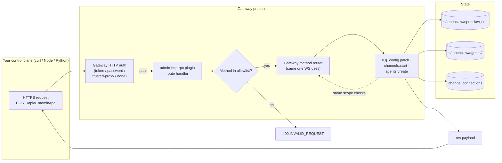

# OpenClaw Gateway — REST / HTTP API for Setup

Short answer first, then the deep dive.

**Does the Gateway provide REST APIs for setup (configure model, register channel, create agent)?**

**Yes — but it's not "REST" in the classic resource-oriented sense.** OpenClaw exposes setup operations over HTTP through a single POST endpoint that dispatches named RPC methods. The transport is HTTP, the shape is JSON-RPC-like. You don't `POST /channels`; you `POST /api/v1/admin/rpc` with `{"method": "channels.start", "params": {...}}`.

There is also an always-on `POST /tools/invoke`, the OpenAI-compat `/v1/*` family for running agents, and any plugin can register its own HTTP route. None of those are setup APIs except admin-http-rpc.

Grounded in `/Users/rajendra/projects/openclaw/openclaw`:
- `docs/plugins/admin-http-rpc.md` — the setup HTTP surface
- `docs/gateway/tools-invoke-http-api.md` — tool invocation HTTP
- `docs/gateway/openai-http-api.md` — OpenAI-compat HTTP
- `docs/plugins/webhooks.md` — webhook ingress plugin
- `docs/plugins/sdk-overview.md` — `api.registerHttpRoute(...)`

---

## 1. The full HTTP surface at a glance

The Gateway multiplexes HTTP on the same port as WebSocket (`18789` default). There are five distinct HTTP surfaces:

| Surface | Path | Default | Purpose | Source |
|---|---|---|---|---|
| **Admin RPC** | `POST /api/v1/admin/rpc` | **OFF** | Setup operations (`config.*`, `channels.*`, `agents.*`, `models.*`, …) | `docs/plugins/admin-http-rpc.md` |
| **Tool invoke** | `POST /tools/invoke` | **ON** | Run one tool through policy | `docs/gateway/tools-invoke-http-api.md` |
| **OpenAI-compat** | `GET /v1/models` · `/v1/models/{id}` · `POST /v1/embeddings` · `/v1/chat/completions` · `/v1/responses` | **OFF** | Run an agent turn from an OpenAI-client | `docs/gateway/openai-http-api.md` |
| **Canvas / A2UI** | `/__openclaw__/canvas/` · `/__openclaw__/a2ui/` | ON | Static assets served to nodes | `architecture.md` |
| **Plugin routes** | Anything a plugin registers (e.g. `/plugins/webhooks/<routeId>`) | Per-plugin | Custom HTTP endpoints | `api.registerHttpRoute(...)` |

> The Admin RPC route is the one you want for setup. Everything else is for running the agent or extending it.

---

## 2. Admin HTTP RPC — the setup endpoint

### What it is

A bundled, opt-in plugin called `admin-http-rpc`. When enabled, it registers exactly one route:

```
POST /api/v1/admin/rpc
```

That route accepts the same RPC envelope as the WebSocket protocol, but as a JSON HTTP POST. Inside, it dispatches a **strict allowlist** of Gateway control-plane methods.

> *"The bundled `admin-http-rpc` plugin exposes selected Gateway control-plane methods over HTTP for trusted host automation that cannot use the normal Gateway WebSocket RPC client."* — `docs/plugins/admin-http-rpc.md`

It is intentionally **not REST-shaped**. There is no `/channels`, `/agents/:id`, `/models` resource tree. Everything goes through one POST with a `method` field. This is JSON-RPC over HTTP.

### Enabling it

```bash
openclaw plugins enable admin-http-rpc
openclaw gateway restart
```

Or in config:
```json5
{
  plugins: {
    entries: {
      "admin-http-rpc": { enabled: true }
    }
  }
}
```

When disabled, the route returns `404` because it isn't registered at all.

### Verify

```bash
curl -sS http://127.0.0.1:18789/api/v1/admin/rpc \
  -H 'Authorization: Bearer <gateway-token>' \
  -H 'Content-Type: application/json' \
  -d '{"method":"health","params":{}}'
```

Response:
```json
{ "id": "generated-uuid", "ok": true, "payload": { "status": "ok" } }
```

### Request / response shape

```http
POST /api/v1/admin/rpc
Authorization: Bearer <gateway-token>
Content-Type: application/json
```

```json
{ "id": "optional", "method": "channels.start", "params": { /* ... */ } }
```

Success:
```json
{ "id": "...", "ok": true, "payload": { /* method-specific */ } }
```

Error:
```json
{ "id": "...", "ok": false, "error": { "code": "INVALID_REQUEST", "message": "bad params" } }
```

HTTP status follows the Gateway error code when possible — `INVALID_REQUEST` → `400`, `UNAVAILABLE` → `503`, etc. Max body size: **1 MB**.

### Authentication

Same auth modes as WS:
- **Token** (`gateway.auth.mode: "token"`): `Authorization: Bearer <token-or-OPENCLAW_GATEWAY_TOKEN>`
- **Password** (`gateway.auth.mode: "password"`): same header, value is the password
- **Trusted proxy** (`gateway.auth.mode: "trusted-proxy"`): identity headers from upstream proxy
- **None** (`gateway.auth.mode: "none"`): no auth header — **never** expose this to the public internet

### Security model (the part that matters for your SaaS plan)

> *"Treat this plugin as a full Gateway operator surface."*

Important caveats from the doc:
1. Shared-secret bearer auth is treated as **full operator access** — no scope narrowing.
2. `x-openclaw-scopes` is **ignored** in `token` / `password` modes; full operator defaults are restored.
3. Trusted identity-bearing modes (`trusted-proxy`, `none` on private ingress) honor `x-openclaw-scopes` when present.
4. Requests dispatch through the **same Gateway method handlers and scope checks** as WebSocket RPC after the plugin-route auth passes.
5. > *"Use separate gateways when callers cross trust boundaries."*

So the token is an owner credential. If two tenants need isolation, give them separate Gateway processes — not separate tokens on one Gateway.

### What you can do through `/api/v1/admin/rpc` (the allowlist)

Straight from `docs/plugins/admin-http-rpc.md`:

| Family | Methods |
|---|---|
| **discovery** | `commands.list` (returns the HTTP-allowed methods themselves) |
| **gateway** | `health`, `status`, `logs.tail`, `usage.status`, `usage.cost`, `gateway.restart.request` |
| **config** | `config.get`, `config.schema`, `config.schema.lookup`, `config.set`, `config.patch`, `config.apply` |
| **channels** | `channels.status`, `channels.start`, `channels.stop`, `channels.logout` |
| **web (channel login)** | `web.login.start`, `web.login.wait` |
| **models** | `models.list`, `models.authStatus` |
| **agents** | `agents.list`, `agents.create`, `agents.update`, `agents.delete` |
| **approvals** | `exec.approvals.get`, `exec.approvals.set`, `exec.approvals.node.{get,set}` |
| **cron** | `cron.status`, `cron.list`, `cron.get`, `cron.runs`, `cron.add`, `cron.update`, `cron.remove`, `cron.run` |
| **devices** | `device.pair.{list,approve,reject,remove}` |
| **nodes** | `node.list`, `node.describe`, `node.pair.{list,approve,reject,remove}`, `node.rename` |
| **tasks** | `tasks.list`, `tasks.get`, `tasks.cancel` |
| **diagnostics** | `doctor.memory.status`, `update.status` |

> Any other Gateway method (chat, agent runs, sessions, talk/TTS, pairing on a node, skills, …) is **blocked** until explicitly added to the allowlist. The HTTP surface is intentionally narrower than the WS surface.

### What's covered for your use cases

| Your goal | HTTP call (all `POST /api/v1/admin/rpc` with this body) |
|---|---|
| **List configured models** | `{ "method": "models.list", "params": { "view": "configured" } }` |
| **Check provider auth status** | `{ "method": "models.authStatus", "params": {} }` |
| **Set default agent model** | `{ "method": "config.patch", "params": { "patch": { "agents": { "defaults": { "model": "anthropic/claude-sonnet-4-6" } } } } }` |
| **Add an API key for a provider** | `{ "method": "config.patch", "params": { "patch": { "models": { "providers": { "anthropic": { "apiKey": "sk-..." } } } } } }` |
| **List channels + their status** | `{ "method": "channels.status", "params": {} }` |
| **Register a Telegram bot** | `{ "method": "config.patch", "params": { "patch": { "channels": { "telegram": { "accounts": { "default": { "botToken": "123:ABC..." } } } } } } }` then `{ "method": "channels.start", "params": { "channel": "telegram" } }` |
| **Start a WhatsApp QR login** | `{ "method": "web.login.start", "params": { "channel": "whatsapp", "account": "personal" } }` then poll `web.login.wait` |
| **Stop a channel** | `{ "method": "channels.stop", "params": { "channel": "telegram" } }` |
| **Create an isolated agent** | `{ "method": "agents.create", "params": { "id": "work", "workspace": "~/.openclaw/workspace-work" } }` |
| **List agents** | `{ "method": "agents.list", "params": {} }` |
| **Add a binding (channel → agent)** | `{ "method": "config.patch", "params": { "patch": { "bindings": [ { "agentId": "work", "match": { "channel": "telegram", "accountId": "default" } } ] } } }` |
| **Schedule a recurring agent run** | `{ "method": "cron.add", "params": { /* job spec */ } }` |
| **Approve a pending device pairing** | `{ "method": "device.pair.approve", "params": { "requestId": "..." } }` |
| **List paired nodes** | `{ "method": "node.list", "params": {} }` |
| **Inspect schema for a config path** | `{ "method": "config.schema.lookup", "params": { "path": "channels.telegram" } }` |
| **Get a sanitized config snapshot** | `{ "method": "config.get", "params": {} }` |
| **Validate before applying** | `{ "method": "config.apply", "params": { "config": { /* full */ } } }` |

That's the entire "REST setup API" surface in practice — `config.patch` is the workhorse for most things.

### What's missing (and why)

Setup operations that are **not** exposed over admin-http-rpc:
- Sending a chat message (`chat.send`) — use the OpenAI-compat endpoint or WS
- Running an agent (`agent`) — use OpenAI-compat or `/tools/invoke` or WS
- Reading session transcripts (`sessions.list`, `sessions.preview`) — WS only
- Skill install (`skills.install`) — WS (admin scope)
- Talk/TTS session lifecycle — WS only
- Plugin install — WS only

Those are deliberate omissions. The HTTP surface is for **provisioning/config**, not for runtime agent operation.

### Error codes you'll see

| HTTP | Body code | Meaning |
|---|---|---|
| 200 | `ok: true` | success |
| 400 | `INVALID_REQUEST` | malformed JSON, missing `method`, or method not in allowlist |
| 401 | — | auth failed |
| 404 | — | plugin disabled, Gateway not restarted, or wrong process |
| 503 | `UNAVAILABLE` | Gateway still starting; retry per `retryAfterMs` |

---

## 3. `/tools/invoke` — single-tool HTTP endpoint

**Always on.** Use it to invoke one tool through Gateway policy without opening a WS connection.

```bash
curl -sS http://127.0.0.1:18789/tools/invoke \
  -H 'Authorization: Bearer <gateway-token>' \
  -H 'Content-Type: application/json' \
  -d '{
    "tool": "sessions_list",
    "action": "json",
    "args": {}
  }'
```

Request fields: `tool` (required), `action`, `args`, `sessionKey`, `dryRun`.

### Critical: it has its own hard deny list

Even if your tool policy allows them, these are blocked over HTTP by default:

`exec`, `spawn`, `shell`, `fs_write`, `fs_delete`, `fs_move`, `apply_patch`, `sessions_spawn`, `sessions_send`, `cron`, `gateway`, `nodes`, `whatsapp_login`

You can override with:
```json5
{
  gateway: {
    tools: {
      deny:  ["browser"],
      allow: ["gateway"]   // remove from default deny
    }
  }
}
```

> Same security boundary as admin-http-rpc — bearer auth = full operator. Loopback / tailnet / private ingress only.

### Use this for SaaS plumbing, *not* for setup
`/tools/invoke` is great for "fetch a tool result on demand" inside your control plane — e.g. a Next.js backend that lists sessions for a dashboard. It is **not** how you create an agent or wire up a channel; admin-http-rpc covers that.

---

## 4. OpenAI-compat HTTP — for running, not setup

`POST /v1/chat/completions` (plus `/v1/models`, `/v1/embeddings`, `/v1/responses`). **Disabled by default**; enable with:

```json5
{
  gateway: {
    http: {
      endpoints: {
        chatCompletions: { enabled: true }
      }
    }
  }
}
```

This is for plugging OpenAI-shaped clients (Open WebUI, LobeChat, LibreChat, RAG pipelines) into the Gateway. The Gateway treats the OpenAI `model` field as an **agent target**:

- `model: "openclaw"` → default agent
- `model: "openclaw/default"` → default agent (stable alias)
- `model: "openclaw/<agentId>"` → specific agent

Optional headers: `x-openclaw-model`, `x-openclaw-agent-id`, `x-openclaw-session-key`, `x-openclaw-message-channel`.

Not a setup API. Listed here so you don't confuse it with one.

---

## 5. Webhooks plugin — inbound HTTP triggers

Bundled, opt-in. Once enabled and configured, it registers `POST /plugins/webhooks/<routeId>` for trusted external systems (Zapier, n8n, CI) to trigger a TaskFlow owned by a specific session.

```json5
{
  plugins: {
    entries: {
      webhooks: {
        enabled: true,
        config: {
          routes: {
            zapier: {
              path: "/plugins/webhooks/zapier",     // optional
              sessionKey: "agent:main:main",        // required
              secret: { source: "env", id: "OPENCLAW_WEBHOOK_SECRET" },
              controllerId: "webhooks/zapier",
              description: "Zapier TaskFlow bridge"
            }
          }
        }
      }
    }
  }
}
```

Each route is bound to a `sessionKey` and a shared secret. It's not for setup, it's for delivering events. Mentioned here because it's the easiest way to give external systems a webhook into your agent.

---

## 6. Custom HTTP routes via plugins

This is the proper REST-API escape hatch.

```typescript
import { definePluginEntry } from "openclaw/plugin-sdk/plugin-entry";

export default definePluginEntry({
  id: "my-rest-api",
  name: "My REST API",
  register(api) {
    api.registerHttpRoute({
      method: "GET",
      path: "/api/v1/tenants/:tenantId/channels",
      async handler(req, res) {
        // Build whatever shape you want — true REST, GraphQL, anything
        res.json({ tenantId: req.params.tenantId, channels: [] });
      }
    });
  }
});
```

This is how you would build a **real, resource-oriented REST API** on top of the Gateway. The route lives in the Gateway process; you decide its shape, scopes, and auth model.

> Reserved core admin namespaces (`config.*`, `exec.approvals.*`, `wizard.*`, `update.*`) always resolve to `operator.admin` regardless of what the plugin requests — you can't widen them.

---

## 7. End-to-end setup walkthrough using HTTP only

This is the full "configure my Gateway over HTTP" flow:

```bash
TOKEN='Bearer my-gateway-token'
URL='http://127.0.0.1:18789/api/v1/admin/rpc'
post() { curl -sS "$URL" -H "Authorization: $TOKEN" -H 'Content-Type: application/json' -d "$1"; }

# 1. Make sure the gateway is healthy
post '{"method":"health","params":{}}'

# 2. See current config and schema for guidance
post '{"method":"config.get","params":{}}'
post '{"method":"config.schema.lookup","params":{"path":"channels.telegram"}}'

# 3. Set Anthropic API key + default model
post '{
  "method":"config.patch",
  "params":{ "patch":{
    "models": { "providers": { "anthropic": { "apiKey": "sk-ant-..." } } },
    "agents": { "defaults": { "model": "anthropic/claude-sonnet-4-6" } }
  }}
}'

# 4. Register a Telegram bot account
post '{
  "method":"config.patch",
  "params":{ "patch":{
    "channels": { "telegram": {
      "accounts": { "default": { "botToken": "123456:ABC..." } }
    }}
  }}
}'

# 5. Start the channel
post '{"method":"channels.start","params":{"channel":"telegram"}}'

# 6. Create a second isolated agent
post '{
  "method":"agents.create",
  "params":{ "id":"work", "workspace":"~/.openclaw/workspace-work" }
}'

# 7. Route Telegram messages to it
post '{
  "method":"config.patch",
  "params":{ "patch":{
    "bindings": [
      { "agentId":"work",
        "match":{ "channel":"telegram", "accountId":"default" } }
    ]
  }}
}'

# 8. Verify
post '{"method":"agents.list","params":{}}'
post '{"method":"channels.status","params":{}}'
```

For a WhatsApp account you'd use `web.login.start` + `web.login.wait` to drive the QR pairing flow over HTTP.

---

## 8. How the HTTP surface plugs into the rest of the Gateway



**Key insight:** the HTTP route is a thin shim. The method dispatch, validation, scope checks, and effects are the **same code paths** WS RPC uses. The plugin just translates "HTTP body" ↔ "RPC envelope" and enforces the allowlist gate.

---

## 9. What this means for your SaaS idea

Mapping back to `idea.txt`:

| Need | Verdict |
|---|---|
| "Provision an OpenClaw instance for a paid user" | Spin up a Gateway container; configure it over `admin-http-rpc` from your control plane. **Feasible.** |
| "Have my control plane wire up the user's channels" | Yes — `config.patch` + `channels.start` + `web.login.*` over HTTP. |
| "Create per-user agents on signup" | Yes — `agents.create` + `config.patch` for `bindings`. |
| "Update model defaults / API keys per tenant" | Yes — `config.patch`. |
| "Run agent chat from a browser UI" | Use OpenAI-compat `/v1/chat/completions`, or a custom plugin route, **not** admin-http-rpc. |
| "Stream tokens / events to my UI" | Admin HTTP is request/response. For streaming, use WS RPC (`agent` two-stage path) or `/v1/chat/completions` SSE. |
| "Fine-grained per-tenant scopes" | **Hard limit.** Bearer-token HTTP is full operator. The only real isolation today is one Gateway per tenant. |
| "RESTful resource API I control" | Build a plugin with `api.registerHttpRoute(...)`. You own the shape, scope, and auth. |

### The decision tree

```
Need to do setup/admin from HTTP?     -> admin-http-rpc (enable it)
Need to run an agent from HTTP?       -> OpenAI-compat /v1/* (enable it)
Need to invoke one tool from HTTP?    -> /tools/invoke (always on)
Need a webhook trigger from HTTP?     -> webhooks plugin (enable + configure)
Need a real REST resource API?        -> Custom plugin with registerHttpRoute
Need streaming agent output?          -> WebSocket (agent RPC) or OpenAI SSE
Need fine-grained per-caller scopes?  -> Separate Gateway per trust boundary
```

---

## 10. The hard caveats (read before designing)

1. **Admin RPC is off by default.** It only exists at `/api/v1/admin/rpc` after enabling the bundled `admin-http-rpc` plugin and restarting.
2. **It is not RESTful.** One POST endpoint that dispatches named methods. If you want resource URIs (`GET /tenants/123/channels`), build a custom plugin route.
3. **Bearer auth = full operator.** No usable per-tenant scope narrowing on shared-secret modes. `x-openclaw-scopes` is ignored for `token`/`password`.
4. **Don't put it on public internet.** Loopback, tailnet, or private trusted ingress only. The repo doc states this explicitly.
5. **The allowlist is fixed.** Adding methods to admin-http-rpc means modifying the plugin (or replacing it with your own plugin that registers a custom route).
6. **Setup ≠ runtime.** Admin RPC handles provisioning. Running chat/agents requires the OpenAI-compat surface, `/tools/invoke`, or WS.
7. **Idempotency.** WS RPC requires idempotency keys on side-effecting methods. The HTTP admin endpoint accepts the same envelope; pass `id` (it's echoed in the response) so retries can dedupe at your layer.
8. **Reserved namespaces.** `config.*`, `exec.approvals.*`, `wizard.*`, `update.*` always resolve to `operator.admin` regardless of any plugin trying to widen access.
9. **The Gateway WS RPC is still the canonical control plane.** HTTP is a fallback for tooling that cannot keep a socket open.

---

## 11. Source map

- `docs/plugins/admin-http-rpc.md` — the canonical doc for setup-over-HTTP
- `docs/gateway/tools-invoke-http-api.md` — `/tools/invoke` reference
- `docs/gateway/openai-http-api.md` — OpenAI compat
- `docs/gateway/openresponses-http-api.md` — `/v1/responses`
- `docs/plugins/webhooks.md` — webhooks plugin reference
- `docs/plugins/sdk-overview.md` — `api.registerHttpRoute(...)` and friends
- `extensions/admin-http-rpc/` — plugin source
- `extensions/webhooks/` — plugin source
- `src/gateway/server.ts` and `src/gateway/server-*.ts` — Gateway HTTP/WS multiplexer
- `src/gateway/server-methods/` — actual method handlers used by both WS and admin-http-rpc
