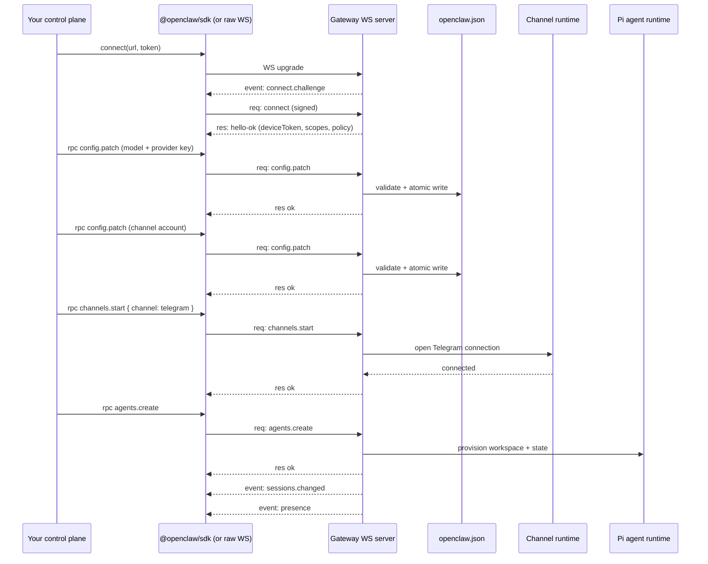

# OpenClaw Gateway — Setup via Native WebSocket

**Short answer:** Yes. WebSocket is **the** native control plane for the Gateway — always on, no plugin required. The bundled `admin-http-rpc` plugin is just an optional HTTP shim over the same underlying WS methods. If you skip that plugin, you talk to the Gateway over WebSocket directly.

This doc covers how to do setup (configure model, register channel, create agent, manage cron / nodes / devices) over the native WS protocol — both via the official `@openclaw/sdk` package and as raw WebSocket frames.

Grounded in `/Users/rajendra/projects/openclaw/openclaw`:
- `docs/concepts/architecture.md` — WS as the single control plane
- `docs/gateway/protocol.md` — frames, handshake, methods
- `docs/concepts/openclaw-sdk.md` — `@openclaw/sdk` reference
- `src/gateway/client.ts` — reference WS client (Node)
- `src/gateway/protocol/version.ts` — current protocol version

---

## 1. Is WebSocket natively available? — Yes

From `docs/concepts/architecture.md`:

> *"Control-plane clients (macOS app, CLI, web UI, automations) connect to the Gateway over **WebSocket** on the configured bind host (default `127.0.0.1:18789`)."*

> *"This protocol exposes the **full gateway API** (status, channels, models, chat, agent, sessions, nodes, approvals, etc.)."*

WS is always on. It's served on the **same port** as HTTP — the Gateway multiplexes both on `gateway.port` (default `18789`). No config, no plugin enable needed. Even the macOS app, CLI, web Control UI, iOS/Android nodes, and headless node hosts are all WS clients of this same surface.

The only reason `admin-http-rpc` exists is for tools that **cannot** keep a WS connection open (CI scripts, basic curl from bash, environments without a WebSocket library). For anything that can hold a socket, WS is the preferred path. From the admin-http-rpc doc itself:

> *"The normal Gateway WebSocket RPC path remains the preferred control-plane API for OpenClaw clients."*

---

## 2. What WS gives you that HTTP doesn't

| Capability | WS | `admin-http-rpc` | `/tools/invoke` | `/v1/*` |
|---|---|---|---|---|
| Setup operations (`config.*`, `agents.*`, `channels.*`) | ✅ all methods | ✅ allowlisted subset | ❌ | ❌ |
| Run an agent (with streaming) | ✅ `agent` + events | ❌ | ❌ | ✅ (no setup) |
| Send chat / receive deltas live | ✅ | ❌ | ❌ | ✅ (SSE only) |
| Read session transcripts | ✅ `sessions.preview`, `chat.history` | ❌ | ❌ | ❌ |
| Subscribe to live events (presence, health, cron, approvals) | ✅ | ❌ | ❌ | ❌ |
| Install / manage skills | ✅ | ❌ | ❌ | ❌ |
| Talk / TTS session lifecycle | ✅ | ❌ | ❌ | ❌ |
| Pair devices / approve nodes | ✅ + auto-loopback-approval | ✅ (subset) | ❌ | ❌ |
| Default state | always on | off until plugin enabled | on | off |

WS is the **superset**. HTTP surfaces are deliberate narrowings.

---

## 3. The two ways to use WS

### Option A — official SDK (recommended)

The `@openclaw/sdk` npm package wraps the protocol in a typed client. From `docs/concepts/openclaw-sdk.md`:

```typescript
import { OpenClaw } from "@openclaw/sdk";

const oc = new OpenClaw({
  url: "ws://127.0.0.1:18789",
  token: process.env.OPENCLAW_GATEWAY_TOKEN,
  requestTimeoutMs: 30_000,
});

await oc.connect();
```

What the SDK gives you out of the box:

| Object | Calls underneath |
|---|---|
| `oc.agents` | `agents.list/create/update/delete`, `agents.files.*` |
| `agent.run({...})` → `Run` | `agent` (two-stage accepted + final), streams via `Run.events()`, finalises via `Run.wait()` |
| `oc.sessions` | `sessions.create/resolve/send/patch/compact/get`, `sessions.list` |
| `oc.runs` | Wait/cancel/stream runs |
| `oc.tasks` | `tasks.list/get/cancel` |
| `oc.models` | `models.list`, `models.authStatus` |
| `oc.tools` | `tools.catalog/effective/invoke` (policy-checked) |
| `oc.artifacts` | `artifacts.list/get/download` |
| `oc.approvals` | `exec.approval.list/resolve` |
| `oc.rawEvents()` | Raw event stream — `tick`, `presence`, `health`, `cron`, `session.*`, etc. |
| `oc.environments` | `environments.list/status` |

It also re-exports `OpenClawTransport` so you can plug your own transport for tests.

### Option B — raw WebSocket

The protocol is just JSON over a WS text frame. You can implement it in any language. Reference: `src/gateway/client.ts`.

Both options speak the same wire format. The SDK is a convenience layer; nothing is impossible without it.

---

## 4. The WS handshake (raw protocol)

### Frame model

```ts
// Request
{ "type": "req", "id": "<uuid>", "method": "<name>", "params": { ... } }

// Response
{ "type": "res", "id": "<uuid>", "ok": true,  "payload": { ... } }
{ "type": "res", "id": "<uuid>", "ok": false, "error":   { ... } }

// Server-push event
{ "type": "event", "event": "<name>", "payload": { ... }, "seq": 42, "stateVersion": 7 }
```

### Step-by-step `connect`

1. **Open WS** to `ws://host:port` (or `wss://` with TLS).
2. **Receive challenge** event (Gateway → client):
   ```json
   { "type": "event", "event": "connect.challenge",
     "payload": { "nonce": "…", "ts": 1737264000000 } }
   ```
3. **Sign the nonce** with your device keypair (v3 signature includes platform + deviceFamily). For shared-secret operator-only use, you can also pass `auth.token`.
4. **Send `connect`** as the very first request frame:
   ```json
   { "type": "req", "id": "<uuid>", "method": "connect",
     "params": {
       "minProtocol": 4, "maxProtocol": 4,
       "client": { "id": "my-app", "version": "1.0.0",
                   "platform": "linux", "mode": "operator" },
       "role": "operator",
       "scopes": ["operator.admin", "operator.read", "operator.write",
                  "operator.pairing"],
       "caps": [], "commands": [], "permissions": {},
       "auth": { "token": "<GATEWAY_TOKEN>" },
       "device": {
         "id": "<fingerprint>", "publicKey": "<base64-url>",
         "signature": "<base64-url>", "signedAt": 1737264000000,
         "nonce": "<echoed-server-nonce>"
       }
     }
   }
   ```
5. **Receive `hello-ok`** response:
   ```json
   { "type": "res", "id": "<uuid>", "ok": true,
     "payload": {
       "type": "hello-ok", "protocol": 4,
       "server": { "version": "…", "connId": "…" },
       "features": { "methods": [...], "events": [...] },
       "snapshot": { /* presence, health, stateVersion, uptimeMs */ },
       "auth": { "role": "operator", "scopes": [...],
                 "deviceToken": "<persist-me>" },
       "policy": { "maxPayload": 26214400,
                   "maxBufferedBytes": 52428800,
                   "tickIntervalMs": 15000 }
     }
   }
   ```
6. **Persist `hello-ok.auth.deviceToken`** for subsequent reconnects (so you don't have to re-pair).
7. **Honor `policy.tickIntervalMs`** — the server pings you with `tick` events; if you don't see one within ~2× that interval, close and reconnect.

Constants (from `src/gateway/client.ts`):
- `PROTOCOL_VERSION = 4`
- Request timeout: `30_000` ms (per RPC)
- Connect-challenge timeout: `15_000` ms
- Initial reconnect backoff: `1_000` ms, capped at `30_000` ms
- `MAX_PAYLOAD_BYTES = 25 MB`
- Tick-timeout close: code `4000` on silence > `tickIntervalMs * 2`

### Pairing on first connect

If your device identity is unknown to the Gateway:
- Loopback (`127.0.0.1`) → **auto-approved** for shared-secret token/password auth in "trusted-loopback" mode.
- Anywhere else → connect returns `PAIRING_REQUIRED` with `recommendedNextStep: "wait_then_retry"` and `retryable: true`. The operator (you) approves via:
  ```bash
  openclaw devices list
  openclaw devices approve <requestId>
  ```
  Or programmatically via `device.pair.approve` from an already-paired operator session.
- Once approved, retry the same `connect` — the response now includes the `deviceToken`.

For SaaS automation, the easy path: bind to loopback (or pre-pair the control-plane device during provisioning), persist the `deviceToken`, reuse it from then on.

---

## 5. Sending a request (raw WS)

```js
// pseudocode for any language
function rpc(method, params) {
  const id = crypto.randomUUID();
  send({ type: "req", id, method, params });
  return waitForFrameWhere(frame =>
    frame.type === "res" && frame.id === id
  );
}
```

The Gateway router doesn't care which connection the request came from — your scope set is fixed at `connect` time.

### Side-effecting methods need idempotency keys

`send`, `agent`, and similar mutating methods accept an `idempotencyKey` in params. The Gateway keeps a short-lived dedupe cache. Pass the same key on retries so a network hiccup doesn't double-trigger an action.

---

## 6. Two-stage agent runs (the streaming pattern)

`agent` requests are special: you get an immediate `accepted` ack, then streamed events, then a final result.

```text
client → req: agent {input, sessionKey, ...}
server ← res: { ok: true, payload: { status: "accepted", runId, acceptedAt } }
server → event: agent { stream: "lifecycle", phase: "start", runId }
server → event: agent { stream: "assistant", delta: "Hello, "...} (many)
server → event: agent { stream: "tool", ... } (zero or more)
server → event: agent { stream: "lifecycle", phase: "end", runId }
server → res:   { ok: true, payload: { status: "ok", summary } }  ← same id as the original req
```

Use `agent.wait` with the `runId` if you want a single blocking call instead of consuming the event stream.

The SDK's `Run.events()` is an async iterator over normalized events; `Run.wait()` blocks for terminal status; `Run.cancel()` calls `sessions.abort` with the run id.

---

## 7. Events: subscribe and consume

Once connected, the Gateway pushes events on its own. You don't poll. Examples:

- `tick` — keepalive (use to detect silent disconnects)
- `presence` — operator/node presence snapshot updates
- `health` — gateway health snapshot
- `chat`, `session.message`, `session.operation`, `session.tool` — for **subscribed** sessions
- `sessions.changed` — index changed
- `agent` — per-run streaming during an active `agent` RPC
- `cron` — cron run/job changes
- `heartbeat` — heartbeat updates
- `exec.approval.requested` / `exec.approval.resolved`
- `plugin.approval.requested` / `plugin.approval.resolved`
- `device.pair.requested` / `device.pair.resolved`
- `node.pair.requested` / `node.pair.resolved`
- `node.invoke.request`
- `voicewake.changed`
- `shutdown` — gateway is shutting down (graceful)

### Scope-gating
- Chat / agent / tool-result events require `operator.read`.
- `plugin.*` broadcasts require `operator.write` or `operator.admin`.
- Transport events (`tick`, `presence`, `health`, `heartbeat`, lifecycle) are unrestricted.
- Unknown event families fail-closed unless a handler explicitly relaxes them.

### Gap recovery
Events are **not replayed**. If your local `seq` jumps, refresh state via `health`, `system-presence`, `sessions.list`, etc.

### Subscribing to one session's transcript
```json
{ "type": "req", "id": "1", "method": "sessions.messages.subscribe",
  "params": { "sessionKey": "agent:main:main" } }
```
You'll now get `session.message`, `session.operation`, and `session.tool` events for that session.

---

## 8. End-to-end setup over native WS

Same workflow as the HTTP one, but every step is a WS `req`.

```typescript
import { OpenClaw } from "@openclaw/sdk";

const oc = new OpenClaw({
  url: "ws://127.0.0.1:18789",
  token: process.env.OPENCLAW_GATEWAY_TOKEN,
});
await oc.connect();

// 1. Health check
const health = await oc.rawRequest("health", {});

// 2. Inspect schema / config
const schema = await oc.rawRequest("config.schema.lookup",
  { path: "channels.telegram" });
const current = await oc.rawRequest("config.get", {});

// 3. Set provider key + default model
await oc.rawRequest("config.patch", {
  patch: {
    models: { providers: { anthropic: { apiKey: "sk-ant-..." } } },
    agents: { defaults: { model: "anthropic/claude-sonnet-4-6" } },
  },
});

// 4. Register a Telegram bot account
await oc.rawRequest("config.patch", {
  patch: {
    channels: {
      telegram: {
        accounts: { default: { botToken: "123456:ABC..." } },
      },
    },
  },
});

// 5. Start the channel
await oc.rawRequest("channels.start", { channel: "telegram" });

// 6. Create a second isolated agent
await oc.rawRequest("agents.create",
  { id: "work", workspace: "~/.openclaw/workspace-work" });

// 7. Bind Telegram → work agent
await oc.rawRequest("config.patch", {
  patch: {
    bindings: [
      { agentId: "work",
        match: { channel: "telegram", accountId: "default" } },
    ],
  },
});

// 8. Verify
console.log(await oc.rawRequest("agents.list", {}));
console.log(await oc.rawRequest("channels.status", {}));

// 9. Subscribe and start using
await oc.rawRequest("sessions.subscribe", {});
for await (const ev of oc.rawEvents()) {
  if (ev.event === "sessions.changed") console.log("sessions changed");
}
```

> The SDK exposes typed helpers (`oc.agents.create({...})`, `oc.models.list()`, etc.) for the common cases. `rawRequest` is the escape hatch for any method on the protocol.

Methods you can't reach over HTTP but **can** over WS for setup-adjacent work:
- `skills.install`, `skills.update`, `skills.status`, `skills.search` (admin scope for install/update)
- `secrets.reload`, `secrets.resolve`
- `wizard.start/next/status/cancel` (onboarding wizard)
- `talk.config`, `talk.catalog`, `voicewake.set`
- `sessions.preview`, `chat.history` (read transcripts)
- `update.run` / `update.status` (gateway self-update)

---

## 9. Raw WebSocket (no SDK) — minimal Node example

```javascript
import WebSocket from "ws";
import { randomUUID } from "node:crypto";

const ws = new WebSocket("ws://127.0.0.1:18789");
const pending = new Map();
let serverNonce = null;

function rpc(method, params) {
  return new Promise((resolve, reject) => {
    const id = randomUUID();
    pending.set(id, { resolve, reject });
    ws.send(JSON.stringify({ type: "req", id, method, params }));
    setTimeout(() => {
      if (pending.has(id)) {
        pending.delete(id);
        reject(new Error("rpc timeout"));
      }
    }, 30_000);
  });
}

ws.on("message", (data) => {
  const frame = JSON.parse(data.toString());
  if (frame.type === "event" && frame.event === "connect.challenge") {
    serverNonce = frame.payload.nonce;
    // Now send connect (skipping device signing here for brevity).
    ws.send(JSON.stringify({
      type: "req", id: randomUUID(), method: "connect",
      params: {
        minProtocol: 4, maxProtocol: 4,
        client: { id: "my-app", version: "0.1.0",
                  platform: "linux", mode: "operator" },
        role: "operator",
        scopes: ["operator.admin", "operator.read",
                 "operator.write", "operator.pairing"],
        caps: [], commands: [], permissions: {},
        auth: { token: process.env.OPENCLAW_GATEWAY_TOKEN },
        // device: { ... }   // omit for shared-secret loopback testing
      },
    }));
    return;
  }
  if (frame.type === "res" && pending.has(frame.id)) {
    const { resolve, reject } = pending.get(frame.id);
    pending.delete(frame.id);
    frame.ok ? resolve(frame.payload) : reject(frame.error);
    return;
  }
  if (frame.type === "event") {
    // tick, presence, health, agent, session.*, etc.
  }
});

ws.on("open", () => {
  // wait for connect.challenge event; do not send any frame first
});

// Use it
ws.once("message", async () => {
  // (after handshake completes — wire your own ready signal)
  console.log(await rpc("models.list", { view: "configured" }));
  console.log(await rpc("agents.list", {}));
});
```

For production: handle the `tick` keepalive, exponential reconnect backoff, idempotency keys on side-effecting calls, and proper device signing if you connect from anywhere other than loopback.

---

## 10. Raw WebSocket — Python sketch

```python
import asyncio, json, os, uuid, websockets

async def main():
    async with websockets.connect("ws://127.0.0.1:18789",
                                  max_size=25*1024*1024) as ws:
        # 1. Wait for challenge
        challenge = json.loads(await ws.recv())
        assert challenge["event"] == "connect.challenge"

        # 2. Send connect
        await ws.send(json.dumps({
            "type": "req", "id": str(uuid.uuid4()), "method": "connect",
            "params": {
                "minProtocol": 4, "maxProtocol": 4,
                "client": {"id": "py-app", "version": "0.1",
                           "platform": "linux", "mode": "operator"},
                "role": "operator",
                "scopes": ["operator.admin","operator.read","operator.write"],
                "caps": [], "commands": [], "permissions": {},
                "auth": {"token": os.environ["OPENCLAW_GATEWAY_TOKEN"]},
            }
        }))
        hello = json.loads(await ws.recv())
        assert hello["ok"], hello

        # 3. RPC helper
        async def rpc(method, params):
            rid = str(uuid.uuid4())
            await ws.send(json.dumps(
                {"type":"req","id":rid,"method":method,"params":params}))
            while True:
                frame = json.loads(await ws.recv())
                if frame.get("type") == "res" and frame.get("id") == rid:
                    if not frame["ok"]:
                        raise RuntimeError(frame["error"])
                    return frame["payload"]
                # else: it's an event; queue/handle as needed

        # 4. Setup
        print(await rpc("models.list", {"view": "configured"}))
        await rpc("config.patch", {
            "patch": {
                "agents": {"defaults": {"model": "anthropic/claude-sonnet-4-6"}}
            }})
        await rpc("agents.create",
                  {"id": "work",
                   "workspace": "~/.openclaw/workspace-work"})

asyncio.run(main())
```

---

## 11. Quick experiments with `wscat`

`wscat` works for poking at the protocol, but you have to assemble frames by hand. Use only for sanity tests on loopback.

```bash
wscat -c ws://127.0.0.1:18789
# Wait for the connect.challenge event to print, then paste:
{"type":"req","id":"1","method":"connect","params":{"minProtocol":4,"maxProtocol":4,"client":{"id":"wscat","version":"0","platform":"linux","mode":"operator"},"role":"operator","scopes":["operator.admin","operator.read","operator.write"],"caps":[],"commands":[],"permissions":{},"auth":{"token":"my-gateway-token"}}}
# After hello-ok arrives:
{"type":"req","id":"2","method":"health","params":{}}
{"type":"req","id":"3","method":"agents.list","params":{}}
```

---

## 12. How WS setup integrates with the rest of the system



The methods you call over WS hit the **same** internal handlers that the admin-http-rpc plugin would dispatch — `src/gateway/server-methods/*.ts`. The plugin is literally a thin HTTP→RPC adapter on top of this WS surface.

---

## 13. Reliability checklist for a SaaS control plane

If your control plane is going to drive Gateways over WS in production, your client needs:

1. **Persist the `deviceToken`** from `hello-ok.auth.deviceToken` after first connect. Use it on reconnects to skip pairing.
2. **Honor `policy.tickIntervalMs`**. Close + reconnect if you go silent past `2×` that.
3. **Exponential reconnect backoff**. Cap at 30s (SDK default).
4. **Idempotency keys** on `send`, `agent`, and any other side-effecting method. Reuse on retry.
5. **`hello-ok.features.methods`** is a discovery hint, not exhaustive. Don't depend on it for capability detection — try the call and handle `INVALID_REQUEST`.
6. **Gap recovery** — if event `seq` jumps, refetch state (`sessions.list`, `health`, `system-presence`).
7. **Treat `shutdown` events** as a clean disconnect. Wait + reconnect.
8. **`UNAVAILABLE` with `details.reason: "startup-sidecars"`** is retryable — honor `retryAfterMs`.
9. **`AUTH_TOKEN_MISMATCH`**: one bounded retry with a cached device token, then surface to operator.
10. **`AUTH_SCOPE_MISMATCH`**: don't loop. The token is recognized but the scopes don't cover the request — re-pair with the wider scope set.

The official SDK already handles 1–4, 7–10 for you. Building raw, you own all of it.

---

## 14. So when **should** I use HTTP instead?

Reach for `admin-http-rpc` (or `/tools/invoke`) only when:
- You're calling from a shell script or a one-shot job where opening a WS is awkward.
- The caller is a third-party tool you don't control (Zapier, IFTTT, n8n) and the natural shape is HTTP.
- You explicitly want a request/response semantic with no event stream.
- You want a route that's restricted to a narrow allowlist (admin-http-rpc enforces this; raw WS gives you the full surface).

For everything else — especially anything that involves streaming, sessions, transcripts, skill management, or live events — **WebSocket is the right call**.

---

## 15. Source map

- `docs/concepts/architecture.md` — WS as canonical control plane
- `docs/concepts/openclaw-sdk.md` — full `@openclaw/sdk` reference
- `docs/gateway/protocol.md` — frame schema, methods, events, scopes, auth
- `src/gateway/client.ts` — reference Node WS client (read this if writing your own in any language)
- `src/gateway/protocol/version.ts` — current `PROTOCOL_VERSION` (4)
- `src/gateway/protocol/schema.ts` — TypeBox schemas for every frame
- `src/gateway/server-methods/` — the actual method handlers
- `src/gateway/server-methods-list.ts` — discovery list returned in `hello-ok.features.methods`

---

## 16. The one-paragraph summary

The Gateway's native control plane **is** WebSocket — always on, on the same port as HTTP. The `@openclaw/sdk` npm package wraps it in a typed client; raw WS works in any language. The handshake is one `connect` request with a signed challenge; success returns a `deviceToken` you persist for reconnects. After that you `req`/`res` against the full method surface — `config.patch`, `channels.start`, `agents.create`, `cron.add`, `device.pair.approve`, plus every method the HTTP admin plugin doesn't expose (skills, transcripts, talk/TTS, streaming agent runs, subscriptions). You also get live events: presence, health, session messages, run streams, approval requests, cron ticks. The admin-http-rpc plugin is just a thin HTTP→RPC shim that wraps a subset of the same handlers — if you can hold a socket open, skip the plugin and go native.
