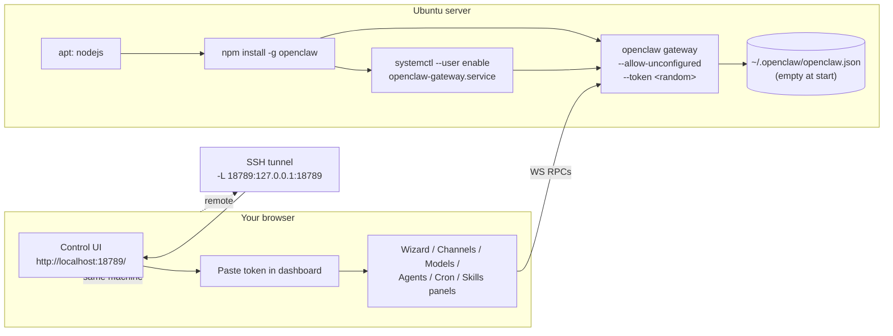

# Running the OpenClaw Daemon on Ubuntu and Setting It Up via the Web UI

**Short answer:** Yes. The repo documents exactly this path: install the binary, start the Gateway with `--allow-unconfigured`, point your browser at the built-in **Control UI** served on the Gateway's HTTP port, and configure everything from there (model, channels, agents, cron, skills, nodes, exec approvals). The Control UI speaks directly to the Gateway over WebSocket on the same port — no CLI setup required.

Grounded in `/Users/rajendra/projects/openclaw/openclaw`:
- `docs/install/index.md` — install paths
- `docs/install/node.md` — Ubuntu/Debian Node bootstrap
- `docs/gateway/index.md` — `--allow-unconfigured`, ports, bind
- `docs/web/control-ui.md` — Control UI capabilities, pairing, themes, language
- `docs/reference/wizard.md` — Gateway wizard RPC (`wizard.start/next/cancel/status`)
- `docs/gateway/remote.md` — remote access patterns
- `src/cli/gateway-run-argv.ts` confirms `--allow-unconfigured` is a real flag

---

## 1. Does the repo actually support this? — Yes, with receipts

Three concrete confirmations from the source:

1. **Unconfigured start is a documented flag.** From `docs/gateway/index.md`:
   ```bash
   openclaw --dev gateway --allow-unconfigured
   ```
   `src/cli/gateway-run-argv.ts` and `src/cli/respawn-policy.ts` both list `--allow-unconfigured` as a known flag. It isn't dev-only — the dev profile just happens to be the example.

2. **The Control UI is built in and exposes setup operations.** From `docs/web/control-ui.md`:
   > *"The Control UI is a small Vite + Lit single-page app served by the Gateway: default `http://<host>:18789/`. It speaks directly to the Gateway WebSocket on the same port."*

   And under "What it can do (today)":
   > *"Channels: built-in plus bundled/external plugin channels status, QR login, and per-channel config (`channels.status`, `web.login.*`, `config.patch`)."*

   Plus dedicated panels for sessions, cron, skills, nodes, exec approvals, dreams.

3. **The onboarding wizard is also exposed over RPC**, so the Control UI can drive it natively. From `docs/reference/wizard.md`:
   > *"The Gateway exposes the onboarding flow over RPC (`wizard.start`, `wizard.next`, `wizard.cancel`, `wizard.status`). Clients (macOS app, Control UI) can render steps without re-implementing onboarding logic."*

So the design intent is exactly what you're asking for: stand up the daemon empty, finish setup from the browser.

---

## 2. The Ubuntu install — three documented options

From `docs/install/index.md` and `docs/install/node.md`.

### Option A — Installer script with no onboarding

```bash
curl -fsSL https://openclaw.ai/install.sh | bash -s -- --no-onboard
```

This installs Node if needed and installs OpenClaw, but **skips** the CLI onboarding step — exactly what you want.

### Option B — npm-only (after installing Node)

```bash
# 1) Install Node 24 from NodeSource
curl -fsSL https://deb.nodesource.com/setup_24.x | sudo -E bash -
sudo apt-get install -y nodejs

# 2) Install OpenClaw globally
npm install -g openclaw@latest
```

Don't run `openclaw onboard` — that's the CLI setup path you want to skip.

### Option C — Local-prefix install (no system-wide Node)

```bash
curl -fsSL https://openclaw.ai/install-cli.sh | bash
```

Keeps OpenClaw and Node under `~/.openclaw`, no `sudo` needed. From the doc:
> *"Use this when you want OpenClaw and Node kept under a local prefix such as `~/.openclaw`, without depending on a system-wide Node install."*

---

## 3. Start the Gateway with no config

```bash
openclaw gateway --allow-unconfigured
```

If you want it managed by `systemd` instead of running in the foreground, install the supervised service (this is documented in `docs/gateway/index.md` Linux tab):

```bash
openclaw gateway install
systemctl --user enable --now openclaw-gateway.service
openclaw gateway status
```

For persistence across logout:
```bash
sudo loginctl enable-linger $USER
```

The doc also includes a manual user-unit example if you need a custom install path — see `docs/gateway/index.md` "Linux (systemd user)" tab.

---

## 4. Open the Control UI

The Control UI is served on the **same port** as the Gateway (default `18789`).

### Local on the same Ubuntu box

```
http://127.0.0.1:18789/
http://localhost:18789/
```

From `docs/web/control-ui.md`:
> *"Direct local loopback browser connections (`127.0.0.1` / `localhost`) are auto-approved."*

So loopback browsing skips the pairing step entirely.

### Remote browser (your laptop hitting an Ubuntu server)

The Gateway binds to **loopback by default**. The doc gives three documented paths to reach it from another machine:

| Pattern | Doc reference |
|---|---|
| SSH tunnel | `docs/gateway/index.md` and `docs/gateway/remote.md` |
| Tailscale Serve (Control UI over HTTPS, Gateway stays loopback) | `docs/gateway/tailscale.md` |
| Trusted LAN/Tailnet bind with explicit allowlist | `docs/gateway/index.md` |

The SSH tunnel is the simplest universal fallback:

```bash
# from your laptop
ssh -N -L 18789:127.0.0.1:18789 ubuntu@<server>
# then on your laptop browser
open http://127.0.0.1:18789/
```

> Warning from the doc: *"SSH tunnels do not bypass gateway auth. For shared-secret auth, clients still must send `token`/`password` even over the tunnel."*

If you want to bind directly to LAN, the doc is explicit about safety:
> *"Public non-loopback Control UI deployments must set `gateway.controlUi.allowedOrigins` explicitly (full origins). Private same-origin LAN/Tailnet loads from loopback, RFC1918/link-local, `.local`, `.ts.net`, or Tailscale CGNAT hosts are accepted without enabling Host-header fallback."*

And:
> *"refusing to bind gateway ... without auth"* — non-loopback binds require auth to be configured first (see step 5).

---

## 5. The gateway token — required even on loopback

From `docs/web/control-ui.md`:
> *"Auth is supplied during the WebSocket handshake via: `connect.params.auth.token`, `connect.params.auth.password`, Tailscale Serve identity headers when `gateway.auth.allowTailscale: true`, trusted-proxy identity headers when `gateway.auth.mode: "trusted-proxy"`."*

When you start the Gateway empty, you can pass a token on the command line:

```bash
openclaw gateway --allow-unconfigured --token "$(openssl rand -hex 32)"
```

(The `--token` flag is referenced in `src/cli/gateway-cli.coverage.test.ts:459`.)

The Control UI's dashboard settings panel:
> *"keeps a token for the current browser tab session and selected gateway URL; passwords are not persisted."*

So paste the token in the UI once and you're in. If you skip auth entirely (loopback-only, throwaway dev box), set `gateway.auth.mode: "none"` later from the UI — but the doc warns explicitly:
> *"do not expose that mode on public/untrusted ingress."*

---

## 6. Device pairing on first browser connect

From `docs/web/control-ui.md`:

> *"When you connect to the Control UI from a new browser or device, the Gateway usually requires a **one-time pairing approval**. This is a security measure to prevent unauthorized access."*
>
> *"What you'll see: `disconnected (1008): pairing required`"*

Pair via CLI:
```bash
openclaw devices list
openclaw devices approve <requestId>
```

Loopback is exempt:
> *"Direct local loopback browser connections (`127.0.0.1` / `localhost`) are auto-approved."*

So if you SSH-tunnel from your laptop to the server's loopback port, your browser is effectively connecting to `127.0.0.1:18789` on your laptop and you skip pairing too.

> *"Each browser profile generates a unique device ID, so switching browsers or clearing browser data will require re-pairing."*

---

## 7. What you can actually configure from the Control UI

Verbatim list from `docs/web/control-ui.md` "What it can do (today)":

### Chat and Talk
- Chat via Gateway WS (`chat.history`, `chat.send`, `chat.abort`, `chat.inject`)
- Talk through browser realtime sessions (OpenAI WebRTC, Google Live token, Gateway-relay for backend-only providers)
- Stream tool calls + live tool output cards in Chat (agent events)
- Activity tab with browser-local redaction-first summaries of live tool activity

### Channels, instances, sessions, dreams
- **Channels: built-in plus bundled/external plugin channels status, QR login, and per-channel config (`channels.status`, `web.login.*`, `config.patch`)**
- Channel probe refreshes keep the previous snapshot visible while slow provider checks finish
- Instances: presence list + refresh (`system-presence`)
- Sessions: list configured-agent sessions by default, apply per-session model/thinking/fast/verbose/trace/reasoning overrides (`sessions.list`, `sessions.patch`)
- Dreams: dreaming status, enable/disable toggle, and Dream Diary reader

### Cron, skills, nodes, exec approvals
- Cron jobs: list/add/edit/run/enable/disable + run history (`cron.*`)
- Skills: status, enable/disable, install, API key updates (`skills.*`)
- Nodes: list + caps (`node.list`)

That covers essentially every setup operation: pick a model, register an API key, add Telegram/WhatsApp/Slack/Teams/etc., create agents, schedule cron jobs, install skills, pair nodes — all from the browser.

The reason it works: every panel above ends up calling one of the WS methods you'd otherwise call from the CLI or SDK. `config.patch`, `web.login.start/wait`, `agents.create`, `cron.add`, etc. are all in `src/gateway/methods/core-descriptors.ts` as `operator.admin` methods, exactly the surface I covered in the gateway-websocket doc earlier in this folder.

---

## 8. The end-to-end flow on Ubuntu

```bash
# === Step 1: install ===
# Either…
curl -fsSL https://openclaw.ai/install.sh | bash -s -- --no-onboard
# …or
curl -fsSL https://deb.nodesource.com/setup_24.x | sudo -E bash -
sudo apt-get install -y nodejs
npm install -g openclaw@latest

# === Step 2: pick a token ===
export OPENCLAW_GATEWAY_TOKEN="$(openssl rand -hex 32)"
echo "Save this token: $OPENCLAW_GATEWAY_TOKEN"

# === Step 3: start the gateway (foreground) ===
openclaw gateway --allow-unconfigured

# Or supervised (recommended):
openclaw gateway install
systemctl --user enable --now openclaw-gateway.service
sudo loginctl enable-linger $USER   # so it survives logout

# === Step 4: reach the Control UI ===
# Same box:
xdg-open http://127.0.0.1:18789/

# Remote browser via SSH tunnel:
# on your laptop:
ssh -N -L 18789:127.0.0.1:18789 ubuntu@<server>
# then:  http://127.0.0.1:18789/  in your laptop browser

# === Step 5: paste the token into the UI ===
# Dashboard → settings panel → paste OPENCLAW_GATEWAY_TOKEN.

# === Step 6: configure everything from the browser ===
# Use the Channels panel for Telegram/WhatsApp/Teams/etc.
# Use Sessions / Agents / Skills / Cron / Nodes panels for the rest.
```

---

## 9. The flow as a diagram



The Control UI is served by the same process you started in step 3. Every click in the UI is a WS RPC against that Gateway. Config writes (`config.patch`) atomically swap the in-memory snapshot — no restart needed for hot-reloadable changes (`gateway.reload.mode: "hybrid"` is the default).

---

## 10. Honest caveats from the docs

1. **`--allow-unconfigured` is a real flag**, but the doc shows it under "Dev profile quick path." It works in the normal profile too (the source files reference it independent of dev), but you may want to be explicit by also passing `--profile default` once you understand what you're doing.

2. **The wizard exists as RPC** (`wizard.start/next/cancel/status`) but the doc says it's *"the recommended way to set up OpenClaw"* via CLI — the browser-driven equivalent is the Control UI panels, which call the same underlying methods directly rather than running the linear wizard.

3. **Non-loopback bind requires auth.** From the doc: *"refusing to bind gateway ... without auth"* — if you skip the token and try to bind to LAN, the Gateway refuses to start. Use `--token` or `--password`.

4. **Some channels are external plugins.** From `docs/install/index.md` and the channels index, WhatsApp specifically ships as `@openclaw/whatsapp` (external plugin), so the Control UI's Channels panel will prompt you to install it on first selection. From `docs/channels/whatsapp.md`: *"Onboarding can show the setup flow before the plugin package is installed, and the Gateway loads the external ClawHub/npm plugin only when the channel is actually active."*

5. **First Control UI connect from anywhere except loopback needs device pairing.** Doc-mandated. You either approve via `openclaw devices approve` on the server, or SSH-tunnel so your browser hits `127.0.0.1` and gets auto-paired.

6. **The doc explicitly recommends Linux user-unit systemd plus `loginctl enable-linger`** for "always on" behavior. Foreground `openclaw gateway` is fine for dev, but a server should use the supervised service.

---

## 11. What you can NOT do from the Control UI today

Honest mapping back to the panels listed in `docs/web/control-ui.md`:

- The doc doesn't claim Control UI handles **plugin install** (skills are listed; plugins like the WhatsApp plugin still flow through onboarding-style prompts). For non-channel plugin install at scale, the WS RPC `skills.install` (admin scope) is the documented path; for one-off setup, the CLI command stays the path of least resistance.
- **First-time channel-sender pairing approvals** (the `openclaw pairing approve <channel> <code>` flow for inbound WhatsApp/Telegram DMs from unknown people) — same gap I called out earlier: that's a local CLI op, not a Control UI panel. Workaround: pick `dmPolicy: "allowlist"` with explicit IDs from the start.
- **Device pairing for the browser itself** still uses `openclaw devices approve` on the server (or loopback auto-approval). The Control UI lists nodes and shows pairing requests but the doc's documented approval path is the CLI.

For everything else — models, providers, API keys, channel registration (Telegram token, WhatsApp QR, Slack/Discord/Teams creds), agent creation, bindings, cron, exec approvals, sessions, talk/TTS, themes — the Control UI is the documented surface and it's all WS-backed.

---

## 12. Source map

- `docs/install/index.md` — installer script, `--no-onboard`, npm path
- `docs/install/node.md` — Ubuntu/Debian Node 24 install
- `docs/gateway/index.md` — `--allow-unconfigured`, ports, systemd user service
- `docs/web/control-ui.md` — Control UI feature catalog, pairing, auth, themes, locales
- `docs/web/index.md` — Web surfaces overview
- `docs/reference/wizard.md` — `wizard.*` RPC methods
- `docs/gateway/remote.md` — SSH tunnel + Tailscale Serve patterns
- `docs/gateway/configuration.md` — `gateway.bind`, `gateway.auth.*`, `gateway.controlUi.*`
- `src/cli/gateway-run-argv.ts` — confirms `--allow-unconfigured` flag
- Companion docs in this folder:
  - `openclaw-gateway-deep-dive.md` — the daemon internals
  - `openclaw-gateway-websocket-setup.md` — the WS surface the Control UI uses underneath
  - `openclaw-channels-via-websocket.md` — exact methods the Channels panel calls
